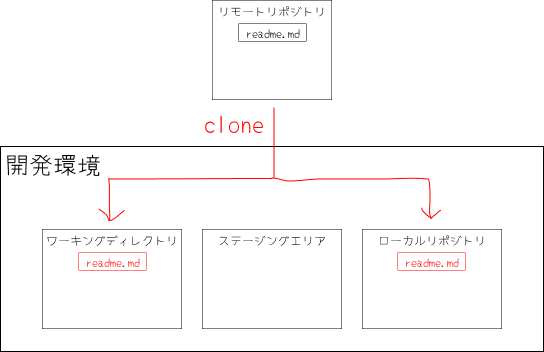
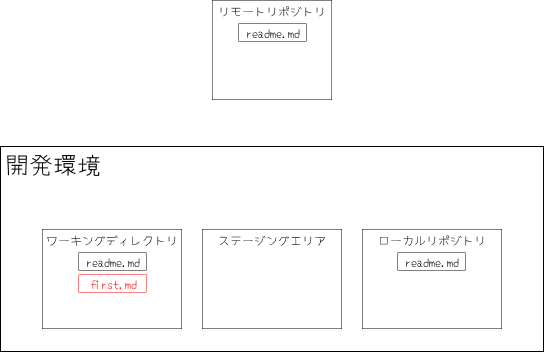
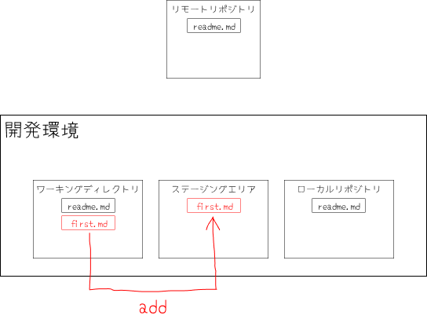
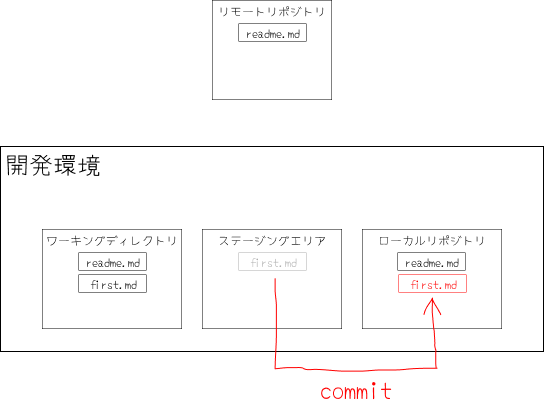
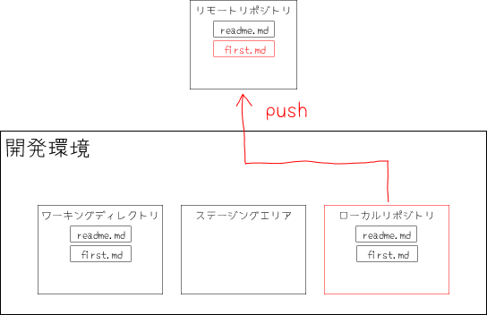
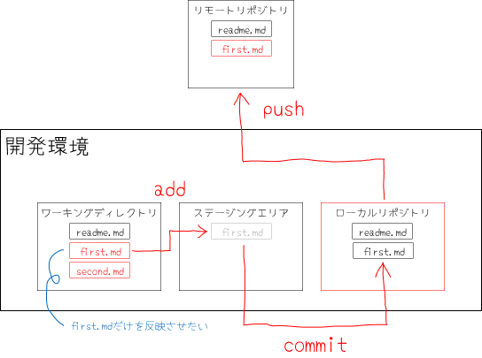

## 資料の目的

このドキュメントでは、次のことを目的とします。

- Gitにおけるリポジトリの流れを理解する
- リモートリポジトリとローカルリポジトリの違いを理解する
- Gitによるファイルの変更・追加方法を理解する

## 新しい作業を始める

### リポジトリ
Gitにおけるリポジトリとは、ファイルを保存しておくための倉庫で、リモートとローカルの二つがあります。

**リモートリポジトリ**は、ソースコードをインターネットのサーバーに置いて、みんなで共有できるリポジトリです。  
**ローカルリポジトリ**は、ソースコードを手元パソコンに置いて、自分だけが変更できるリポジトリです。  

### リポジトリを複製して作業開始
まず、自分の開発環境を用意します。  
といっても、どのディレクトリで作業するかを決めるだけです。  
例えば、ホームディレクトリでもいいし、普段使っているディレクトリで構いません。  

次に、リモートリポジトリからファイルをコピーして持ってきます。  
これを`clone`といいます。  

この段階で一緒に作業ディレクトリが作成されます。  
なので、新しいディレクトリを作成しなくていいです。  

```
$ git clone <プロジェクトURL>.git
```



リモートリポジトリには、`readme.md`だけ入っていて、そのリモートリポジトリを`clone`した時のイメージです。

### ファイルを変更・追加する
リポジトリのソースコードの変更は、ワーキングディレクトリ、ステージングエリアを通して行われます。  
実際には、我々がソースコードを変更するのは、ワーキングディレクトリです。  

新しく、`first.md`というファイルを作成してみます。



次に、ステージングエリアに変更したファイルを追加します。  

変更したファイルをローカルリポジトリに反映させる前に、ワンクッションおくのがGitの特徴です。  
なぜこのクッションがあるのか後ほど詳しく説明します。  

```
$ git add first.md
```




開発環境の状態の確認は`git status`というコマンドを使用します。  
`status`では、ワーキングディレクトリ、ステージングエリアなどの環境にどのような修正が加えられたか確認することができます。  

```
$ git status
```

そして、ステージングエリアで追加された内容をローカルリポジトリへ登録します。
これを`commit`と言います。

`commit`にはどのような修正を行ったかコメントをつけることができます。  
今回はファイルを追加したので、`'docs: firstを追加'`と書きましょう。  

```
$ git commit -m 'docs: firstを追加'
```



:::tip


コミットすると、リポジトリに**コミットオブジェクト**が作成されます。  
コミットオブジェクトを超簡単に説明すると、更新者の情報や変更後のファイルが保存されているデータです。  
（このときデータは、差分だけではなく、その瞬間のファイルの状態（スナップショット）全てが保存されます。）  

:::

### 差分を確認する

同じファイルの同士の変更点を`diff`といいます。  
作業の途中で自分が行った変更を確認することができます。  
`git diff`というコマンドを使用します。  

コマンドの詳しい説明は省きますが、よく使う３つを紹介します。  
`add`する前に、元のワーキングディレクトリとの変更点をみる`git diff`。  
`add`した後に、作業中のワーキングディレクトリとの変更点を見るなら`git diff --stage`。  
コミット同士を比較するなら`git diff <commit> <commit>`など。  

```
$ git diff <commit> <commit>
$ git diff <branch> <branch>
```

### リモートリポジトリへ変更を反映する

上記作業で、自分の手元の作業は終わりました。  
最後に行うのが、ローカルリポジトリの変更をリモートリポジトリへ反映させることです。  
これを`push`と言います。  

```
$ git push origin <branch>
```



### まとめ
一度`clone`して、作業ごとに`add`,`commit`,`push`が基本的な作業の流れです。  



:::tip

`clone`:リモートリポジトリから自分の開発環境（ローカルリポジトリとワーキングディレクトリ）にコピーを作る。  
`add`:ワーキングディレクトリからステージングエリアにファイルを追加し、コミットの準備をする。  
`commit`:ステージングエリアからローカルリポジトリに登録する。この時、コミットオブジェクトが作成される。  
`push`:ローカルリポジトリからリモートリポジトリへ変更内容を登録する。  

:::
