## 資料の目的

このドキュメントでは、次のことを目的とします。

- Gitにおけるブランチ運用の流れを理解する
- Git-Flow、GitHub-FlowとGitLab-Flowの違いを理解する
- ブランチとリポジトリの役割を理解する

## ブランチとは
Git上で別々の作業を並行して行うための仕組みをブランチといいます。  
ブランチを作成することを、**「ブランチを切る」**や**「ブランチを生やす」**ということもあります。  

分岐したブランチは他のブランチの影響を受けないため、同じリポジトリ中で複数の変更を同時に進めていくことができます。

SVNなどの中央集権リポジトリを利用していると、自分のコミットがどうやっても他人に影響を及ぼしてしまいます。  
（コミットしたら、Aさんが修正したソースが壊れましたとか）  

自分のソースの挙動確認したい時、ブランチを活用します。  
例えば、本番環境で動くリポジトリから自分の開発用ブランチを作って、自分が修正した分だけをテストしてマージが簡単にできます。  

## 新しいブランチを作る
`testing-branch`というブランチを作ってみます。  

`git branch <new branch>`や`git checkout -b <new branch>`で作ることができます。  
前者はブランチを作るだけ、後者はブランチを作ってそのブランチに移動します。  
（ブランチはリポジトリ内で管理されています。）  

```
# testing-branchという名前のブランチを作る場合
$ git branch testing-branch

# testing-branchブランチで作業する場合
$ git checkout testing-branch

# 上記二つを一つのコマンドで行う
$ git checkout -b testing-branch
```

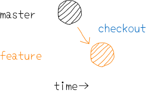

ブランチを作成する時のポイントは、どのブランチを派生元にするかということです。

派生元を`git checkout -b <new branch> <from branch>`として指定することができます。  
指定しなければ、現在作業しているブランチが`<from branch>`になります。  

### ブランチで作業を進める
作業するブランチを移動することを`checkout`すると言います。

現在作業しているブランチのポインタを`HEAD`と呼びます。  
つまり、`master(main)`ブランチから`develop`ブランチ移動するというのは`HEAD`を変えることを意味します。  

## マージとは
枝分かれたブランチ同士を統合することを`merge`と言います。  
コマンドは、取り込みを行いたいブランチ上で、行います。  

```
$ git merge <feature branch>
```

基本的に、`master(main)`ブランチや`develop`ブランチに対して統合を行なっていきます。

注意点は、**「どのブランチ」**が**「どのブランチ」**を**統合(吸収)**するかの主語を間違わないことです。
必ず、派生元のブランチに（`HEAD`を）移動して、派生先のブランチからの統合を行うことになります。

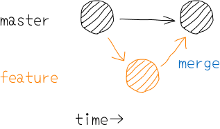

`merge`には二種類がありますが、基本的にGitLab上でマージを行うため、意識する必要はありません。

### マージまでの作業
現在、`feature`ブランチで作業を行なっていて、下記のような　`third.txt`を作成しました。

```txt title="third.txt"
hoge hoge
```

そして、`add`して`commit`まで終えました。

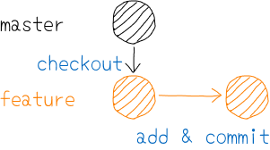

### fast-forward
`fasta-forward`はマージコミットが作られません。  
図のように、ブランチの位置が最新の位置に移動されるだけです。  

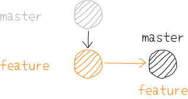

### no-fast-forward
それぞれ別々の開発が進んでしまっている場合、マージコミットが作られます。  
このようにマージコミットが作られるコミットが、`no-fast-forward`と呼ばれるコミットです。  

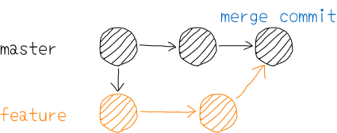

## ブランチ戦略
ブランチ戦略とはGitのブランチ機能をどういった方法で使用・管理するかをあらかじめ決めておく規約の事です。  

### Git-Flow
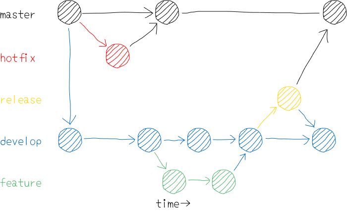

#### 各ブランチの定義

`master`:プロダクトとしてリリースする用のブランチ。※このブランチ上での作業は行わない

`develop`:開発用ブランチ。リリース準備ができたら`release`へマージする。※このブランチ上での作業は行わない

`feature`:機能の追加用。`develop`から分岐し、`develop`にマージする。

`hotfix`:リリース後の緊急対応（クリティカルなバグフィックスなど）用。`master`から分岐し、`master`にマージすると共に`develop`にマージする。

`release`:プロダクトリリースの準備用。リリース予定の機能やバグフィックスが反映された状態の`develop`から分岐する。リリース準備が整ったら、`master`にマージすると共に`develop`にマージする。

#### 特徴
Git-FlowはGitブランチを活用するために最初に提案されたフローの1つで、大変注目されました。  

`master`ブランチとは別に`develop`ブランチがあり、その他に`feature`、`release`、`hotfix`というブランチがあります。  
`develop`ブランチでの開発作業を進めた後に、`release`ブランチを作成し、成果は最終的に`master`ブランチへマージされます。  

### GitHub-Flow
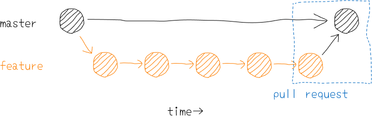

#### 各ブランチの定義
`master`:プロダクトとしてリリースする用のブランチ※このブランチ上での作業は行わない

`feature`:機能の追加用。`master`から分岐し、`master`にマージする。

#### 特徴
Git-FlowをよりシンプルにしたのがGitHub-Flowです。  

GitHub-Flowでは`feature`ブランチと`master`ブランチしか使いません。シンプルでわかりやすいフローで、多くの開発チームが採用し成功を収めています。  
全てを`master`ブランチにマージし、こまめにデプロイすることで、デプロイ待ちのコードの量を最小限にできます。  

### GitLab-Flow
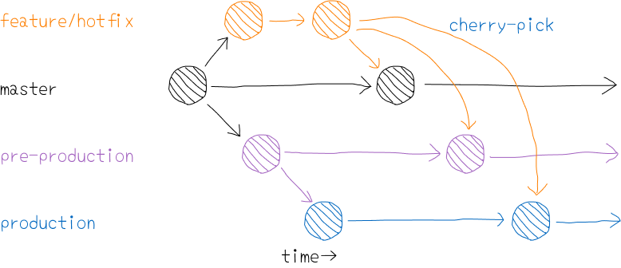

#### 各ブランチの定義

`master`:ソースを常に最新に保つブランチ。※このブランチ上での作業は行わない

`pre-production`:`staging`用ブランチ。リリース準備ができたら`production`へマージする。※このブランチ上での作業は行わない

`production`:プロダクトとしてリリースする用のブランチ。リリース予定の機能やバグフィックスが反映された状態。※このブランチ上での作業は行わない

`feature`:機能の追加用。`master`から分岐し、`master`にマージする。

#### 特徴
GitLab-Flowはイメージとしては「GitHub-Flow + リリースに必要なブランチ」です。  

`master`ブランチでリリースに向けた作業が終わった段階で上記図のように`production`ブランチや`pre-production`ブランチにマージを行いリリースの調整やリリース作業を行います。  

## ローカルリポジトリを最新にする

ローカルである程度作業を進めると、リモートリポジトリが他の開発者によって更新されている場合があります。
この場合において、リモートリポジトリの情報を再度ローカルリポジトリに反映させるために行うのが`pull`です。

```
$ git pull origin <remote branch>
```

### ブランチとリポジトリ
ブランチは、各リポジトリに保存されています。  
実際に作業を行うブランチです。  

一方で、ローカルリポジトリには、リモートリポジトリをコピーしたブランチがあります。  
これは「リモート追跡ブランチ」と呼ばれます。  
`remotes/<remote branch>`でリモートのブランチと紐づく名前のブランチです。  

これは、あくまでもリモートリポジトリを監視しているに過ぎません。


### 最新の状況を確認する
リモートリポジトリの`develop`ブランチがリモート追跡ブランチより一つ進んでいる状況だったとします。

リモートリポジトリのブランチの最新の状況をリモート追跡ブランチに反映させることを`fetch`と言います。

```
$ git fetch origin <remote branch>
```

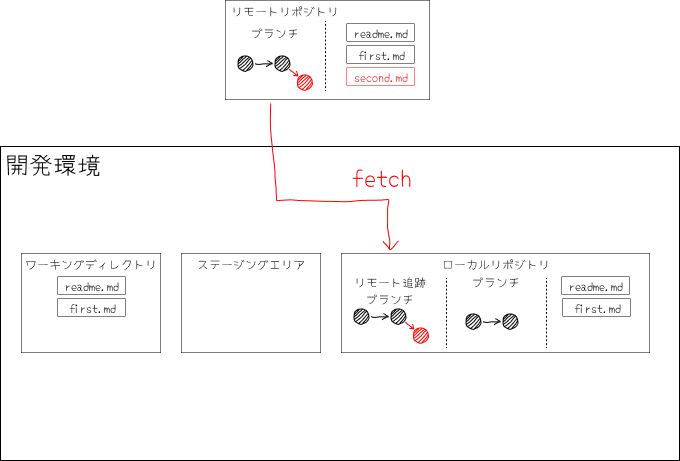

### 最新の状態に更新する
`fetch`を行い、最新の状況をリモート追跡ブランチに反映させた後にローカルブランチに`merge`を行うと更新されます。  
`pull`は`fetch`と`merge`を行うのでコマンドを入力する手間が省けます。  

```
$ git pull origin <remote branch>
```

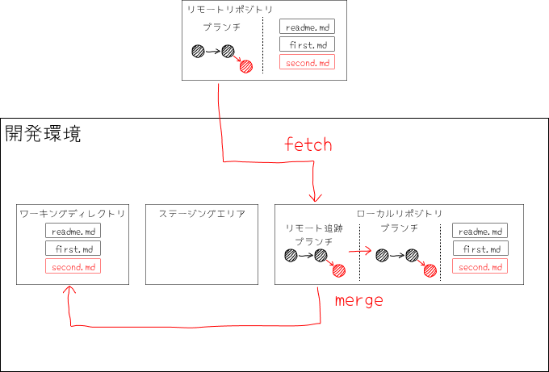

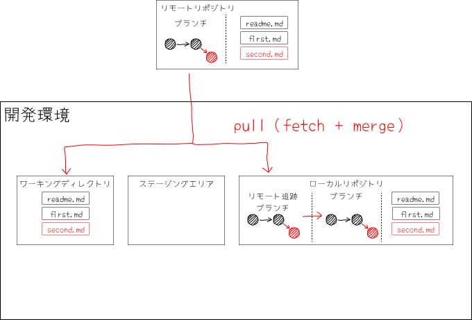

:::tip

`pull`:`fetch` + `merge`。`pull`は、リモートリポジトリの状態をローカルリポジトリに反映させること。

:::


## （余談）マージ(プル)リクエスト
基本的にリモートとローカルの関係は、リモートリポジトリからローカルリポジトリに`pull`し、ローカルリポジトリからリモートリポジトリに`push`することになります。  
ですが、GitLabをはじめとするサービスには、リモートリポジトリ内にあるブランチから、`master`ブランチのようなブランチに`merge`する前に`request`を送るという仕組みをとっています。  

ローカルから直接反映する訳ではありません。  

というのは、開発者の個人の判断で、`master`ブランチなどに`push`して、リモートリポジトリを更新してしまうと誰もチェックできずに大きな障害が発生する可能性があります。  
一旦上位の開発者がコードをレビューするプロセスを挟むのが`merge(pull) request`です。  

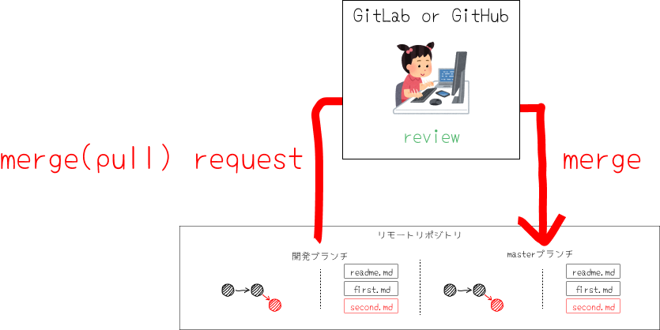

## まとめ
### 新規のbranchで修正を始める方法
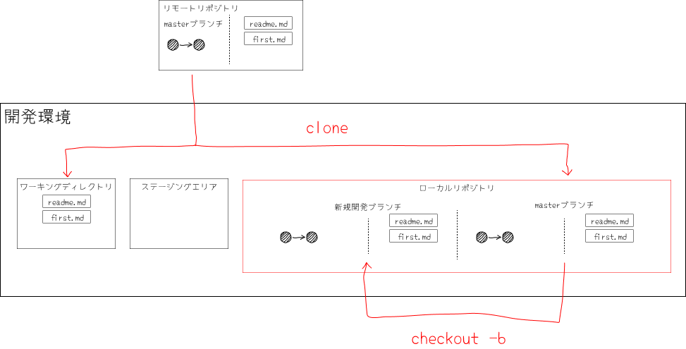

### 既存のbranchで修正を始める方法
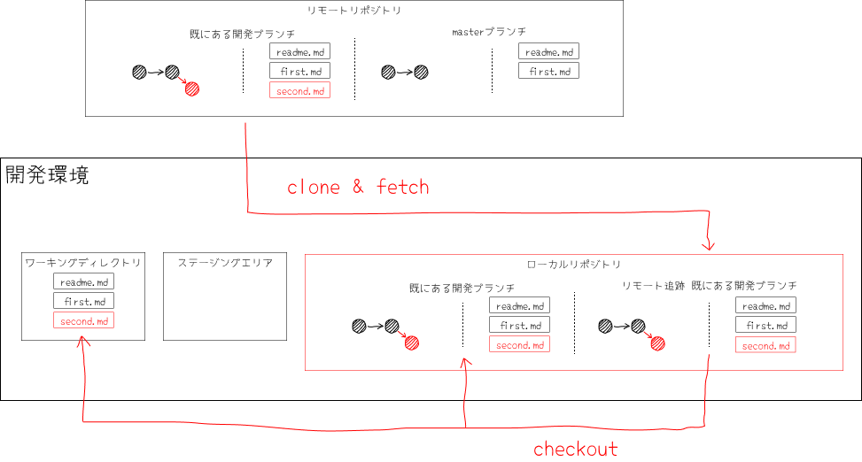

### Gitで修正を反映する方法
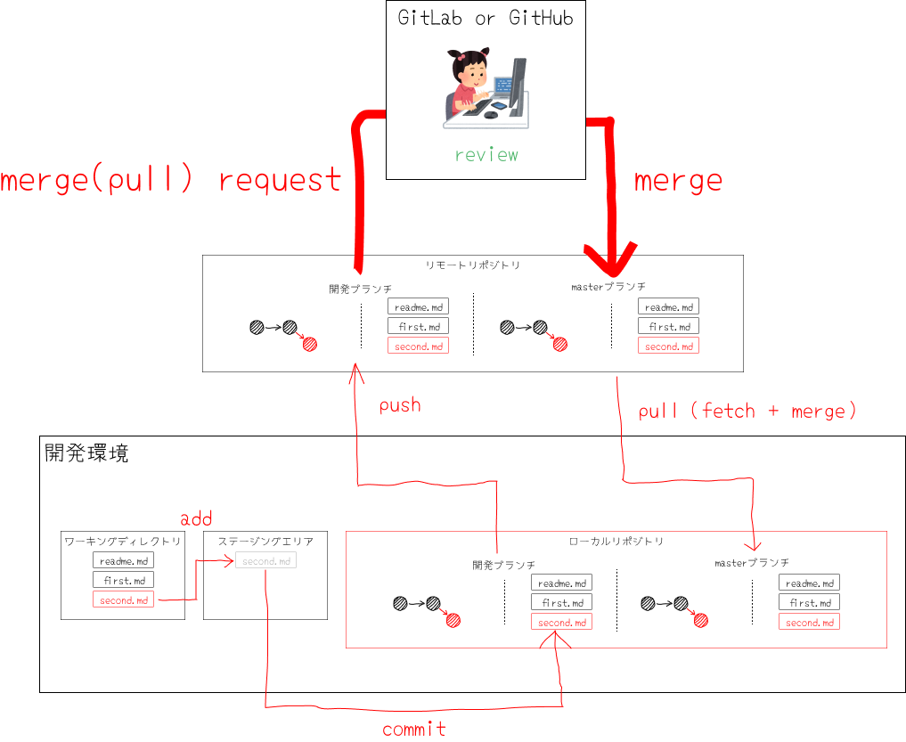
