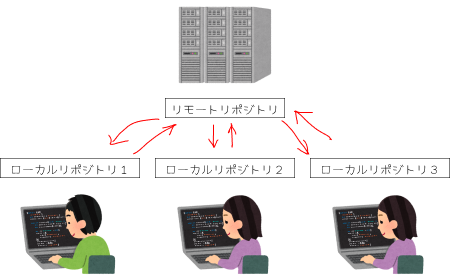
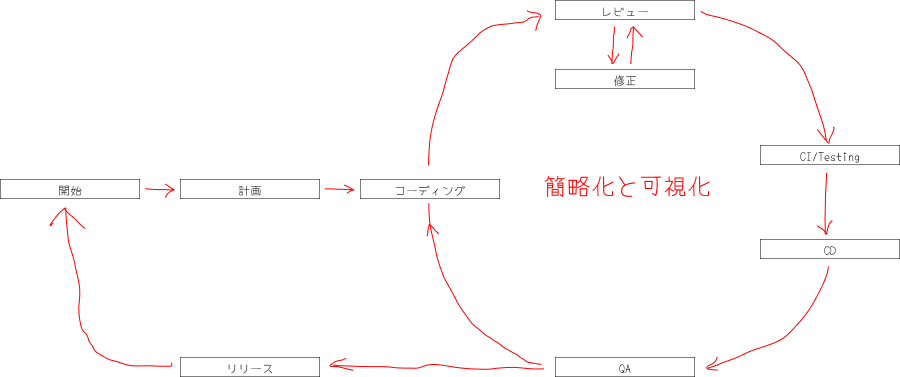
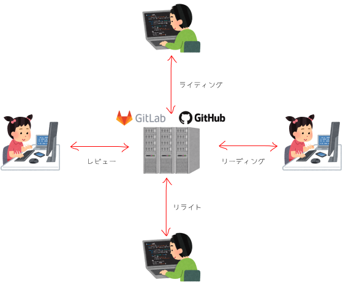

## 資料の目的

このドキュメントでは、次のことを目的とします。

- Gitとは何かを理解する
- バージョンコントロール（管理）とは何かを理解する
- Gitのような分散型バージョン管理システムを理解する
- GitとGitHub、GitLabの違い、およびこれらがソフトウェア開発ライフサイクルで果たす役割について理解する

## Gitとは

### バージョンを管理し、作業を分散する

Gitは、分散型バージョン管理システムと呼ばれるソースコードの管理システムの1種です。
Gitは、ファイルの**変更履歴（バージョン）**を記録・追跡することで、過去と現在のファイルを比較し、変更点を明らかにすることで、円滑に開発作業を進めるためのツールです。

また、一度に**複数の開発者がファイルを編集**できるシステムなので、作業を分散して行うことができます。

:::tip

バージョンコントロール（管理）システム

バージョン管理システムとは、ファイルに対して「誰が」「いつ」「何を変更したか」というような情報を記録することで、過去のある時点の状態を復元したり変更内容の差分を表示できるようにするシステムのことです。バージョン管理システムは大きく2つに分けると、「集中管理方式」「分散管理方式」があります。

<details>
<summary>集中管理方式（集中型）</summary>
集中管理方式とは、ファイルのバージョン管理を専用のサーバ（リポジトリ）で一元管理する方式です。サーバ上にリポジトリと呼ばれるバージョン管理専用のフォルダを作成し、ユーザーのPCにクライアントソフトウェアを導入します。クライアントPCからユーザーがそれぞれがサーバに接続するとファイルを利用できます。
集中管理方式では、コミット（チェックイン）するごとにバージョンが加算され、リポジトリ内のバージョンが自動的にひとつずつ増えていきます。
ここでいう「コミット」（バージョン管理ソフトによっては「チェックイン」ともいう）とは、ファイルをアップロードすることです。逆に、サーバからファイルをダウンロードすることを「チェックアウト」と呼びます。

集中管理方式ではサーバ上でファイル情報を一括管理するため、サーバにつながっていない状態ではファイルの変更情報を記録できません。以前は、集中管理方式の「CVS」や「Apache Subversion（SVN）」が多く利用されていました。
</details>

<details>
<summary>分散管理方式（分散型）</summary>
サーバ上に置いたリポジトリでファイル情報を一括管理する集中管理方式に対し、ユーザーがそれぞれPC内にリポジトリのコピーを持つ方式を分散管理方式と呼びます。ファイルが更新されると、まずそれぞれのPC内にあるローカルリポジトリでファイルの変更を記録します。ある程度作業が進んだら、サーバ上のリモートリポジトリに変更内容を反映させます。

ユーザーがそれぞれ自分のPC内にリポジトリを保持しているため、ネットワークにつながらずサーバにアクセスできなくても作業ができるのが特徴です。システム開発においては、複数人が分散して開発するという近年のニーズとマッチした、分散管理方式の「Git」や「Mercurial」などが主流になってきています。
</details>

Gitは「分散管理方式（分散型）」！

:::

## Gitを使うということ
みんなで共有できる保存場所（以下、リモートリポジトリ）にあるファイルなどを、手元のパソコン（以下、ローカルリポジトリ）にコピーを作って、新しいコードやファイルを追加・編集します。

そして、ローカルリポジトリからリモートリポジトリへ登録することでファイルを更新していくことです。



## Gitのいいところ
**5W1Hがわかる**

Gitは、情報伝達のポイントといわれる5W1H「いつ（When）、どこで（Where）、だれが（Who）、なにを（What）、なぜ（Why）、どのように（How）」をきちんと表現できるように作られています。

- 「いつ(When)」コードに対していつ変更を加えたのかはタイムスタンプを見れば分かる
- 「どこで(Where)」コードに対して何を変更を加えたのかはリソース(file/dir)名で分かる
- 「誰が(Who)」コードに対して誰が変更を加えたのかはauthorを見れば分かる
- 「何を(What)」コードに対してどうやって変更を加えたのかはdiffを読めば分かる
- 「なぜ(Why)」コードに対してなぜ変更を加えたのかはコミットメッセージを読めば分かる
- 「どうやって(How)」コードに対してどうやって変更を加えたのかは実装を読めば分かる

具体例をあげると、  
ユーザーヒアリング1-1_山田最新版_Final★完了★20210222.docx  
ユーザーヒアリング1-1山田田中最新版_Final★完了★20210212.docx  
ユーザーヒアリング1-1_山田田中中田最新版_Final★完了★20210225.docx  
...のような地獄からの開放されます。  

## GitとGitHub、GitLab
既に説明したように、Gitは分散型バージョン管理システム(DVCS)であり、複数の開発者や他の共同作成者がこれを使用してプロジェクトを操作できます。1つ以上のローカルブランチを操作した後にそれらをリモートリポジトリにプッシュする方法が提供されます。

GitHubとGitLabは、簡単に説明するとGitを使用するクラウドプラットフォームです。GitHubとGitLabにより、プロジェクトでの共同作業のプロセスが簡略化と可視化され、Webサイト、コマンドラインツールが複数の開発者と連携できるようにするための全体的なフローが提供されます。

GitHubとGitLabは、前述のリモートリポジトリとして機能します。

### Gitで行えるソフトウェア開発ライフサイクルの簡略化と可視化


### Gitとの相関図


### GitHubの概要
GitHubは世界で最も利用されているGitのサービスです。ダントツで多くのユーザー数を誇っていて、GitのサービスといえばGitHubと考える人が多いぐらいです。日本では特にGitHubが幅広く利用されていますので、Gitのサービス選択で困ったならばGitHubを選択しておくと安心です。

実際、日本で公開されている開発サービスはGitHubに対応しているものが多々あります。GitHubと連携してソースコードが世の中に公開できるようなものがあり、日本にGitHubが根付いていると印象付けられます。また、GitHubの利用法や活用法を解説する書籍や雑誌も多数発行されています。

機能面ではGitに必要な機能が無料で一通り揃っています。加えて現在はMicrosoft社の傘下で提供されているサービスということもあり、Azure DevOpsの傾向を汲んだ機能開発が進められています。これらはGitHub Actionsと呼ばれていて、GitHubを利用する魅力のひとつだと言えます。

他にもGitHubでは「多く利用されているプログラミング言語」「人気のOSS」などのレポートを公開しています。これはGitHubの利用者数が多いからこそ発表でき、信頼できるものとなっています。日本のみならず世界の動向が把握できますので、GitHubを利用して開発をしている人以外でも注目したい情報です。

### GitLabの概要
GitLabはGitLab社が公開しているGitサービスです。無料で利用できるCEと有料で利用するEEがあり、どちらを利用するかで機能が異なります。ただ、基本的には無料で公開されているOSSであると考えて良いでしょう。

GitHubの後発として開発されたサービスですので、GitLabの基本的な機能はGitHubに似ています。GitHubにある多くの機能はGitLabにもあると考えて良いぐらいです。どちらもGitの機能として求められるものは揃っています。

ただ、GitLabはGitHubとは異なるサービスですので、独自路線でも機能を開発しています。例えばGitLabでは「グループ・プライベートリポジトリを作れる」などの特徴があります。むしろここが魅力的であると考えられています。

GitHubに似た後発のサービスということもあり、「速度面」「ユーザー数」などGitLabにはまだ見劣りしてしまう部分があります。ただ、徐々にユーザー数を増やしているGitサービスですので、これからの機能追加などに期待したい状況となっています。

### GitHubとGitLabのちがい
GitHubとGitLabは似たもので、リモートリポジトリとして行えることは基本的に同じですが、ちがいはいくつもあります。

本ドキュメントの目的とずれるので割愛しますが、「GitHub GitLab」などで検索して、短くまとめてみてください。宿題です。

<details>
<summary>堀川的ちがい</summary>
主な違いは、GitLabに継続的インテグレーション／継続的デリバリー（CI/CD）とDevOpsワークフローが組み込まれていることです。GitHubでは好みのCI/CDツールを使用でますが、それらを自分で統合する必要があります。ちょっと面倒...。GitHubユーザーは通常、「Jenkins」「CircleCI」「TravisCI」といったサードパーティーのCIプログラムを使用しています。

もう1つの重要な違いは、GitHubが速度を優先しているのに対し、GitLabは信頼性を重視していることです。それぞれ推奨するブランチ運用が異なり、それによりマージやタグ発行の手順や操作方法が違います。
</details>

## Gitの基本的なコマンド

クローンからプル、アド、コミットしてプッシュする

### クローン

#### リポジトリの作成

Gitのリポジトリを作成する方法は以下の2種類がある。

* 新しくローカルリポジトリを作成する (`git init`)
* リモートの Git リポジトリをコピーしてきて、作業ディレクトリとローカルリポジトリを作成する (`git clone`)

#### git initで新しくリポジトリを作成する

完全に新規の作業ツリーを作成する場合と、既存のファイル群を Git で管理する場合は、`git init`コマンドを使用して、あるディレクトリ以下を Git の管理下に置く。

```
$ mkdir ka-horikawa
$ cd ka-horikawa
$ mkdir test
$ cd test
$ git init
Initialized empty Git repository in /home/ec2-user/environment/ka-horikawa/test/.git
```

#### git cloneでリモートリポジトリから作成する

リモートリポジトリからローカルにリポジトリがコピーされる。  
ターミナルで以下のコマンドを入力する。

```
$ mkdir ka-horikawa
$ cd ka-horikawa
$ git clone https://gitlab.com:gitlab-sample/test.git
```

### ブランチ

#### ブランチについて

作成された段階のリポジトリには、次のように「master」ブランチのみが存在する。

```
$ git branch
* master
```

Gitで開発する際には、直接masterブランチを修正するのではなく、作業用のブランチを作成して、修正をする。

新たにブランチを作成することを「ブランチを切る」と言ったりする。

#### ブランチの作成

ブランチを作成する。ここでは「ファイルを新しく追加する」作業を行うため、ブランチ名は「feature/add-new-file」とする。

```
$ git branch feature/add-new-file
```

ブランチが作成されているか確認する。ここで、アスタリスク（\*）が付いているブランチと、付いていないブランチが確認できる。

```
$ git branch
  feature/add-new-file
* master
```

確認ができたら、作業したいfeature/add-new-fileブランチに移動（切り替え）する。

```
$ git checkout feature/add-new-file
Switched to branch 'feature/add-new-file'
```

再度現在のブランチを確認すると、feature/add-new-fileブランチに移動したことがわかる。

```
$ git branch
* feature/add-new-file
  master
```

ブランチの作成と移動を同時に行うこともできる。

```
$ git checkout -b (ブランチ名)
```

#### リモートブランチの取得

リモートブランチ（他の人が作成したブランチ）から自分のローカルにブランチを取得する。

```
$ git fetch origin <ブランチ名>
```

ブランチを切り替えれば、作業が行える状態になる。

```
$ git checkout <ブランチ名>

```

### プル

他の人が更新した内容をローカルに反映させる。

```
$ git pull origin feature/add-new-file
```

### アド & コミット

#### ファイルをアドしてコミットする

feature/add-new-fileブランチにファイルを追加する。  
sample.txtファイルを作成する。

```
$ vi sample.txt
hoge.
```

#### アドしてIndexに追加

新規に作成したファイルを、バージョン管理の対象（Gitのコミット対象）に追加する。

```
$ git add sample.txt 
```

#### コミットする内容を確認

コミットをしていない内容（現在の状態）を確認する。

```
$ git status
On branch feature/add-new-file
Changes to be committed:
  (use "git reset HEAD <file>..." to unstage)
    
    new file:   sample.txt
```

#### コミットして変更をHEADに追加

コミット名（修正内容）を記載してコミットする。

```
$ git commit -m "コミット名"
```

コミットが完了しているか確認する。

```
$ git status
On branch feature/add-new-file
nothing to commit, working tree clean
```

### プッシュ

#### リモートリポジトリ（GitLab）にプッシュする

ローカル環境でコミットした内容を、GitHub（リモートリポジトリ）へ反映させる。

```
$ git push origin feature/add-new-file
```
