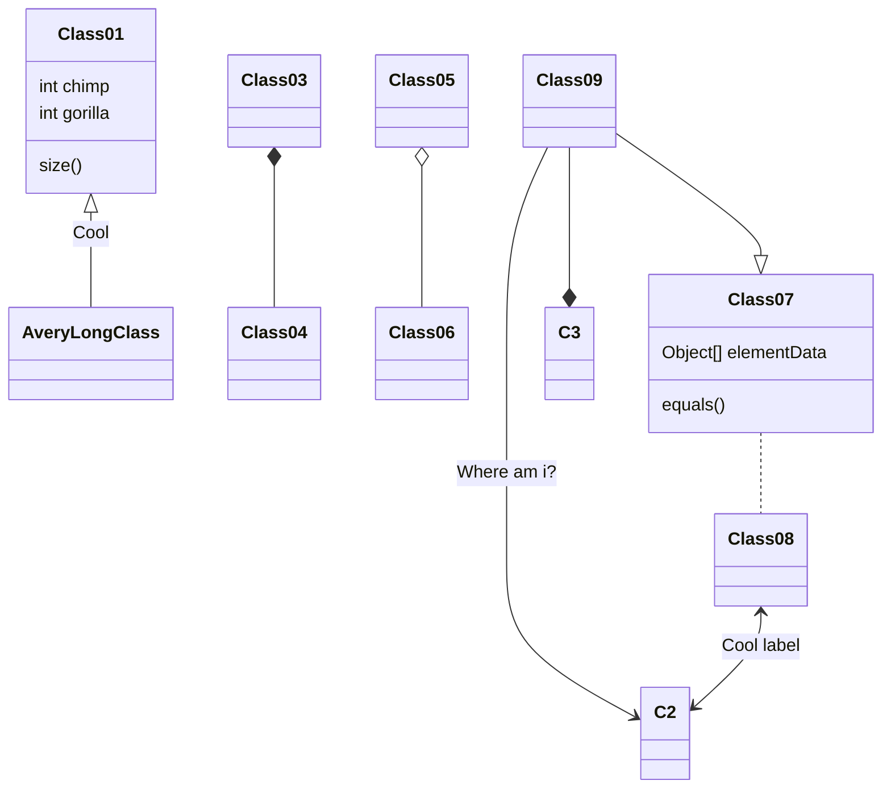
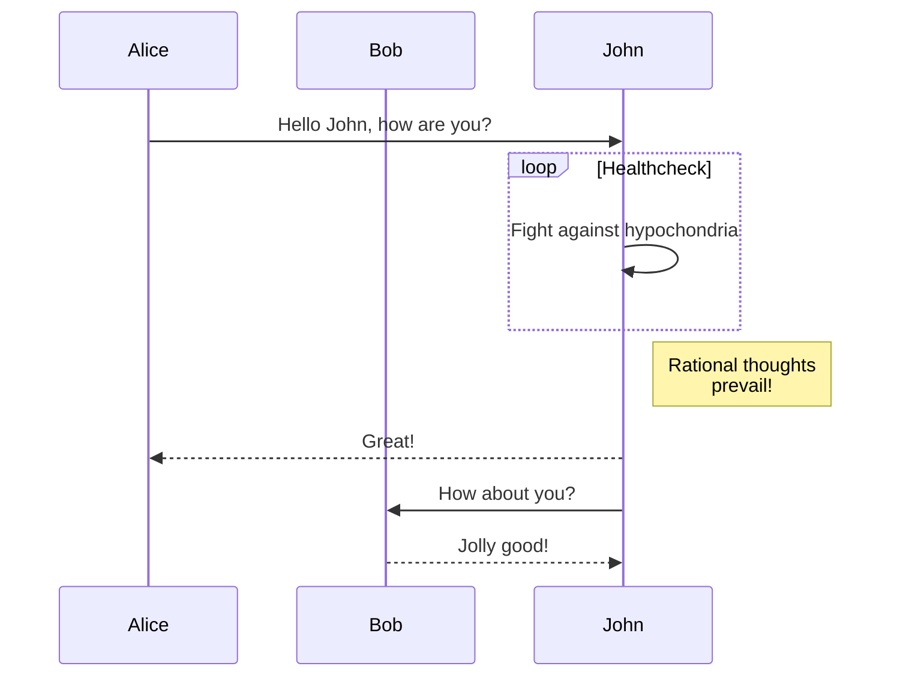
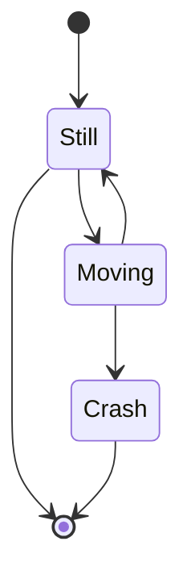
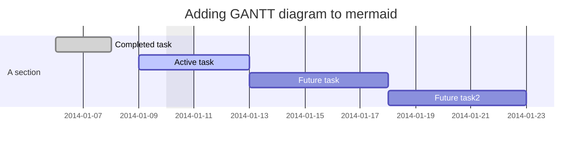
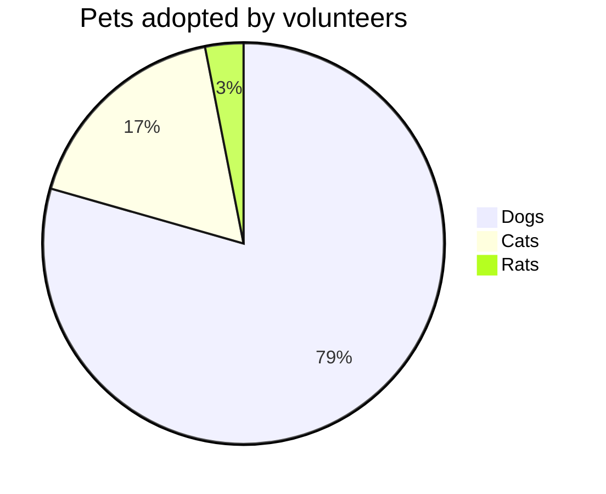
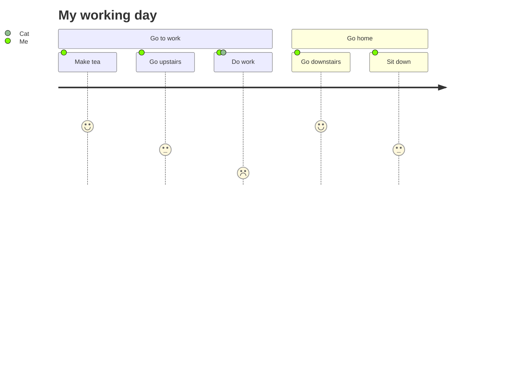
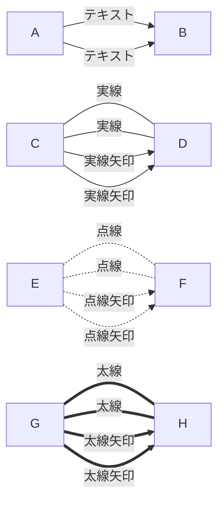

コードブロック内でMermaidを使用すると、図を記載することができます。  
GitLabやGitHubなどのmarkdownを使用しているサイトで利用できます。

````md title="Example Mermaid diagram"

````


## mermaid とは

[mermaid(github)](https://github.com/mermaid-js/mermaid)

mermaid はシーケンス図やガントチャート、フローチャートを、Markdown 形式のテキストで書くことができる。  
詳細については、[公式ドキュメント](https://mermaid-js.github.io/mermaid/#/)が分かりやすいので、そちらを参照。  
Javascript で web 上に描画する事もでき、mermaid の web ページや VSCode のプラグインでエディタ上でプレビューする方法もある。

GitLab 上では下記の markdown をそのまま記載すれば図が作成できる。

## メリット

- テキストで作成することで差分管理ができる。  
  **脱 Excel！**
- テキストエディタの機能が使えるため、一括の修正も用意である。
- javascript にて web 上で動作するため、比較的環境を選ばずできる。

## デメリット

- 普段コードを書かない人には難しい。
- 細部の見た目まで見た目を調整するのは難しい。

## mermaid で主に作成できる図

- フローチャート
- クラス図
- シーケンス図
- 状態遷移図
- ガントチャート
- 円グラフ

などなど

## 図の作成例

### フローチャート

markdown

````

````

作成される図


### クラス図

markdown

````

````

作成される図


### シーケンス図

````

````

作成される図


### 状態遷移図

markdown

````

````

作成される図


### ガントチャート

markdown

````

````

作成される図


### 円グラフ

markdown

````

````

作成される図


### ユーザージャーニー

markdown

````

````

作成される図


## mermaid-live-editor

mermaid を web 上で編集プレビューすることも出来る。  
https://mermaid-js.github.io/mermaid-live-editor/

## 記載例

### 方向

| 指定 | 方向     |
| ---- | -------- |
| TB   | 上から下 |
| BT   | 下から上 |
| LR   | 左から右 |
| RL   | 右から左 |

### ノード形状

markdown

````

````

作成される図


### 線

markdown

````

````

作成される図


### グルーピング

markdown

````
```mermaid
graph TB
    subgraph s1
        s1a --> s1b
    end
    subgraph s2
        s2a --> s2b
        s2a --> s1b
    end
```
````

作成される図

```mermaid
graph TB
    subgraph s1
        s1a --> s1b
    end
    subgraph s2
        s2a --> s2b
        s2a --> s1b
    end
```

markdown

````
```mermaid
graph LR
    subgraph s1
        s1a --> s2a
    end
    subgraph s2
        s2a[s2内にあってほしいノード]
    end

    subgraph s3
        s3a
    end

    subgraph s4
        s4a[s4内にあってほしいノード]
    end
    s3a --> s4a
```
````

作成される図

```mermaid
graph LR
    subgraph s1
        s1a --> s2a
    end
    subgraph s2
        s2a[s2内にあってほしいノード]
    end

    subgraph s3
        s3a
    end

    subgraph s4
        s4a[s4内にあってほしいノード]
    end
    s3a --> s4a
```

### 装飾

markdown

````
```mermaid
graph LR
    customnode --> normal
    style customnode fill:#f00,stroke:#fff,stroke-width:5px,stroke-dasharray:3

    customlink --> normal
    normalA --> normalB

    linkStyle 1 stroke:#ff3,stroke-width:4px,stroke-dasharray: 1
```
````

作成される図

```mermaid
graph LR
    customnode --> normal
    style customnode fill:#f00,stroke:#fff,stroke-width:5px,stroke-dasharray:3

    customlink --> normal
    normalA --> normalB

    linkStyle 1 stroke:#ff3,stroke-width:4px,stroke-dasharray: 1
```
