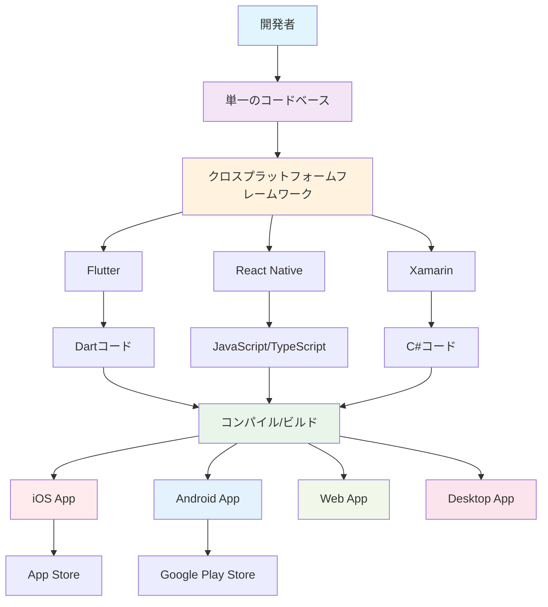
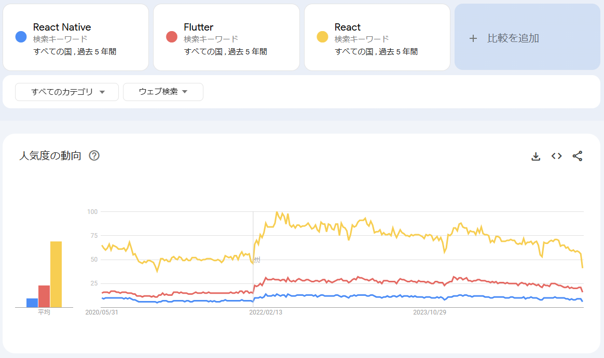

FlutterはGoogleが開発したDartベースのフレームワークで、React NativeはFacebookが開発したJavaScript/TypeScriptベースのフレームワークです。  

どちらもクロスプラットフォーム開発の人気フレームワークとしてよく比較されますが、アプローチや特徴が大きく異なります。

## クロスプラットフォーム開発とは

クロスプラットフォーム開発では、一つのコードベースでiOSとAndroidの両方のアプリを開発できます。これにより開発効率が大幅に向上し、保守性も高まります。

### ネイティブ開発との違い

従来のネイティブ開発では、iOSは`Swift`/`Objective-C`、Androidは`Kotlin`/`Java`といった異なる言語とツールチェーンが必要でした。クロスプラットフォーム開発では、一つの技術スタックで両プラットフォームに対応できます。

### クロスプラットフォーム開発の利点

- **開発効率**: 一つのコードベースで複数のプラットフォームに対応できるため、開発時間を大幅に短縮できます。  
- **保守性**: バグ修正や機能追加を一箇所で行えるため、メンテナンスコストが削減されます。  
- **一貫性**: 両プラットフォームで同じUIとUXを提供できます。

## Flutterとは

FlutterはGoogleが開発したオープンソースのUIツールキットで、Dartプログラミング言語を使用します。

### Flutterの特徴

Flutterは独自のレンダリングエンジンを持ち、ネイティブコンポーネントを使用せずに直接キャンバスに描画します。これにより、プラットフォーム間での一貫したUIを実現し、高いパフォーマンスを提供します。

Flutterの大きな特徴の一つは「`Hot Reload`」機能で、コードの変更を瞬時にアプリに反映できるため、開発効率が大幅に向上します。

また、Flutterはモバイルアプリだけでなく、Web、デスクトップアプリケーションの開発にも対応しており、真の意味でのクロスプラットフォーム開発が可能です。

### Dartとの関係

DartはGoogleが開発したプログラミング言語で、Flutterの開発に最適化されています。JavaScriptに似た構文を持ちながら、型安全性とパフォーマンスを両立しています。

## React Nativeとは

React NativeはFacebookが開発したフレームワークで、ReactとJavaScript/TypeScriptを使用してモバイルアプリを開発できます。

### React Nativeの特徴

React Nativeは「`Learn once, write anywhere`」の哲学に基づいており、Reactの知識があれば比較的容易にモバイル開発を始められます。

React Nativeはネイティブコンポーネントを使用するため、各プラットフォームのネイティブなルック&フィールを保持できます。これにより、ユーザーにとってより自然なアプリ体験を提供できます。

また、既存のネイティブコードとの統合が容易で、段階的な移行や部分的な導入が可能です。

### Reactとの違い

ReactはWebアプリケーション開発のためのライブラリですが、React Nativeはモバイルアプリ開発に特化したフレームワークです。Reactの概念（コンポーネント、state、propsなど）を活用しながら、モバイル特有の機能やUIコンポーネントを提供します。

## FlutterとReact Nativeの違い

FlutterとReact Nativeは、どちらもクロスプラットフォーム開発に優れたフレームワークですが、アプローチや特徴が大きく異なります。  
人気度では、React Nativeが先行していましたが、近年Flutterが急速に成長しています。

|       | Flutter      | React Native |
|-------|--------------|--------------|
| Stars | 171k | 122k |
| Watchers | 3.5k | 3.6k |
| Forks | 28.6k | 24.7k |

|                | Flutter                           | React Native                    |
|----------------|-----------------------------------|---------------------------------|
| リポジトリ          | https://github.com/flutter/flutter | https://github.com/facebook/react-native |
| 開発言語           | Dart                              | JavaScript/TypeScript           |
| レンダリング方式       | 独自エンジン（Skia）                      | ネイティブコンポーネント                    |
| パフォーマンス        | 高い（ネイティブに近い）                      | 中程度（ブリッジのオーバーヘッドあり）             |
| 学習コストの低さ       | 中程度（Dartの習得が必要）                  | 低い（JavaScript/React知識活用可能）      |
| UI一貫性          | 高い（全プラットフォームで同一）                  | 中程度（プラットフォーム固有のルック&フィール）       |
| エコシステム         | 成長中                               | 成熟                              |
| 企業サポート         | Google                            | Meta（Facebook）                 |
| 対応プラットフォーム     | Mobile, Web, Desktop, Embedded    | Mobile, Web（限定的）               |

### 選択の指針

**Flutterを選ぶべき場合**

- 高いパフォーマンスが必要
- 全プラットフォームで統一されたUIが必要
- Web/デスクトップアプリも視野に入れている
- 新しい技術への挑戦を厭わない

**React Nativeを選ぶべき場合**

- 既存のReact/JavaScript開発チームがある
- プラットフォーム固有のネイティブなUXを重視
- 豊富なサードパーティライブラリを活用したい
- 既存のネイティブアプリとの統合が必要
