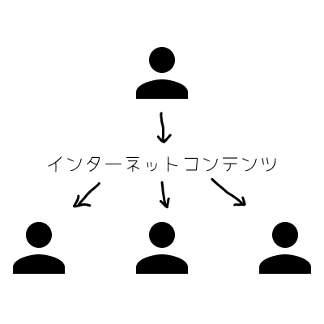
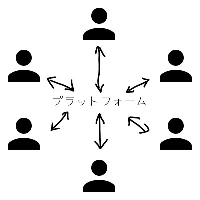
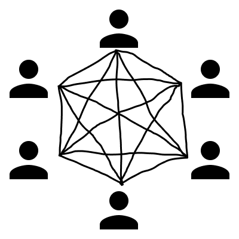

## Web3の概要
:::tip
Web3（Web3.0）は、インターネットの歴史におけるWeb1.0、Web2.0に続く「第3世代」や、ブロックチェーン技術を用いることでインターネットがさらに分散化の度合いを強めた姿（ブロックチェーンやP2P（Peer to Peer）など）を指す言葉。  

（読み：ウェブスリー）
:::

Web1.0/Web2.0との違いを利用者視点でみると、コンテンツ閲覧が中心の一方向コミュニケーションがWeb1.0、プラットフォーマーの登場によりコンテンツ閲覧に加え自らコンテンツを生み出し発信する双方向コミュニケーションが可能になったものがWeb2.0と言えます。一方、Web3ではデータの所有や信頼性担保、決済処理などのインターネット上のコンテンツ運用の仕組み自体が利用者側に分散化されることで、非中央集権型の新しいエコシステムが創出できるとして注目を集めています。

| Web1.0 | Web2.0 | Web3 |
| ---- | ---- | ---- |
|  |  |  |
| コンテンツ閲覧のみの一方向のコミュニケーション | コンテンツ閲覧・発信の双方向のコミュニケーション | 閲覧・配信に加えコンテンツの運用の仕組みも利用者側に分散 |

:::tip
Web2.0をわかりやすく言うと

例えば日経のサイトを見ると、誰が見ても同じページです。でもYouTubeのトップページは人によって違います。要は見ている人によって、この人はこれが好きだろうとか、ユーザー情報を使って表示する情報を変えるというのが、今までの同じものをずっと送り続けるWeb 1.0とWeb 2.0の違いです。

これをティム・オライリーという人が提言しました。
:::

## Web3の特徴
Web3は、①非中央集権化、②相互検証可能な透明性、③自己主権性、④自律性という4つの特徴を持ちます。これらは、ブロックチェーン技術という、「信頼できる第三者」を介在させずに参加者相互による分散型の合意形成を実現し、すべての取引の監査証跡管理を可能にする技術に基づいて実現されています。

### ①非中央集権化（Decentralization）
パブリックブロックチェーン上のデータやサービスは、基本的にネットワークの参加者間で共有されているため、特定のプレーヤーに権限が集中することがない。

### ②相互検証可能な透明性（Transparency）
取引データはブロックチェーンにより「ブロック」と呼ぶファイルにまとめられ、複数の検証者によって改ざんされないように確定される。悪意のある人が取引データを改ざんしようとする場合、他の人がもつブロックを含めすべてのブロックを改ざんする必要がある。そのため、ブロックチェーンは参加者同士の間で公開されながらも改ざんが困難な透明性の高いデータになる。

### ③自己主権性（Self-sovereignty）
ブロックチェーンは、特定の組織が統治権を持たない分散型システムである。参加者は個人であり、個々人の身元の証明に必要なデータは暗号技術を使って自分自身で管理しながら価値を取引することができる。その反面、自身の身元に関するデータを管理する上でのセキュリティ対策は自己責任に委ねられる。

### ④自律性（Autonomy）
ブロックチェーン上の取引をトリガーにして自動実行できる処理プログラム「スマートコントラクト」を使って、様々なサービスを構築できる。処理内容はプログラムで自由に定義でき、「トークン」と呼ばれる価値単位を使用し、処理開始から取引完了までが自動的に行われる。「トークン」は、エンドユーザー同士の直接の価値交換やサービス利用料に使用され、これにより、サービスを自己責任で構築し利用する「自律性」が実現できる。

## Web3の分類と具体例
主に以下のような領域で新しいサービスが登場しています。

### NFT（Non-Fungible Token：ノンファンジブルトークン：非代替性トークン）
偽造不可な鑑定書と所有証明書付きのデジタルデータで「所有者の明確化」をすると同時に「希少性の担保」が可能でコレクターや投資家の投資商品となっている。

### DeFi（Decentralized Finance：ディセントラライズドファイナンス：分散型金融）
これまで銀行や政府等が行っていた貸付・借入や投資、さらには通貨発行なども含む一連の金融サービスを、管理主体がない方法で実現する仕組み。
DeFiのサービスは、人ではなくブロックチェーンを利用した「スマートコントラクト（契約の自動執行）」により稼働されているため、透明性が高いと言われている。

### Metaverse（メタバース：３次元の仮想空間）
コンピュータやコンピュータネットワークの中に構築された、３次元の仮想空間やそのサービスを指す。「人」はアバター（デジタル上の分身）で表現される。
メタバース上の土地やアイテムがNFTとして取引も行われている。

## Web3.0の胡散臭さと面白さ
Web3を調べた堀川の感想です。

### テックドリブンでデザインがない
Web3は技術参考、マーケティングでいうシーズからのプロダクトアウトで語られており、活用される世界観がまだ明確に見えておらず、何となく儲かるということで流行っているように感じます。断続的な革新は天才的なシーズから生まれますが、基本は活用とセットであると思います。活用の全体デザインができていないのに、技術に飛びつくとVCとその背後にいるLPに搾取される構造になっているのではないか？という違和感を感じました。Web3はラベルが違うだけで、結局は中央集権型のように感じました。

### Web3はレジスタンスではない
Web3の議論を見ていると「GAFAがインターネットの情報を牛耳っている状態は許せない」「インターネットを再び自分たちの元へ」という論調の声が大きいです。ブロックチェーンをベースにし、非中央集権型のソーシャルモデルを実現するという点で、レジスタンス的な論調だと思います。インテリの机上の空論ぽいです。

声の大きい人の多くが、上場ゴールを決めた人や情報商材屋、仮想通貨で一儲けした人、もしくは儲け損なったのでリベンジを決め込んでいる人が多いのが気になりました。
その人たちがFIREをするための手段としてWeb3を商材として使い、GAFAで発信してPVで換金しているので臭いです。

### ブロックチェーンは面白そう
調べる前まではブロックチェーンといえば、ビットコインなどのような暗号資産（仮想通貨）のイメージでしたが技術自体は、（第三者が関与する仕組み）ステークホルダーによる相互牽制力が働くようになっているのは面白かったです。
ブロックチェーンでは、アプリケーションプログラムが格納した取引情報を、通信相手に確実に渡すことができ、通信履歴がネットワーク基盤上に残されるため、通信内容を検証できるところに魅力を感じました。

また、51％攻撃といった全体のハッシュパワーの50％以上を攻撃者が保有することで、不正な取引を正当化したり、正当な取引の記録を拒否したりできる攻撃手法も存在することに、野蛮ですがワクワクしました。

## 参考
- [NRI）Web3 | 用語解説](https://www.nri.com/jp/knowledge/glossary/lst/alphabet/web3)
- [NEC）Web3.0とは？ 実現にむけたデジタルアイデンティティの重要性](https://wisdom.nec.com/ja/feature/digitalfinance/2022100301/index.html)
- [NTTテクノクロス）ブロックチェーンとは？](https://www.ntt-tx.co.jp/products/contractgate/nyumon_01.html)
