## 海外カオスマップ
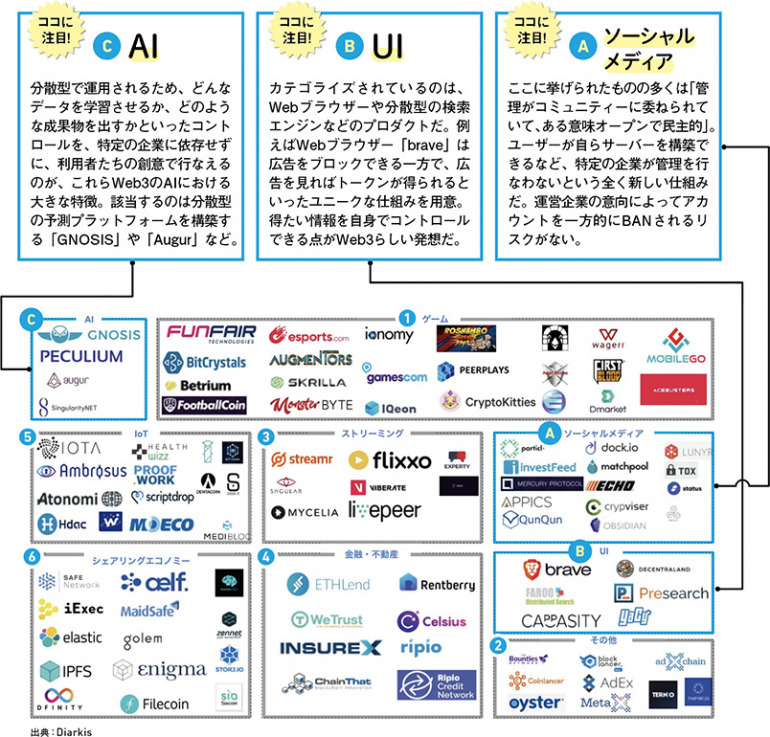

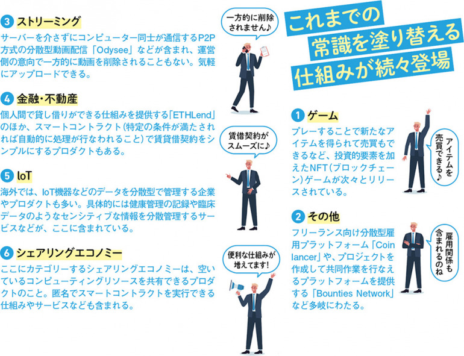

## 国内カオスマップ
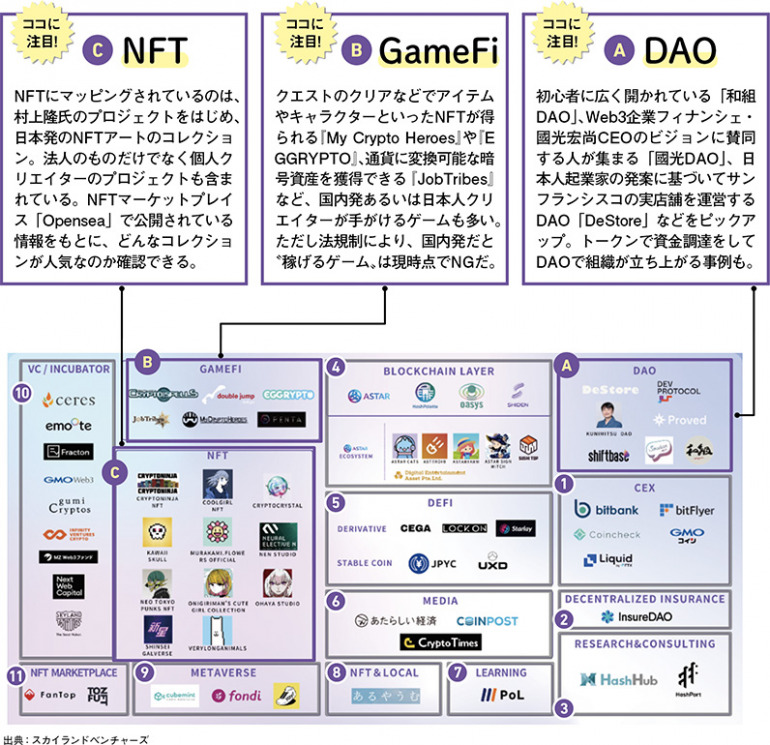

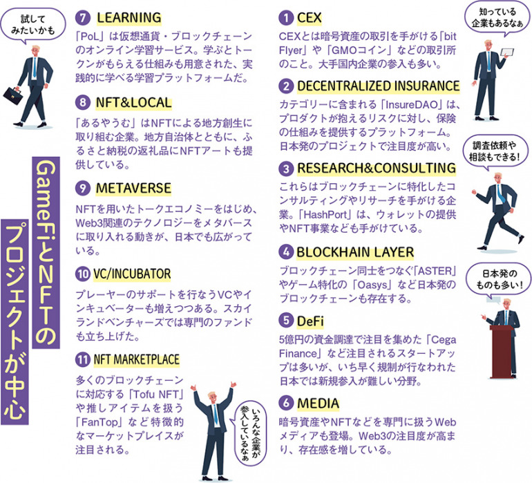

## 国内カオスマップex
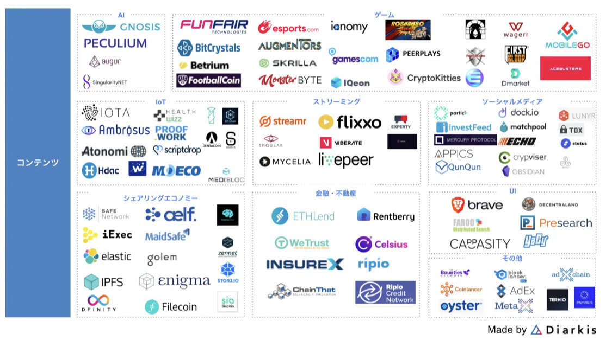

## 参考
- [どこまで進んでいる？国内外で始動したWeb3プロジェクトとサービスのカオスマップ](https://dime.jp/genre/1494620/)
- [Web3 カオスマップ](https://digital-shift.jp/flash_news/FN220218_1)

## 事例
### Brave（検索エンジン）
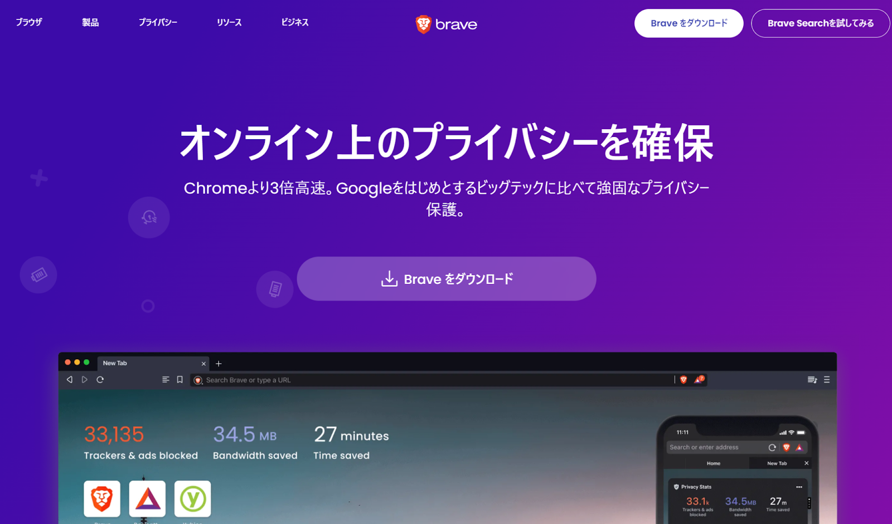

Braveは2019年にサービスを開始したブラウザ。圧倒的シェアを誇るブラウザGoogle Chromeと同等以上の性能を持ちながら、プライバシーやデータを守ることを目的として開発されている。

2020年の角川アスキー総合研究所が実施した調査では、Braveの表示速度は主要ブラウザの中で最速であるという結果。公式によると、Google Chromeより3倍高速に動作する。

Braveでは、Brave独自の広告（Braveプライベート広告）を表示することで、仮想通貨BAT（ベーシックアテンショントークン）を報酬として受け取ることができる、Brave Rewards（Braveリワード）という機能がある。

### Steemit（ソーシャルネットワーク）
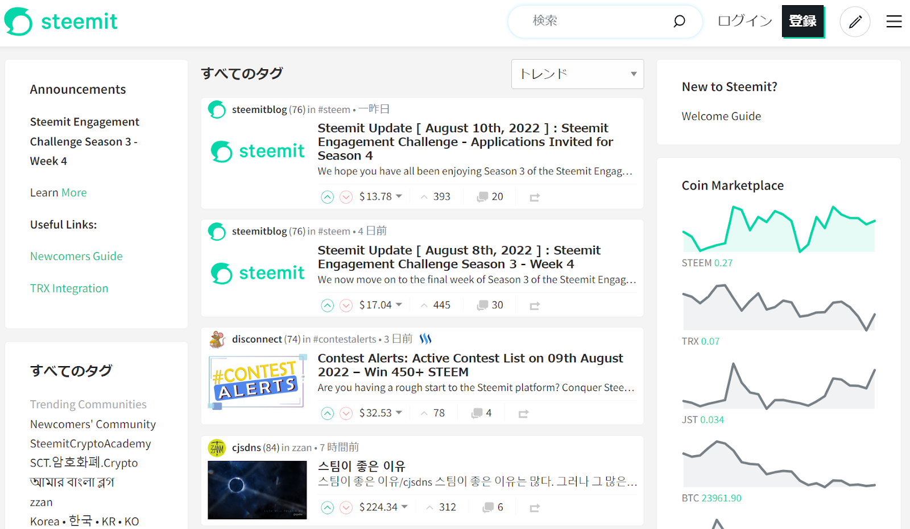

Steemit は、ソーシャルブロックチェーンである Steem 上で開発された、暗号資産によってコンテンツクリエイターにインセンティブ（報酬）を支払うソーシャルプラットフォーム。 Steem は、 Steemit のようにリアルタイムで動くアプリケーションをサポートする、唯一のブロックチェーンをベースとしたソーシャルメディアモデルであると謳われている。

コンテンツがブロックチェーンネットワーク上に保存されるという特徴を有している。ブロックチェーンを利用することにより、前述のインセンティブの支払い、ユーザーやコンテンツの透過性等が実現できる。

Steemit が他のソーシャルメディアサービスと異なり競合優位性を持つ点として、独自のインセンティブのロジックがあります。 Steemit では、ユーザーは投稿とコメントに評価を投票することが可能で、投票された記事の執筆者は Steem Dollars という仮想通貨で報酬を受け取ることができる。

### IPFS（クラウドストレージ）
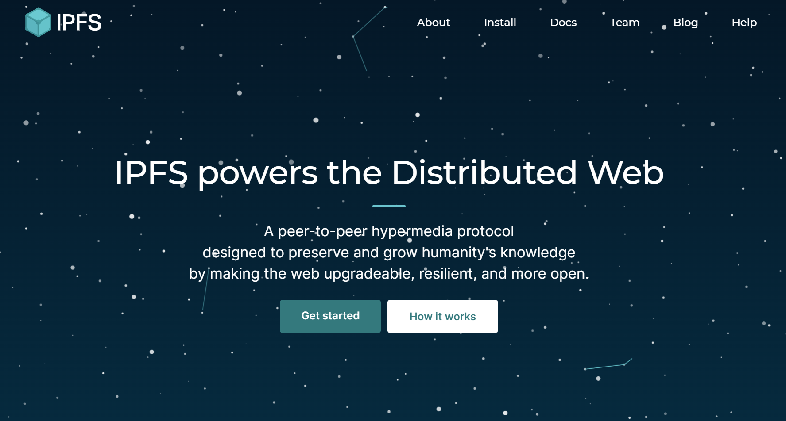

「IPFS」は、Web3の技術を用いたクラウドストレージサービス。メタバースプラットフォームなどの根幹を支える技術としても知られている。

IPFSは「InterPlanetary File System」の略称で、「分散型ファイルシステム」の意味を持ちます。一般的なHTTPプロトコルではなく、分散型の「Filecoin」というP2Pプロトコルが使用されていることが特徴。

この仕組みによってサーバーへのリクエストを分散できるため、「通信速度が向上する」「ハッカーの攻撃を受けにくい」「安全にデータを保管できる」といった利点がある。

### The Sandbox（ブロックチェーンゲーム・DApps）
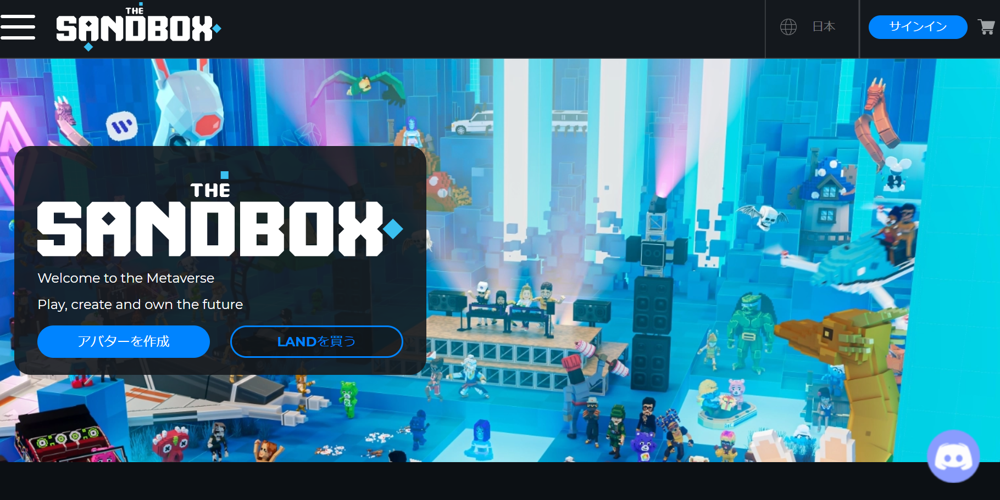

「The Sandbox」とは、仮想空間のメタバース内でアバターを操作して遊ぶブロックチェーン上で提供されているNFTゲーム。

The Sandbox内でユーザー同士が交流できることはもちろん、ゲームしながら稼げる「Play to Earn」としても注目されている。

例えば、The Sandbox内で所有する土地（LAND）の賃料や、NFT化された建物やアイテムの売却益を得ることが可能。取引や交流には、暗号資産の「SAND」が用いられている。

### OpenSea（NFTマーケットプレイス）
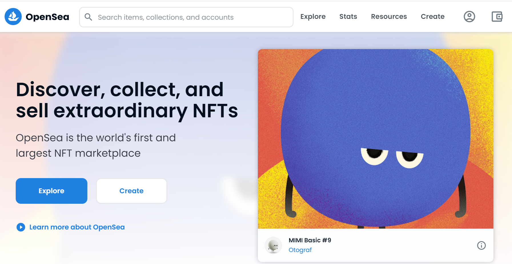

OpenSeaとは、2017年に米・ニューヨークで設立されたNFTマーケットプレイス。アートや音楽をはじめとするNFT作品の、取引・生成・管理・オークション出品などを、オンライン上で実行できる。

OpenSeaは、NFTマーケットプレイスとしては海外では最大級で、出品数も豊富。

決済で利用できる暗号資産は、「ETH」「SOL」「USDC」などに対応しており、ウォレットと連携することで、個人間でNFTの取引が可能になる。

### Ethereum（プラットフォーム）

分散型のアプリケーションを動かすための、プラットフォームです。主要な機能として、さまざまな契約を自動的に締結できる「スマートコントラクト」がある。

認証機関を必要とせず当事者間での契約が行えるもので、この機能を用いて多くの分散型アプリケーションが作られている。

信頼性の高い仮想通貨というイメージが強いですが、仮想通貨はあくまでプラットフォーム内の通貨として開発されている。

### Nishikigoi NFT（DAO・NFT）

新潟県長岡市山古志は錦鯉をシンボルにしたNFTアート「Colored Carp」を発行および発売し、急激に人口減少が進む山古志地域（旧山古志村）の地域活性化施策を行っている。

「Colored Carp」のNFTを購入した人はデジタル住民票を得ることができ、専用のコミュニティチャット内（Discordを使用）で意見を発信することができる。NFTの販売収益の使い方をコミュニティメンバーが意見を出し合ったり投票するなどして新たな地域づくりをすることを目的としている。

### 飯塚市ブロックチェーン推進宣言（ブロックチェーン）
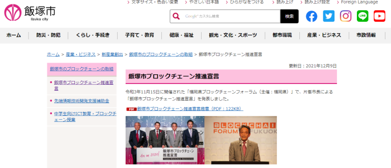

福岡県飯塚市ではブロックチェーン技術を活用した社会実験を行っており、生活に密接するサービスにブロックチェーンを活用している。

一例として、住民票等各種証明書の申請と交付を住民所有の端末から作成可能とする仕組みの実証実験がある。ブロックチェーン技術を活用し、不正改ざんを見つけやすくすることで電子文書の信頼性の保証を実現している。また、窓口での手続きが必要ないことから、コロナ禍による非接触の行政サービスとしても期待されている。

### NOT A HOTEL（NFTプラットフォーム）
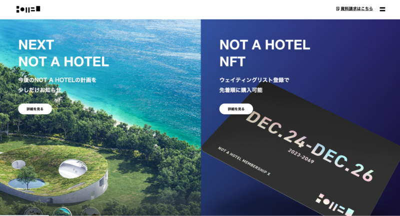

NOT A HOTELとは、2022年8月に開始した、別荘の所有権をNFTで販売するサービス。
購入した別荘は、使用していない時間にホテルとして貸し出すことができるため、所有者は不動産を無駄なく運用できる。

なお、別荘を購入する以外にも、サービスの活用法がある。
「MEMBER SHIP」と呼ばれる会員権NFTを購入すると、毎年ランダムに決められた旅行先と宿泊日で旅行体験を楽しめる。

NFTは1口125万円と非常に高額だが、新たな旅行の形をNFTの技術で実現している。

### HIS トラベルワールド（メタバース）
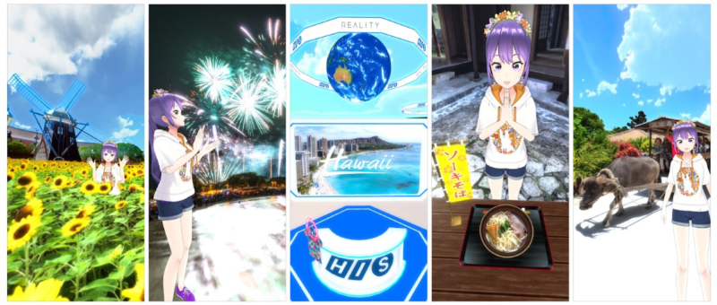

HIS トラベルワールドとは、スマートフォン向けメタバース「REALITY World」内にバーチャル支店として、期間限定で設立されたメタバース。
REALITY Worldは、株式会社エイチ・アイ・エスとグリー株式会社の100%子会社であるREALITY株式会社が運営している。

HIS トラベルワールド内では、ハワイ、沖縄、ハウステンボスをはじめとする人気エリアが設けられており、アバターの自撮りが楽しめる空間となっている。
また、ワールド内に掲載されたQRコードを読み取ると、HISサイトにアクセスして旅行の予約ができる点も特徴的。

### バーチャル大阪（メタバース）
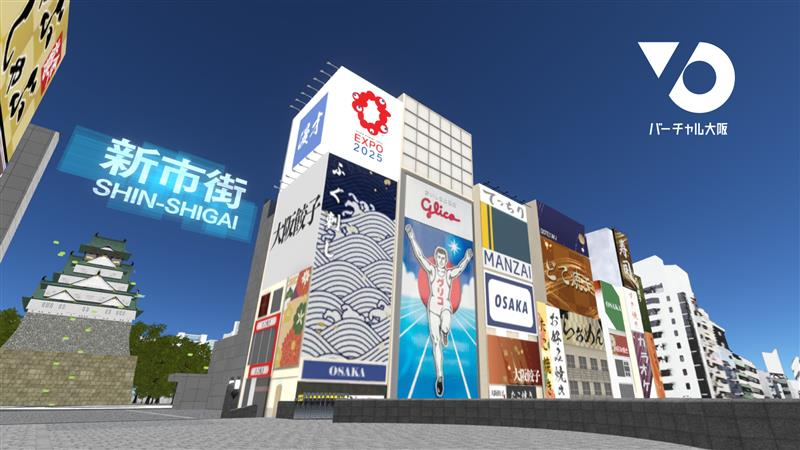

バーチャル大阪とは、大阪の観光地をメタバース常に構築するプロジェクト。
大阪府、大阪市、KDDIが共同で作成しており、PCやスマートフォンから「cluster」というアプリをダウンロードすることで参加できる。

メタバース上では大阪の魅力を発信すべく、道頓堀・大阪城・梅田スカイビルなどの観光地が構築されている。
また、メタバース上でライブや参加型イベントなどを実施しており、将来的にはショッピングを楽しめるようにする構想も生まれているそう。

### CRYPTO SPELLS（ブロックチェーンゲーム・DApps）
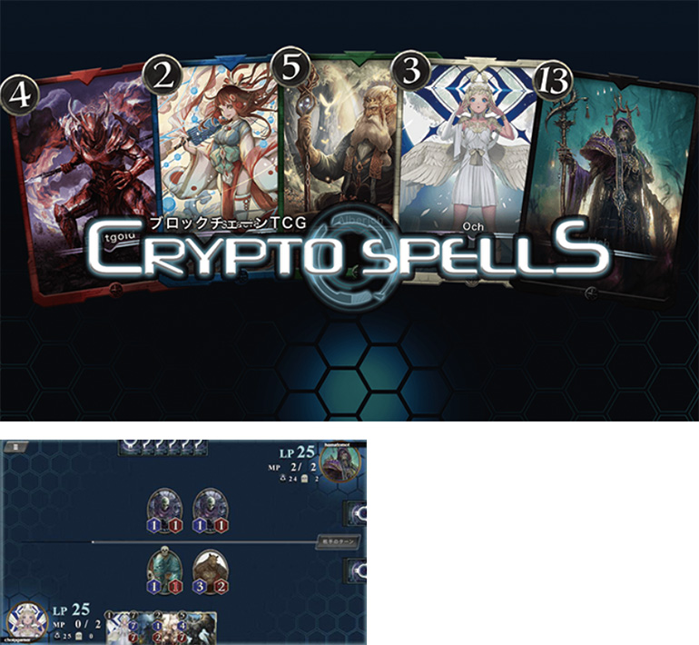

日本発のブロックチェーンを用いたトレーディングカードゲーム。

カード（NFT）をマーケットで自由に売買できるほか、ゲーム内で獲得できるカード発行権を使ってオリジナルのカードも発行できる。提携しているほかのブロックチェーンゲームへ、カードを転送することも可能。無料で始められるのも魅力。