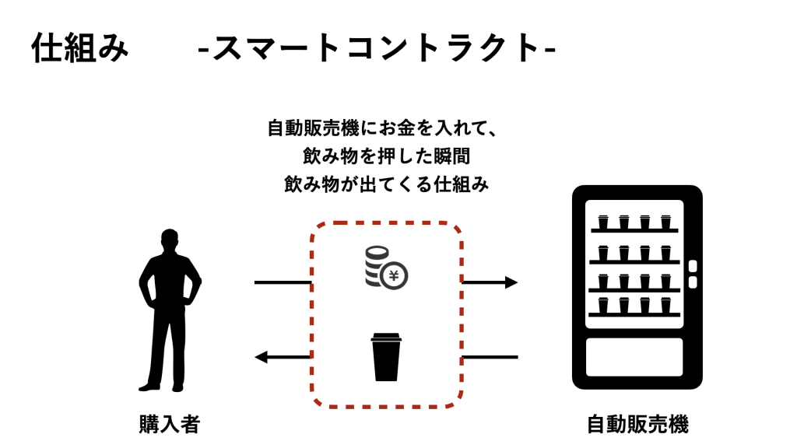

スマートコントラクトとは、様々な契約を自動で実行する仕組みのことです。  
よく例えられるものとして、自動販売機にお金を入れて、飲み物を押した瞬間飲み物が出てくる（契約が成立する）イメージが似ています。  

イーサリアムのプラットフォームに自動で実行できるプログラムとして埋め込むことも可能です。

スマートコントラクトの契約はプログラミング言語で組まれています。  
P2Pのネットワーク上でブロックチェーンに記述されているため、契約の透明性が確保されているのが特徴です。  

サービスの管理者が存在しない状態でも、消費者同士で通貨の移動を自動処理するプログラムとして機能します。

## 他のプログラムとの違い
イーサリアムのスマートコントラクトとの大きな違いは「一度埋め込んだプログラムを変更できない」ことです。

例えば、「誰かが電子アイテムを1つ送ったら、プラットフォームから3ETHが配布される」とします、実際にこのスマートコントラクトを利用して、Aさんが電子アイテムを送り、3ETHが配布されたとします。

しばらくして、この内容を「誰かが電子アイテムを3つ送ったら、プラットフォームから10ETHが配布される」というものに変更したいと思ったとします。

通常のプログラムの場合、元のプログラムの数字を変更すれば契約内容を変更可能です。

ですが、イーサリアムのスマートコントラクトは一度埋め込んだプログラムを変更できません。ですのでまた新しく「誰かが電子アイテムを3つ送ったら、プラットフォームから10ETHが配布される」というプログラムを埋め込む必要があります。

そしてこれを適用した上で、電子アイテム3つを送った場合10ETHが配布されるのです。

その時最初のスマートコントラクトである「誰かが電子アイテムを1つ送ったら、プラットフォームから3ETHが配布される」を適用しなければ実行されません。

## スマートコントラクトが可能にすること
イーサリアムのスマートコントラクトを応用すると、「`Dapps`：`Decentralized Applications`」と呼ばれるアプリケーションを使用できます。

これは、分散型アプリと言われ、特定の管理者・運営者がいなくても稼働し続けるアプリです。

普段身近に私たちが使用しているアプリは特定の運営者がいます。そして問題が起きれば修正をしたり新しい機能を追加していきます。

しかしDappsは特定の管理者や運営者がいない状態でも、公開後常に稼働し続けます。
そしてそのアプリが動いている状態を誰もが確認することが可能になっています。
