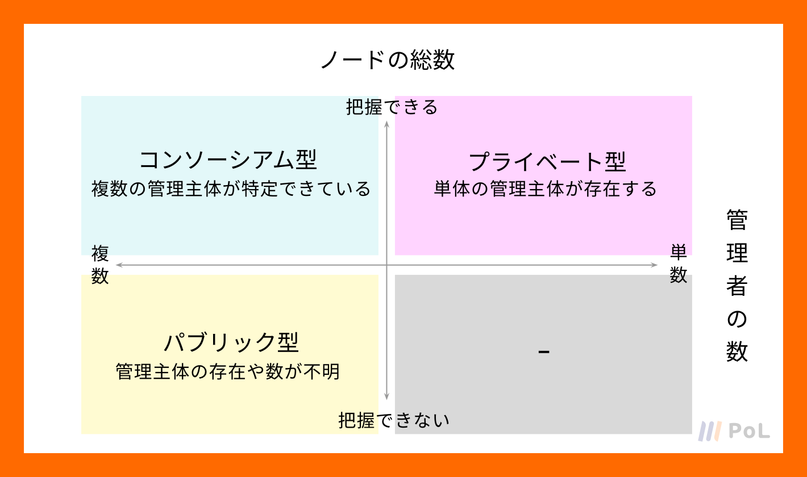
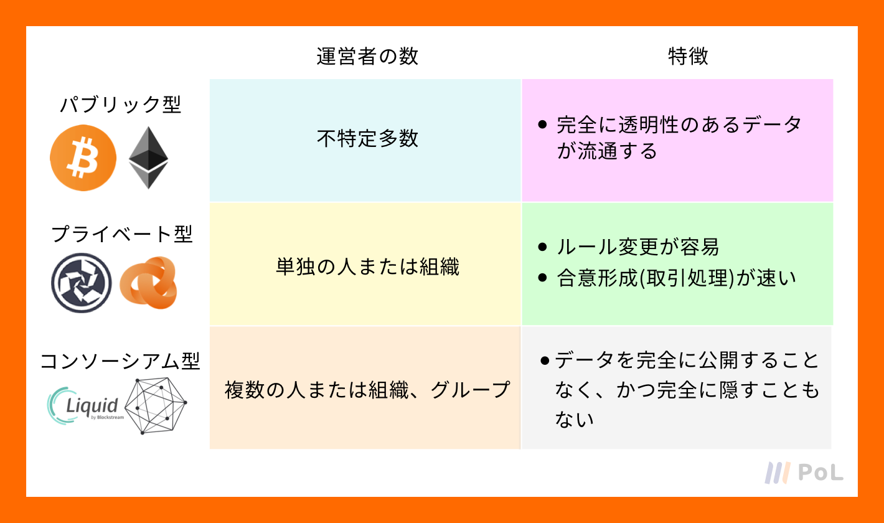

ブロックチェーンには、「ビットコインのブロックチェーン」や「イーサリアムのブロックチェーン」といったプロジェクトごとの分類以外に、「パブリック型」「プライベート型」「コンソーシアム型」といった3つの種類が主に存在します。

これらは、ブロックチェーンを構成するノードの総数を把握できるかどうか、管理者の数は複数か単数か、といった観点で分類することができます。

## パブリックチェーンの概要
パブリック型のブロックチェーンは「パブリックチェーン」と呼ばれ、ブロックチェーンと呼ばれるものはほとんどがこのパブリックチェーンに該当します。

そのため、「ブロックチェーン=パブリックチェーン」という前提のもとに議論が進むことがほとんどです。

パブリックチェーンは無数のマイナーによって管理されているため、特定の企業などの運営者がおらず、記録されるデータも全て公開されてるため、文字通り非中央集権を実現しています。

パブリックチェーンの代表例は、ビットコインやイーサリアムになります。

## プライベートチェーンの概要
パブリックチェーンと対をなすものがプライベート型のブロックチェーンです。

これは「プライベートチェーン」と呼ばれ、特定の運営者が存在し、記録されるデータの編集・削除が可能であり、非公開の状態になっています。

## コンソーシアムチェーンの概要
コンソーシアム型のブロックチェーンは「コンソーシアムチェーン」と呼ばれ、イメージとしてはパブリックチェーンとプライベートチェーンの間に位置します。

特定できる多数の運営者で管理しデータはその運営者にだけ公開しよう、というものです。

パブリックチェーンはデータが全て公開されるためプライバシーの問題が懸念される、かといってプライベートチェーンではブロックチェーンの特徴を活かし切れない。

こういった場面では、コンソーシアムチェーンが適しているのです。  
従って、コンソーシアムチェーンは同業他社が協力して形成するケースが多くなっています。

コンソーシアムチェーンの代表例は、Blockstream社を中心に約20の取引所が参画する「Liquid Network」やLinux Foundationを中心に30以上のIT企業が参画する「Hyperledger」などになります。

## まとめ

