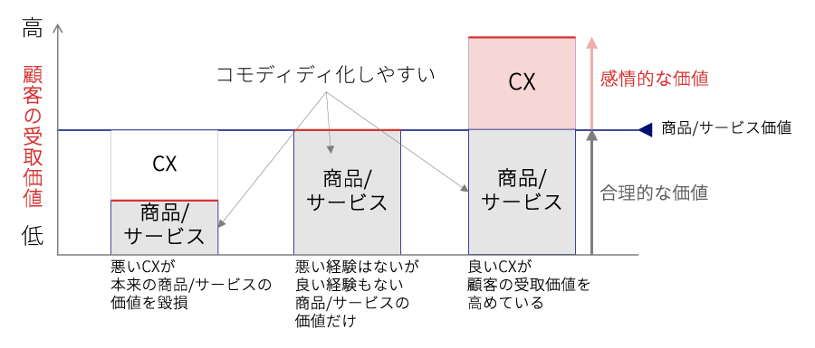
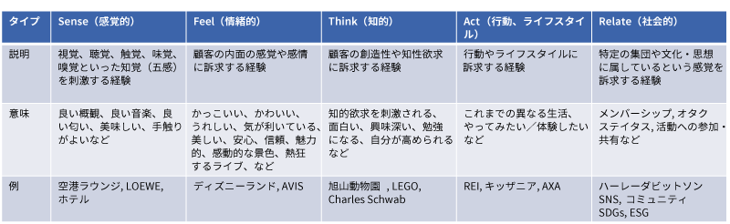

## CX（カスタマー・エクスペリエンス）とは？
CXとは、2000年ごろから注目され始めたマーケティングや経営戦略のコンセプトで、商品やサービスの機能・性能・価格といった「合理的な価値」だけでなく、購入するまでの過程・使用する過程・購入後のフォローアップなどの過程における経験「感情的な価値」の訴求を重視するものです。

日本語では「顧客経験価値」「顧客体験価値」という用語が使われています。
（読み：シーエックス）

## なぜCXが重視されるのか
多くの業界で共通することですが、機能・性能・価格といった合理的な価値はコモディティ化しやすく、それだけでは自社の特徴を出したり他社と差別化したりすることが難しい状況になっています。

CXでは、合理的な価値に感情的な価値を上乗せすることで、「顧客の受取価値」全体を押し上げ、差別化を図ります。

:::tip

コモディティ化とは、市場投入時に高付加価値の製品やサービスと認識されていたものが、市場が活性化した結果、他社が参入しユーザーにとって機能や品質などで差がなくなってしまうことを指すマーケティング用語

:::

## 感情的な価値とは
感情的な価値といっても、人には多くの感情があり、どのような感情的な価値を訴求すべきか迷います。

以下では、『経験価値マネジメント』の著者であるバーンド・H・シュミットが整理した感情的な価値の種類で、

- Sense（感覚的）
- Feel（情緒的）
- Think（知的）
- Act（行動、ライフスタイル）
- Relate（社会的）

の5つに分類しています。

昨今話題となっているSDGsやESGのような企業活動は、Relateに分類される感情的な価値として訴求することができます。

:::tip

SDGs（エスディージーズ）とは、「Sustainable Development Goals」の略で、日本語では「持続可能な開発目標」という指針

:::

:::tip

ESG（イーエスジー）とは、Environment（環境）、Social（社会）、Governance（ガバナンス（企業統治））の略で、企業の長期的・持続的な成長のために、環境や社会への配慮・取り組み、企業統治の向上が重要だという考え方を示す用語

:::

参考：『経験価値マネジメント』、バーンド・H・シュミット著、野村総合研究所
