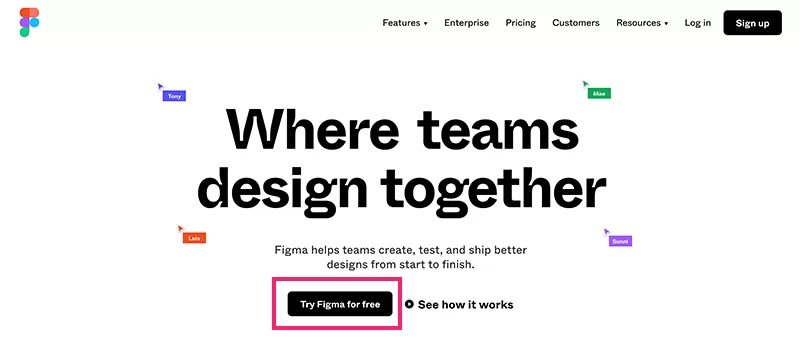
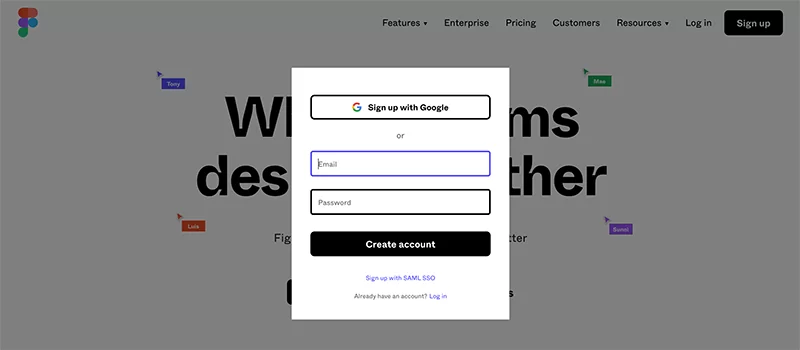
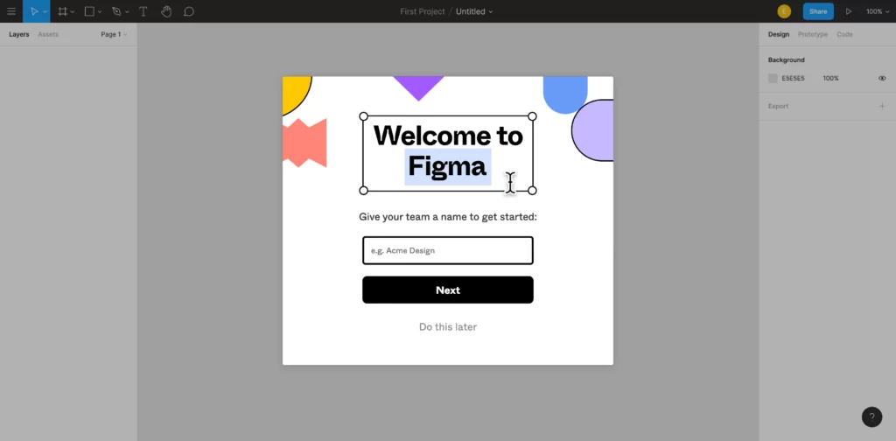
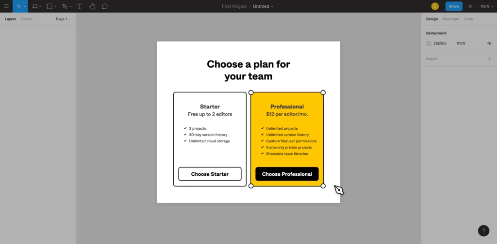
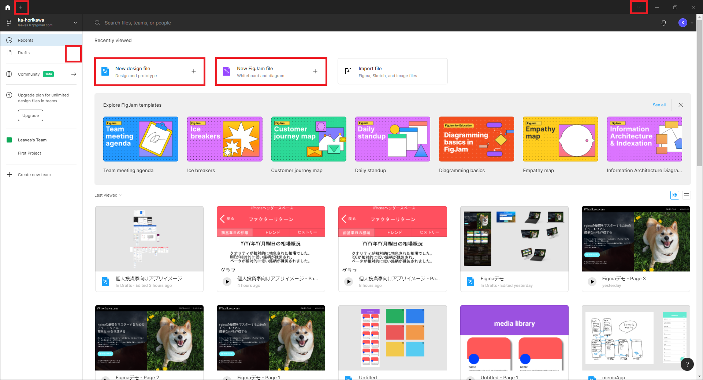
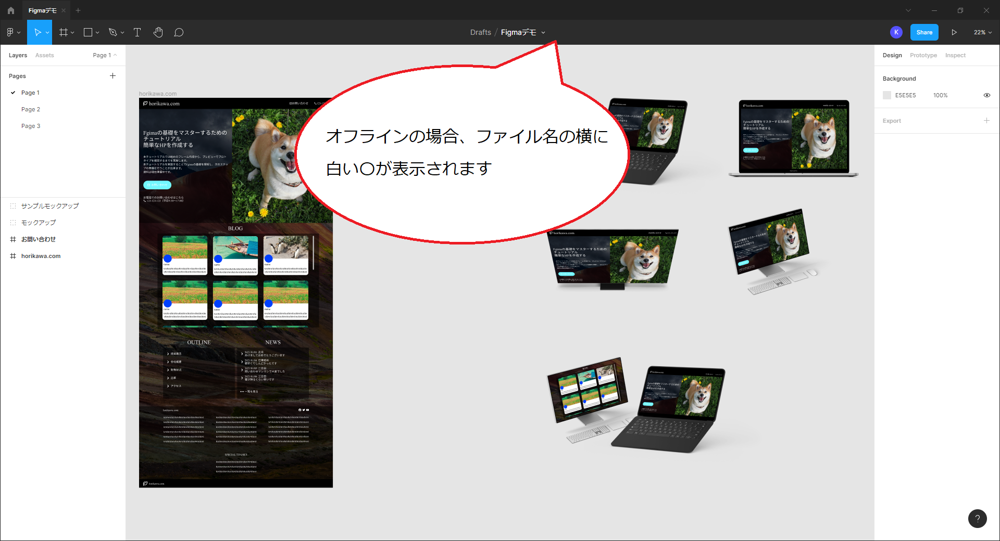
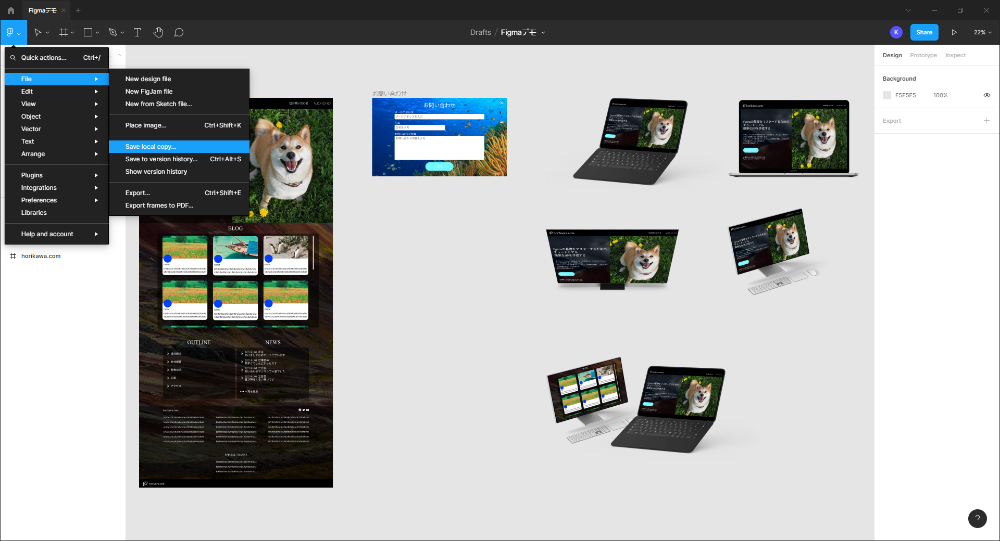
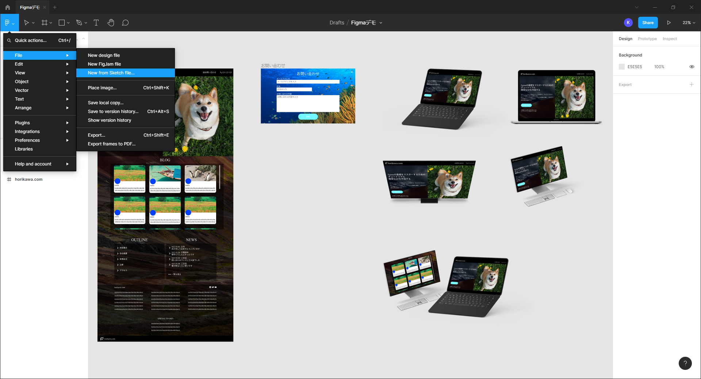

## Figma（フィグマ）とは
Figmaは2016年9月にリリースされたUIデザインツールです。Sketchの後発に開発されたので、Sketchを利用したことがあれば使いやすいツールです。

最大の特徴は、1つのファイルを複数人で編集することができるリアルタイムコラボレーションです。Web上で利用できる為、アカウントさえあれば誰でもどのパソコンからでもブラウザで起動してデザインを閲覧、編集、コメントすることができます。

また、ファイルの保存先もクラウドなので、どのデバイスからでも編集を行うことが可能です。

### Figmaの特徴

- 複数人で共同編集ができる
- Webブラウザ上で作業ができる（デスクトップアプリあり）
- 個人、少人数なら無料で使える　（複数人・複数プロジェクトで利用する場合は有料プランあり）
- gitのデザイン版のようにバージョン管理できる
- Sketchファイルをインポートできる
- インタフェースが日本語に対応
- AWSのサービスと連携できる

### Figmaの料金
Figmaは、個人や少数であれば無料で利用できますが、多人数でチームを組んで利用する場合は有料で利用する必要があります。

ちゃんと使うとすると高いです。

https://www.figma.com/ja/pricing/

2023年11月時点

スターター（無料）

- 3つのFigmaファイルと3つのFigJamファイル
- 個人用ファイル数無制限
- コラボレーター数無制限
- プラグインとテンプレート
- モバイルアプリ

プロフェッショナル（￥1,800 (年払いの月額)）

- スターターに含まれるすべての機能、および以下の機能
- Figmaファイル数無制限
- バージョン履歴数無制限
- 共有プロジェクトとプライベートプロジェクト
- チームライブラリ
- 高度なプロトタイピング
- 開発モード

ビジネス（￥6,750 (年払いの月額)）

- Figmaプロフェッショナルのすべての機能、および以下の機能
- 組織全体のライブラリ
- デザインシステムアナリティクス
- 分岐・結合
- ファイルの一元管理
- 管理・請求の一元化
- プライベートプラグイン
- シングルサインオン
- 開発モード

エンタープライズ（￥11,250 (年払いの月額)）

- Figmaビジネスに含まれるすべての機能、および以下の機能
- 専用ワークスペース
- 高度なデザインシステム
- ゲストアクセス管理
- SCIM経由の役割設定
- アイドルセッションタイムアウト
- 強制パスワードリンク
- ネットワークアクセス制限
- オンボーディングおよびアカウントに関するサポート
- 公開リンクの有効期間設定
- 開発モード

## アカウント登録
https://www.figma.com/

Figmaを利用にはアカウント登録が必要です。
オフィシャルサイトにアクセスし、「Try Figma for free」からアカウント登録します。

Googleアカウント、もしくはメールアドレスとパスワードでアカウント登録します。

「Tell us about yourself」名前と役職を回答してくださいと、表示が出ますが飛ばして問題ありません。

料金プランを聞かれるので「Starter（無料）」を選択して完了です。

## Figmaのファイル管理

### 新規ファイルの作成
Figmaでのファイル管理は、ファイルブラウザと呼ばれるダッシュボードで行います。起動するとすぐに表示される画面がファイルブラウザです。

左のメニューDraftsの横の＋ボタンなどで「New File」の作成ができます。

### ファイルの保存先
Figmaは、ファイルをクラウドに保存します。インターネットに繋がっていれば、編集するとすぐに上書き保存されます。

オフライン時に変更が保存できていない場合は、ファイル名の横に白い●が表示されます。オンラインになると保存されますが、●が消えない場合は、「.fig」ファイルとして一時的にローカルに保存することができます。

### ローカルに保存
左上のメニューから「file>Save local copy…」をクリックして保存できます。

保存したファイルを開くには、Figmaのファイルブラウザにドラッグ&ドロップでインポートします。

### Sketchファイルのインポート
Figmaは、Sketchファイルを開くことができます。ファイルブラウザにドラッグ＆ドロップするか、「新規ファイルの左上メニュー＞File＞New Form Sketch File」でインポートします。

