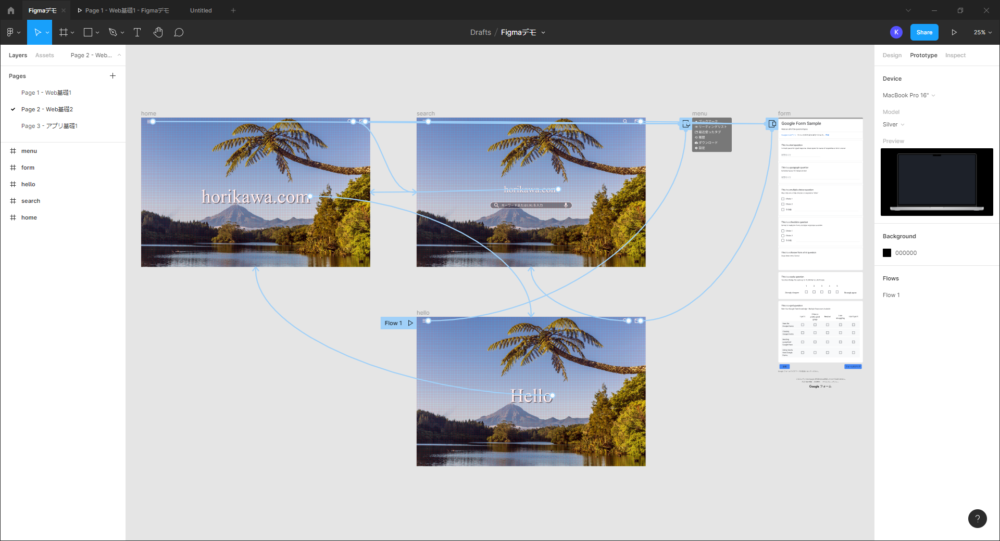

## 基礎
まず、自分が操作したいところにいけるよう、Figmaのページ内で動く方法を解説します。

### ショートカット

- 「⌘(control)」 + 「+」　(ズームイン)
- 「⌘(control)」 + 「-」　(ズームアウト)
- スペース長押し + クリックアンドドラッグ　(てのひらツール)
- 「z」長押し + クリック　(ズームイン)
- 「z」+ 「option(alt)」長押し + クリック　(ズームアウト)
- 「z」+ クリックアンドドラッグ　(選択した範囲までズームイン)

上記、6つのショートカットが基本的な、ページ内移動・ズームのショートカットです。
一番使いやすいものを模索しながら慣れるまでページ内をくるくる移動してみてください。

## 「オブジェクト」を掴む
FigmaではPhotoshopやSketchと同じように、全てのデザイン部品を「レイヤー」という単位で分けています。

また、「レイヤー」をいくつかまとめたもののことを「グループ」と呼びます。  
普通にFigma内でデザイン上をクリックすると「グループ」の方が選択されます。  

グループ内のレイヤーを掴みたい場合は、「⌘」+ クリックで中のレイヤーを掴みましょう。

画像のレイヤー、シェイプのレイヤー、テキストのレイヤーなど思い通りに自分のレイヤーが掴めるように練習してみてください。

## ツールバーの操作
画面上部の黒い帯状の部分がツールバーです。

1. サーチ/メニュー  
  階層タイプの基本メニューが表示されます。
2. ムーブ/スケール ☆  
  レイヤーを選択したり、大きさを変更します。
3. フレーム/スライス ☆  
  フレーム・スライスを作成します。各種デバイスサイズから選ぶこともできます。
4. シェイプツール  
  様々な図形やラインの描画ツールです。
5. ペン/鉛筆ツール  
  ペンは点と点を繋いで線を描画します。  
  鉛筆は、フリーハンドで描画します。  
6. テキスト ☆  
  テキストを入力します。
7. 手のひらツール ☆  
  画面の表示位置をちょっとずらしたりする(パンする)時に使うツールです。
8. コメント  
  任意の場所にアンカーを付けて、コメントを残せます。  
  コメントはステータスが付けれるので、複数人でデザイン編集する場合に便利です。  
9. ファイル名変更  
  開いているファイル名が表示されます。ファイル名を変更することもできます。
10. オブジェクト編集  
  図形をベクトル編集できます。
11. コンポーネント作成 ☆  
  コンポーネントとは、デザインで再利用できるUIの部品（パーツ）のことを言います。例えば、ボタン、アイコン、モーダルなどを登録しておくと便利です。  
  複数の画面に渡って同じパーツがあるとき、元となるコンポーネントを編集すると、全てのパーツに修正内容を反映することができるため、作業の効率化とアプリ全体の統一性を保つことができます。  
12. マスク  
  オブジェクトのシェイプの形状にに合わせて、選択したオブジェクトを切り抜くことができます。
13. 画像の切り取り ☆  
  画像の切り取りと、簡単なエフェクトができます。
14. 結合/合成  
  複数レイヤーをまとめることができます。
15. リンク  
  テキストにリンクを設定することができます。

## レイヤーパネルの操作
Figmaの左サイドバーがレイヤーパネルです。  
ページ ＞ フレーム ＞ グループ ＞オブジェクト（テキストやシェイプなど） の順でまとまっています。

レイヤーはそれぞれ、専用のアイコンで表示されます。選択すると青くアクティブになります。

レイヤーパネルで表示順を直接変更するか、ショートカットメニューから操作できます。

- Bring Forward – 最前面へ
- Bring Front – ひとつ全面へ
- Send Backward – 最背面へ
- Send to Back – ひとつ背面へ

## ページ・フレーム・オブジェクトの作成
### ページの作成
新規ファイルを作成したら、左サイドバーから「Page1」の部分をクリックして、ページリストを開きます。「page1」を任意の名前に変更します。Pages横の➕でページを追加できます。または、「page1」のショートカットメニューから「Duplicate Page」で同じページを増やすこともできます。

ファイル名を変更

### フレームの作成
上部ツールバーの「Frame」を選択すると、右サイドメニューに各種デバイスが表示されるので、そこから選ぶか、「Slice」で好きなサイズのフレームを作成します。

### オブジェクトの作成
フレームまでできたら、あとは、オブジェクトを置いてデザインするだけです。テキストや写真やボタンなどのパーツを作ってデザインを行います。

## プロトタイプを作成
Figmaではプロトタイピング機能を使用して、リンクや画面遷移をつけたプロトタイプを作ることができます。

> プロトタイプとは
Figmaにおけるプロトタイプ機能は、作ったデザインを元に画面遷移やマイクロインタラクションを再現できる機能です。

プロトタイプは、「Interaction」、「Show Prototype Settings」を設定できます。

### Interaction
画面遷移時やプルダウンメニューの表示など、アクションやアニメーションなど細かな設定ができます。

### Triggers
Triggersはクリック・タップ・ホバーなど、どんなアクションをきっかけにページが切り替わるか選択できます。

### Action
ActionはTriggerが発動した時に行うアクションの種類を指定します。

### Animation
AnimationはActionがどのように行われるかを指定することができます。

### Show Prototype Settings
シミュレーションのデバイスの種類・背景色・スタートするフレームなど、プロトタイプをどのように表示するか設定ができます。

## ファイルの共有とCodeモード
### ファイルの共有
最後に、デザインが完了したら、他のユーザーにファイル共有したり、共同作業メンバーとして招待することもできます。

### Codeモード
右サイドのプロパティパネル上部にある「Inspect」を選択します。
「Inspect」タブの「Code」にコードや、選択中のオブジェクトの様々なプロパティが表示されます。

