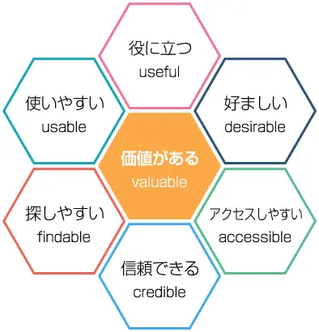

## UI（ユーザーインターフェイス）とは
UIはUser Interfaceの略です。Userは利用者の意味で、WebサービスやWebサイト、アプリケーションやソフトウェアの利用者を指します。Interfaceは境界面という意味で、IT用語として、2つの異なるシステムやプログラムを結びつける備品やプログラムを指します。

UIとは、ユーザーとサービスなどをつなぐもので、ユーザーの目に触れるものはすべてUIといえます。ユーザーが操作する画面だけでなく、マウスやキーボード、タッチ画面などもUIに含まれます。

### アプリにおける良いUIの具体例
- どのページからでもTOPに戻るボタンが認識しやすい
- テキストリンクの位置や色がユーザーにとって違和感がない
- 見やすいフォント、レイアウト
- フォームに入力補助の機能がある
- ユーザーが迷うことなくメニューや申し込みボタンを見つけられる

## UX（ユーザーエクスペリエンス）とは？
UXのXはExperienceの略で体験という意味です。UXとは、ユーザーが商品やサービスを通じて得られる体験を指します。商品やサービスによって、楽しんだり美しいと感じたりするだけでなく、他社製品より使いやすいなどの品質に関わるものも「ユーザー体験」のUXに含まれます。

### アプリにおける良いUXの具体例
- 読み込み速度が早い
- アプリ内の導線がわかりやすい（欲しい情報にすぐ辿り着ける）
- 入力フォームでの手順がスムーズ
- ユーザーの興味を掻き立てるグラフィック

## UI・UXの関係性
UIとUXは言葉が似ているだけでなく、お互いが影響しあうものです。例えばUXを高めるためにはわかりやすく操作しやすいUIが必要です。また、使いにくいUIではUXの評価も下がってしまいます。

つまり、「ユーザーとサービスやプロダクトの接点」であるUIは、顧客体験の中に含まれ、UIはUXの一部と考えることができます。

例① アプリ内の導線がわかりやすい

UX  
- アプリ内の導線がわかりやすく欲しい情報にすぐ辿り着ける

↓

UI  
- ユーザーが迷うことなくメニューや申し込みボタンを見つけられる
- どのページからでも簡単にTOPに戻れる

例② 手順が簡単

UX
- 申し込みや会員登録の手順が簡単

↓

UI
- リンクの位置や色がユーザーにとって違和感がない
- 見やすいフォント、レイアウト
- 入力フォームの項目数が必要最低限

このように、UIはあくまでUXを作り出す要素の1つにすぎません。どんなにUIが優れたWebサイトやアプリを作ったとしても、サービス全体の体験が考えられていなかったらユーザーの顧客体験を損なってしまいます。

つまり、サービスを成功させるためには、まずユーザーニーズを理解したUXデザインを行う必要があり、UXを向上させるようなUIデザインを思案する必要があります。

## UXハニカム
UXを具体的に説明する際、よく引用されるのが「UXハニカム（ユーザー・エクスペリエンス・ハニカム）」です。  
UXハニカムとは、情報アーキテクチャ論の先駆者であるピーター・モービル氏が 2004年に提唱したUXを構成する7つの要素を表したハニカム構造です。
UXという概念を図示することによって、UXが持つ性質を理解することができます。

この構造モデルでは ユーザーが感じる価値（Valuable）を中心に、ユーザーエクスペリエンスを構成する6つの要素が配置されています。

- Useful 役に立つ
- Usable 使いやすい
- Findable 探しやすい・見つけやすい
- Credible 信頼できる
- Accessible アクセスしやすい
- Desirable 好ましい

これら6つの要素が満たされて、はじめてユーザーにとって価値のある体験を創造することができるという考え方です。

参考：https://www.asobou.co.jp/blog/web/ux-honeycomb