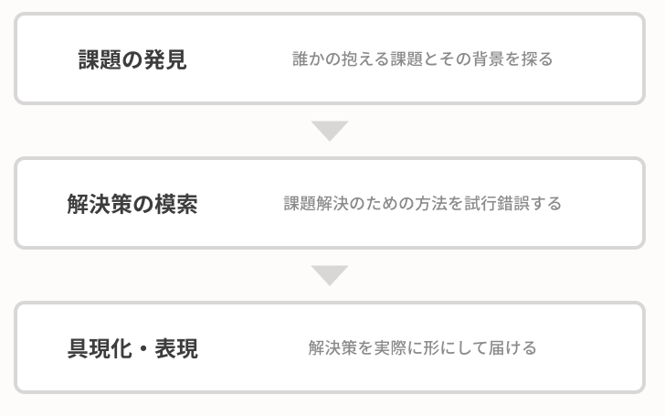

## はじめに
デザインという言葉は、日々の暮らしの中で耳にする機会も多く、特にこのサイトに訪れている方はデザインをこれから学んでいこうと思われている方かと思います。

皆さんは「デザイン」と聞いて、どんなイメージを持ちますか？
「綺麗につくられたもの」だったり「美しいもの」といったイメージを持たれるかもしれません。

ここでは、まず「デザイン」という言葉の意味や、「アート」との違い、そしてビジネスにおけるデザインの重要性について理解する必要があります。

## デザインとは
デザインの言葉の語源はラテン語の`designare`を由来としていると言われており、「計画を記号に表す」や「線を引く、描く」といった意味を持っています。つまり、「アイデアを何らかの形として表現する」とも言えるでしょう。

次に、デザインは「何のため」にするものなのか、ということにも触れます。
私たちの周囲にあるモノを思い浮かべてください。例えばペットボトルであれば、ラベルは私たちが飲み物の味を連想できるような表現になっており、キャップも私たちが開けやすいように凹凸があります。何よりドリンクを持ち運ぶことができ、安価であるという機能性もあります。

その他、私たちの目にするあらゆるモノは「利用者＝ヒト」に向けてつくられています。中でも、利用者目線であらゆることが考慮されたモノは、ずっと使っていたい、持っていたいと思えたりするのではないでしょうか。

まとめると、**デザインとは、ヒトのために思考し、最適な形として表現すること。つまり、誰かの課題を解決すること**と言えるでしょう。

デザインという言葉の意味は非常に広く、デザインの中でも更に「UXデザイン」「グラフィックデザイン」などの細分化された定義がありますが、ここでは割愛します。

## デザインとアートの違い
デザインに近しい言葉に「アート」があります。ここにおいても理解しておくと、デザインの役割を明確に理解した上で取り組めるでしょう。

先ほど、デザインとは誰かの課題を解決することであると説明しました。

対してアートは、作者による自己表現を主としています。
表現者の持つ価値観や、表現者が感じた社会的な問題などが作品として表現され、表現の幅は無数かつ多様です。

ただし、デザインとアートは相容れないものではなく、デザインとアートが融合することによって魅力的なものを生み出すこともできます。

## なぜデザインが重要なのか
ビジネスにおいてデザインは重要性を増しています。デザインで成功した会社の例として、よくAppleが挙げれらます。

スティーブ・ジョブズは「デザインとはおかしな言葉だ。デザインとはどう見えるか（how it looks）を意味すると考える人がいる。しかし掘り下げれば、それはどう機能するか（how it works）ということのなのだ」と言いい、プロダクトにどのような機能を持たせるか、デザインを重視していました。

ここではデザインが重要な理由を大きく3つに分けて説明します。

### 伝えたいことが伝わりやすくなる
誰かの課題を解決するためには、まずその人の求めていることを理解し、その上でどんな機能や情報がどんな段階で必要なのか、といった設計をしていくことが大切です。

その過程での取捨選択や、表現のブラッシュアップなどを経て、伝えたい人に伝わるようになっていきます。

### 言葉で伝えられない情報を伝えられる
デザインしていく上で、余白や文字組み、色、イラスト、画像、触感などにも気を払っていくことが大切です。これらは言葉ではありませんが、様々な情報を伝え、印象を持ってもらうことに大きな役割を果たしています。非言語はデザインを構成する重要な要素で、誠実さや楽しさ、大らかさなどの感覚的な印象を見る人に感じてもらうことができます。

### ブランディングにつながる
前述の2つを満たし、誰かにとっての良いデザインを生み出し続けることは、一貫性のあるブランドの形成につながります。

ブランドが形成されていくと、数ある中から価格やスペックで選ばれるのではなく、「このブランドが好きだから」と選ばれるようになります。利用者のロイヤルティを高め、継続的に購入してくれたり、利用してくれたりするファンを増えやすくなっていきます。
