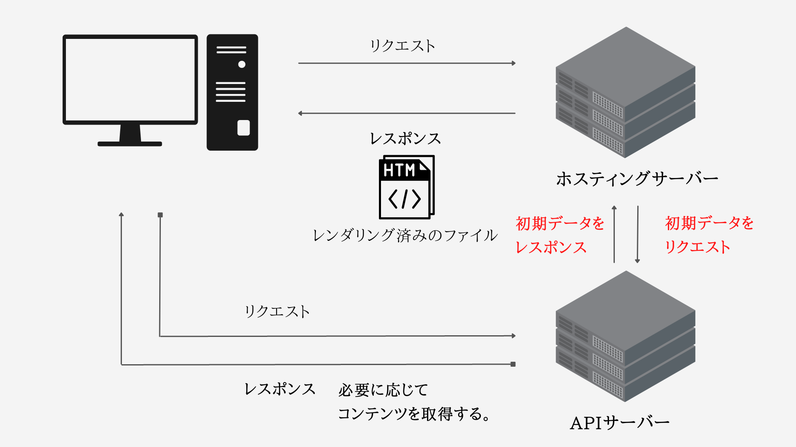
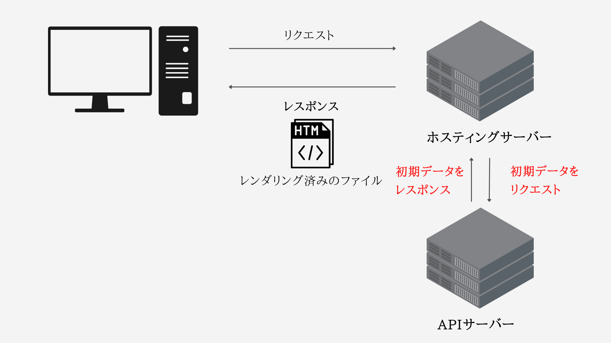
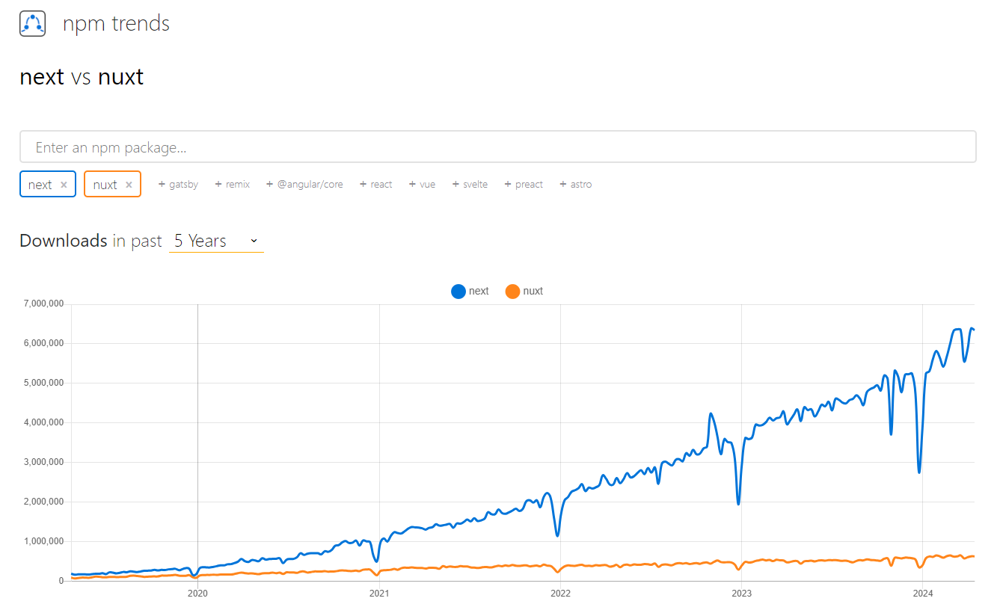

Next.jsはReactベースで、Nuxt.jsはVue.jsベースのフレームワークです。  
ふたつは人気のフレームワークとしてよく比較されますが、けっこう違います。  

## SSRとSSG
Next.jsとNuxt.jsは、`Server Side Rendering（SSR）`や`Static Site Generation（SSG）`といった強力な機能を提供しており、アプリケーションのパフォーマンスを最適化できます。
簡単にSSRとSSGについて解説します。

実装についてはまた別途

### Server Side Rendering（SSR）とは
`Server Side Rendering` は、ユーザーがリクエストしたときに、サーバー上で各ページを生成します。SSRでは、ページを事前にレンダリングするサーバーがあります。それは、変数を差し込むテンプレートのようなもので、サーバーはすべてのレンダリングを処理します。。これはリクエスト時に発生するので、ユーザがページをリクエストすると、サーバ側でレンダリングされたページを取得します。このレンダリングはすべてサーバーサイドで行われ、ブラウザで実行されることはありません。そのため、ページがすでにサーバでレンダリングされてクライアントに提供されるのを待っているSSGとは異なり、SSRはリクエストを受け取ったときにサーバでページをレンダリングします。SSRは、e コマースサイトやソーシャルメディアプラットフォームのような、頻繁に変更される動的またはパーソナライズされたコンテンツを持つWebサイトに最適です。

### SSR の利点
一貫したユーザー体験： ユーザーは、その場で生成された最新のコンテンツを見ることができ、常に最新の情報を得ることができます。  
パーソナライゼーション： SSR は、ユーザーの嗜好やその他の動的なデータに基づいて、ユニークなコンテンツを提供することができます。 

### Static Site Generation（SSG）とは
`Static Site Generation` は、ビルド時に静的なHTMLファイルを生成します。アプリをビルドするたびに、全てのページが作成されます。ユーザーがWebサイトにアクセスするとこれらのファイルがユーザーに提供され、サーバーは余計な作業をする必要がなくなります。このアプローチは、ブログやドキュメントサイトのような、頻繁に変更されないコンテンツを持つWebサイトに適しています。

### SSG の利点
速度： レンダリングされたHTMLファイルが直接提供されるため、ロード時間が短縮されます。  
スケーラビリティ： 静的ファイルはCDNによって簡単に提供され、アプリケーションの能力を向上させ、グローバルなトラフィックを処理することができます。  

## Next.jsとは
Next.jsはReactを基盤としたJavaScriptフレームワークで、SSRや静的サイト生成に特化しています。

### Reactとの違い
Reactはフロントエンドライブラリで、主にユーザーインターフェースの作成に利用されます。Next.jsはReactをベースにしたフレームワークですが、Reactをさらにグレードアップさせています。

Reactの機能に加えてSSRや静的サイト生成、ルーティングの設定などが容易に行えるようになっています。Reactに上乗せされた機能により、開発者はビジネスロジックの開発により集中でき、より高度なアプリケーションを容易に作成できます。

また、Next.jsの一つの大きな特徴は、バックエンド機能のサポートがあるため、Next.js一つでフロントエンドからバックエンドまで一貫して開発することが可能となります。APIもまとめて開発することができます。

## Nuxt.jsとは
Nuxt.jsは、Vue.jsを基盤としたフレームワークです。

かんたんに開発できるVue.jsの使いやすさを持ちつつ、多機能なWebアプリケーションに必要なルーティングなどの機能が追加されています。

### Vue.jsとの違い
Vue.jsはJavaScriptフレームワークで、シンプルで直感的な開発ができることから初心者には特に人気です。

そして、Nuxt.jsはVue.jsの機能に加え、さらにSSRや静的サイト生成、ルーティングの設定が容易になるよう追加の機能を提供しています。

Nuxt.jsもNext.jsと同様、バックエンドまで一気にWebアプリケーションを作ることができるというメリットがあります。

## ReactとVue.jsの違い
Next.jsとNuxt.jsの両フレームワークともSSRなど、多機能なWebアプリケーション開発に必要な機能は揃っています。  
ですが人気度でいえば、Next.jsが圧倒的です。  

|                | Nuxt.js                           | Next.js                         |
|----------------|-----------------------------------|---------------------------------|
| リポジトリ          | https://github.com/vercel/next.js | https://github.com/nuxt/nuxt.js |
| ベース            | React                             | Vue.js                          |
| 開発規模           | 大規模向き                             | 小規模向き                           |
| TypeScriptとの相性 | createコマンドの時にセットアップできる            | 手動でセットアップが必要                    |
| 習得難易度          | 高いかも                              | 低い                              |
