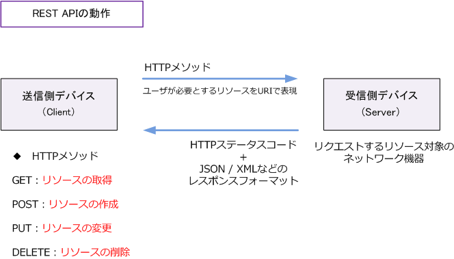
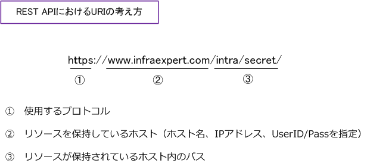

## REST APIとは

REST APIは、REST（Representational State Transfer）の原則に基づいて設計されたAPIのことです。Webシステムを外部から利用するためのAPIであることから、REST APIはWeb APIの1つだと言えます。REST APIでは、HTTPで定義するGET、POST、PUT、DELETEなどのリクエストでデータを操作します。

:::note
おさらい

API（Application Programming Interface）とは、ソフトウェア同士が互いに情報をやりとりするのに使用するインターフェースの仕様のことです。

:::

## REST - 4つの設計原則

RESTの原則は、大きく以下の4つに集約できます。

※より詳細に分類する場合は6つの原則と言えるそうです。自分は理解できていません。

- 原則1：ステートレスなクライアント/サーバプロトコル
- 原則2：リソースを一意なURIにより識別される
- 原則3：HTTPメソッドで操作方法を表現した統一されたインターフェース
- 原則4：アプリケーション情報と状態遷移の両方を扱えるハイパーメディアの使用

## 原則1：ステートレスなクライアント/サーバプロトコル
REST APIではHTTP技術をベースとしており、HTTPメソッド（GET、POST、PUT、DELETE）などで送信側から操作方法をHTTPメソッドで表現して、受信側は処理結果をステータスコードで表現しておりクライアント/サーバ形態の通信を行います。

ユーザ（クライアント側）が必要とするリソースはURIで表現します。そのリソースに対してどのような操作を行うのかはHTTPメソッドで示します。受信側デバイス（サーバ側）では受信したHTTPリクエストに対して、その処理結果をHTTPステータスコード（処理の成功/失敗）といっしょにJSONやXMLなどのレスポンスフォーマットで応答します。

## 原則2：リソースを一意なURIにより識別される
REST APIでは、URIで、リソースが存在する位置を文字列で示します。

## 原則3：HTTPメソッドで操作方法を表現した統一されたインターフェース
送信側デバイスから受信したHTTPメソッドに応じ、受信側デバイス（例えばネットワーク機器）は自身のリソースに対して作成、更新、削除などの動作を行います。このようにリソースに対して行う主要な動作はCRUDと呼ばれます。

| CRUD | HTTPメソッド | 説明 |
|---|---|---|
| Create | POST/PUT | 作成 |
| Read | GET | 読み取り |
| Update | PUT/PATCH | 更新 |
| Delete | DELETE | 削除 |

## 原則4：アプリケーション情報と状態遷移の両方を扱えるハイパーメディアの使用
送信側デバイスと受信側デバイスとでは、REST API を通してデータのやり取りが行われますが、受信データを正常に処理するためには、汎用的なデータ形式に変換し通信を行う必要があります。

リソースを表現するそのデータ形式には色々ありますが、HTMLやテキストだけでなくて、例えば`JSON`、`XML`、`YAML`などがあります。  
基本的には`JSON`を利用します。

### JSON（JavaScript Object Notation）- 拡張子（.json）
JSONはデータ記述言語の1つです。標準的なテキストベースのデータフォーマットでありプログラミング言語を問わずに利用できます。

XMLに比べて記述が容易で人が理解しやすいデータフォーマットと言えます。

### XML（Extensible Markup Language）- 拡張子（.xml）
XMLはマークアップ言語の1つです。マークアップ言語ではタグと呼ばれる特定の文字列で記述文に情報の意味や構造などを埋め込んでいく言語のことです。

HTMLもXMLと同じ様にマークアップ言語ですが、HTMLはWebページ作成に特化しているのに対して、XMLでは自由度が高く拡張性を備えており、設定情報ファイルの記述など様々な形で利用されます。

### YAML（YAML Ain't a Markup Language）- 拡張子（.yaml .yml）
YAMLは構造化されたデータを表現するためのフォーマットです。YAMLではスペースによるインデントを使用して階層構造を表現します。

例えばサーバの構成管理ツールのAnsibleでも設定ファイルのフォーマットとしてYAMLを利用します。
