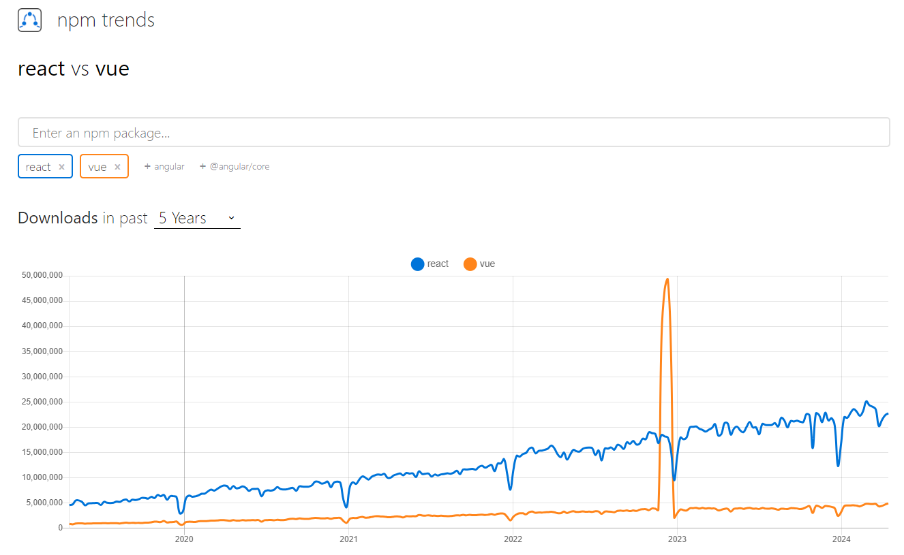

## Vue.jsとは
Vue.jsとは、GoogleのエンジニアであったEvan You（エヴァン・ヨー）氏によって開発されたJavaScriptのフレームワークです。フレームワークとは、アプリケーション開発に必要な機能を一通り揃えた枠組みを指します。

Vue.jsの主な用途は、Reactと同じくUIの構築です。Googleが提供するさまざまなサービス以外にZoomやNoteなどもVue.jsを用いて開発されています。

## ReactとVue.jsの共通点
ReactとVue.jsには、用途や機能に共通点があります。両者に見られる主な共通点は次の通りです。

### UI構築ができる
ReactとVue.jsは、いずれもUI構築に用いられます。

Webサイトやアプリケーションにおいては、ユーザーが操作する画面をUIと呼ぶことが一般的です。また、操作画面の見た目だけでなく、操作方法やボタンの動きなどもUIの要素に含まれます。

### コンポーネントに分けて編集できる
コンポーネントとは、部品や構成要素という意味の言葉です。ReactとVue.jsは、いずれもコンポーネントに分けてUI開発を進められます。

プログラムコードをコンポーネント単位で編集できるため、UIの見た目や動きなどを部分的に修正することが可能です。

## ReactとVue.jsの違い
ReactとVue.jsの両方とも、基本的なWebアプリケーション開発に必要な機能は揃っています。  
人気度でいえば、Next.jsが圧倒的です。  



|          | React                       | Vue.js              |
|----------|-----------------------------|---------------------|
| 開発規模     | 大規模向き                         | 小規模向き                 |
| 開発方法     | 関数型プログラミング                  | クラス宣言によるプログラミング     |
| 処理速度     | 速い                          | Reactと比べると遅い傾向      |
| スタイリング方法 | 状況に応じて使い分け可能                | 外部ライブラリ「Vuetify」を活用 |
| サポートの充実度 | 公式サイトのライブラリが少ない             | 公式サイトのライブラリが充実      |
| 習得難易度    | 高いかも                          | 低い                  |

## ReactとVue.jsのコンポーネント
カウントアップするコードで比較

### React
```js
const App = () => {
//State管理，メソッドなどなんでもここに書ける
  const [num, setNum] = useState(0);
  const onClickButton = () => {
    setNum(num + 1);
  };
//ここでHTML形式を返り値で返す
  return (
    <div className="App">
      <p>{ num }</p>
      <button onClick={ onClickButton }>+1</button>
    </div>
  );
};
```

### Vue.js
```js
<template>
    <div>{{ num }}</div>
    <button v-on:click="onClickButton">+1</button>
</template>
<script>
export defualt {
    data() {
        return {
            //ここにStateを記述
            num: 0,
        }
    },
    methods: {
        //ここにメソッドを記述
        onClickButton() {
            this.num ++;
        }
    }
}
</script>
```

## ReactとVue.jsのCSS

### React
ReactでのCSSによるデザインは長年議論がなされています。まだ結論は出ていないです。

ライブラリ等によって変わりますが、デフォルトでは通常のHTMLファイルのように、CSSファイルを外部に書いてインポートする方法や、オブジェクト形式で記述する方式があります。

```js title="App.css"
#外部ファイルとして記述する方法
.green {
    background-color: green;
}
```

```js title="App.jsx"
const App = () => {
  const blue = {
    backgroundColor: blue,
  };
  return (
    <>
      <div className="green">green</div>
      <div style={blue}>blue</div>
    </>
  );
};
```

### Vue.js
`.vue`ファイルにそのまま`<style></style>`タグに 通常の書き方でCSSを記述することができる。

```js title="App.vue"
<template>
  <div class="red">red</div>
</template>
<style>
.red {
  background-color: red;
}
</style>
```

## 再描画（再レンダリング）
### React
Reactが再レンダリングされるタイミングは

1. `state`が更新されたコンポーネント
1. `props`が変更されたコンポーネント
1. 再レンダリングされたコンポーネント配下のコンポーネントすべて

### Vue.js
Vueが再レンダリングされるタイミングは

1. 監視対象の変数が変更
1. `data`や`computed`など
1. `props`が更新
