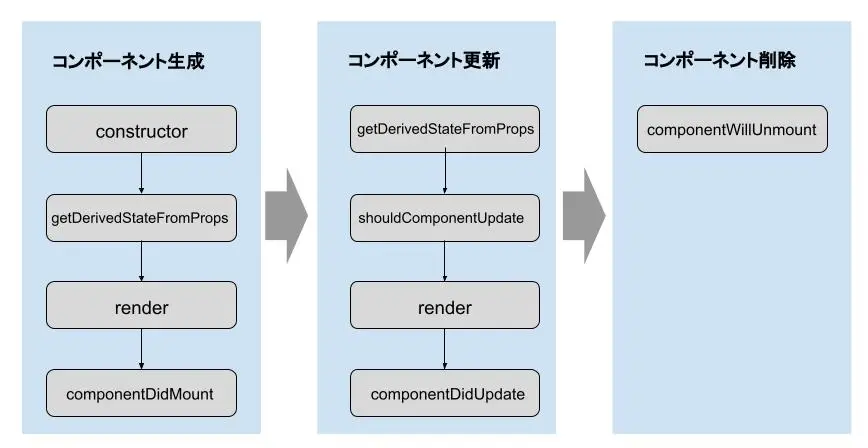
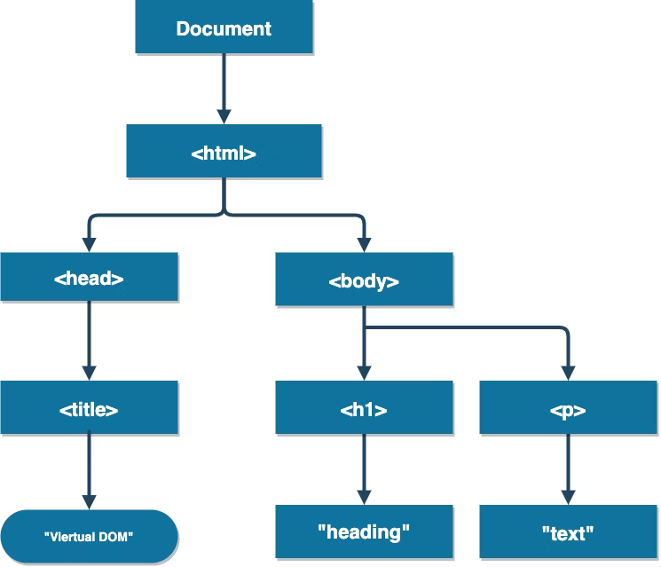
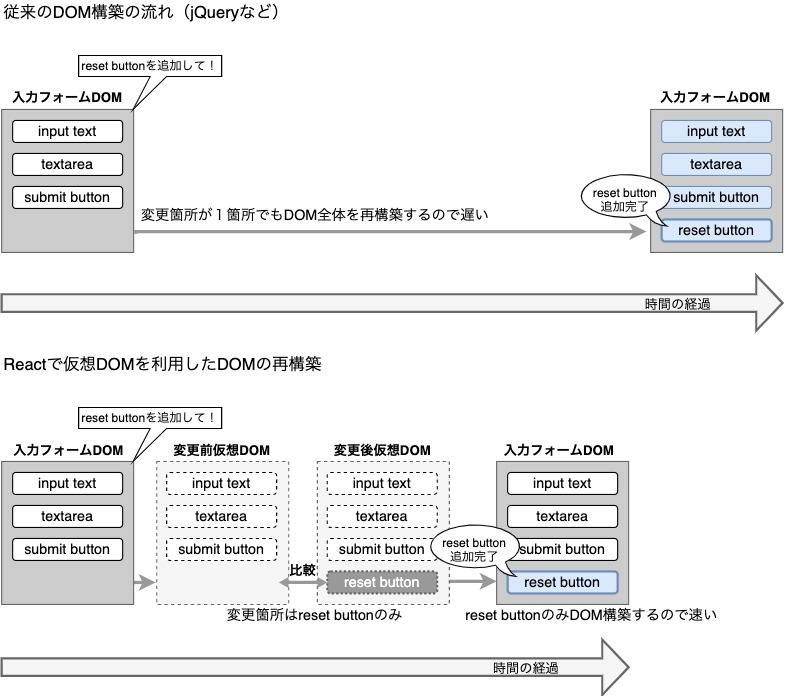
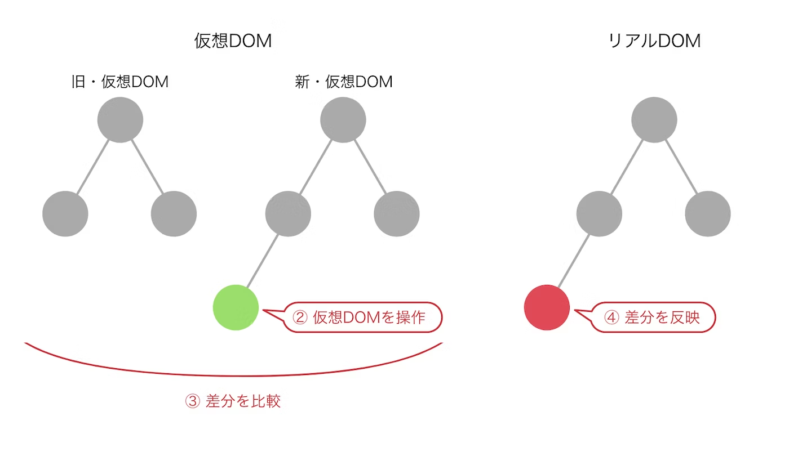

## Reactとは
ReactはMeta社（旧Facebook社）が作成したJavaScriptライブラリです。2013年にオープンソース化された後は、コミュニティの開発者と共に開発が進められています。

Reactはフレームワークではなく、UI（ユーザーインターフェース）の作成に特化したライブラリです。フロントエンドエンジニアがUIを構築する際に、Reactが活用されます。

### 特徴
Reactは「宣言型」のため、「手続き型」や「命令型」と呼ばれるプログラミング言語よりも効率的にコーディングできる点が特徴です。

Reactでデータを更新すると、HTMLの内容も自動で更新されます。  
jQueryとは異なり、データの更新とHTMLの書き換えを両方行う手間がかかりません。

コンポーネントベースであることもReactの特徴です。

## コンポーネントとは
コンポーネントとは必要な機能がまとまった部品（関数）のようなもので、シンプルなコンポーネントの組み合わせでUIを構築できます。

Reactには仮想DOMと呼ばれる機能があり、コンポーネントの編集時に差分のみを反映できるため、高速な動作が可能です。

```js
function Welcome(props) {
  return <h1>Hello, {props.name}</h1>;
}
```

この関数は、データの入った “props”（「プロパティ」の意味）というオブジェクトを引数としてひとつ受け取り、 React 要素を返す為、有効な React コンポーネントである。これは文字通り JavaScript の関数であるため、 このようなコンポーネントのことを【関数コンポーネント(function component)】と呼ぶ。
また、Reactで扱えるコンポーネントは、クラスコンポーネントと関数コンポーネントの2種類があります。

### クラスコンポーネント（現状使わないです）
クラスコンポーネントは、React.Componentを継承したクラスによって定義されます。stateやライフサイクルなどを最初から持っている点が特徴です。クラスコンポーネントは次のように記述します。

```js
import React from 'react';   
 
class 任意のクラス名 extends React.Component {
  render() {
    return (
      &lt;h1>Sample Text&lt;/h1>
    );
  }
}
```

ただし、React Hooksと呼ばれる機能が実装されたことで、クラスコンポーネントと同様の機能を関数コンポーネントでも使えるようになりました。
そのため、基本利用しません。クラスコンポーネントから関数コンポーネントに移行する際などに必要な知識となります。

### 関数コンポーネントとは
関数コンポーネントは、stateやライフサイクルを持たないコンポーネントです。クラスコンポーネントと異なり、`render()`を省略して記述できます。

関数コンポーネントの記述例は次の通りです。

```js
function 任意の関数名() {
  return ( 
    &lt;h1>Sample Text&lt;/h1> 
  ); 
}
```

## ライフサイクルとは
ライフサイクルとは、Reactでコンポーネントが生成されてから削除されるまでの一連の流れのことです。

Reactのコンポーネントがレンダリング（DOMのdiffを計算している：差分を確認している）されるタイミングは以下の３つです。

コンポーネントが：

1. マウント(DOM の初回ロード)された時
1. コンポーネントが更新された時 ※
1. アンマウントされた時

※は具体的にはコンポーネントに新しい props が渡された時や、コンポーネントの state が更新された時です。

<details>
<summary>以下の説明はクラスコンポーネントの説明なので、隠します</summary>

コンポーネントが生成、更新、削除されるタイミングで実行されるメソッドは以下の通りです。



コンポーネントの生成時には、まずclassを初期化するためのconstructorメソッドが実行されます。次のgetDerivedStateFromPropsは、コンポーネントのstateを計算するメソッドです。続いてrenderメソッドで仮想DOMの更新とDOMの生成が行われ、componentDidMountが実行されます。

コンポーネントの更新時に実行されるメソッドは、生成時と同様です。ただし、コンポーネントを再描画するか判断するためのshouldComponentUpdateメソッドが途中で実行されます。値がfalseの場合、render以降のメソッドは実行されません。コンポーネントが仮想DOMから削除された際は、componentWillUnmountが実行され、DOMからコンポーネントが削除されます。

</details>

## DOMとは
DOM（Document Object Model）は、HTMLファイルのソースコードのことではなく、画面を表示するまでに解釈したHTML/CSS/JavaScriptによって構築されたDOM（ツリー）を指します。  
DOMはChromeやFireFox、Safari、IEなどのブラウザ上で、Webページを描画するために構築されます。  

Chromeの開発者ツールのElementsタブでDOMツリーを確認できます。  

以下がDOMツリーのイメージです。



このDOMツリーの`<html>`,`<body>`といった一つ一つの要素をオブジェクトとして扱い、これらを**Node（ノード）**と呼びます。

## 仮想DOM（VIRTUAL DOM）とは
Reactにおける仮想DOMとは、情報を受け取ってもすぐにはブラウザの描画を行わず、まずはバーチャルなDOM（プログラム的に作成された仮のDOM）を構築することを指します。そして、構築された仮想DOMの内容を元にHTMLを作成し、実際のDOM(リアルDOM)に同期されます。このプロセスは差分検出処理 (reconciliation)と呼ばれます。  

この仮想DOMはリアルDOMに比べ、ページ表示の高速化を実現します。  



簡単にいうと、リアルDOMを模したJavaScriptのオブジェクトです。  
以下のようなフローでリアルDOMを操作します。  

1. 仮想DOMを2種類用意する
1. 一方の仮想DOMをJavascriptで操作
1. 変更前後の仮想DOMの差分を比較
1. **差分だけをリアルDOMに反映**



仮想DOMを用いることで、無駄なレンダリングを避ける以外に

- ロジックとUIが分離できる
- 状態の管理を簡単にできる
- ロジックとUIを繋ぐ処理を簡単にできる

といったメリットがあります。

## JSX記法とは
ReactはJSXと呼ばれる記法でコーディングできます。JSXとは、HTMLとJavaScriptを組み合わせたような形の記法です。

JSX記法には以下のような特徴があります。

- 「class」の代わりに「classsName」、「for」の代わりに「htmlFor」を使用する
- 変数など、文字列以外の値を代入する際は`{ }`でくくる

`｛ ｝`内に数式を記述すると、数式の計算結果を代入することが可能です。また、`｛ ｝`の中から関数の呼び出しもできます。JSXは、必ず一つのReact要素を返す必要がある記法です。複数の要素から構成される場合、divタグなどで囲っておく必要があります。ReactはJSX記法を使わず、通常のJavaScriptで記述することも可能です。

具体的には以下のような形です。
```js
const element = (
  <h1 className="greeting">
    Hello, world!
  </h1>
);
```

JavaScriptの変数宣言にHTMLタグが代入されているように見え、違和感を感じるかもしれませんが慣れです。
上記の通り拡張構文ですので上の式は以下の式にコンパイルされます。

```js
const element = React.createElement(
  'h1',
  {className: 'greeting'},
  'Hello, world!'
);
```

### JSX記法のルール
```js
// Reactコンポーネントを書く場合、お作法としてreactのインポートが必要（React17のアップデートでJSXを使用するだけの場合は記述不要になった）
import React from "react";
// htmlにコンポーネントを反映するために、react-domをインポートする
import ReactDom from "react-dom";

// Reactでは関数を使用して画面の要素であるコンポーネントを表現していけるので、アロー関数を書いていく
const App = () => {
 return (
  <> 
   <h1>ReactJSX記法のルール</h1>
   <p>React学習中</p>
  </>
 );
};
// Appをコンポーネントとしてレンダリングする
// 第一引数にレンダリングしたいコンポーネント、第二引数に反映箇所を指定する
ReactDom.render(<App />, document.getElementById("root"));
```

まとめると以下

- jsxはjavascriptの中にHTMLを書いていく。
- returnの内容が複数になる場合は`（）`で囲う必要がある。
- returnしていく内容は1つのタグで囲わないとエラーになるので、フラグメント`（<></>）`で囲ってあげる。

## React Hooksとは
React Hooksのフック（hook） とは、2019年2月リリースのReact16.8から追加された、クラスを使用せずに Reactを書くことができる機能です。React Hooksは便利な機能のため、最近ではフックを使った関数コンポーネントによる開発が主流になっています。

React Hooksには、機能の異なる複数のフックがあります。基本的なフックは次の通りです。

1. useState
1. useEffect
1. useContext
1. useRef
1. useMemo
1. useCallback
1. useReducer

### useState()
useStateは、関数コンポーネントのstateを保持したり、更新したりするためのフックです。数あるReact Hooksの機能の中でも、特に頻繁に利用されます。

:::important

stateとは、フォームに入力されたデータなど、アプリケーションが保持している状態のことです。

useStateを呼び出すと、各コンポーネントのstateを作ることが可能です。また、コンポーネントが保持するstateは、setStateによって変更できます。コンポーネントに格納されたstateをsetStateで変更すると、コンポーネントを自動で更新することが可能です。

:::

基本構文は以下です。  

```js
const [状態変数, 状態を更新するための関数] = useState(状態の初期値)
```

`状態変数`、`状態を更新するための関数`には任意の名前を付けることができます。  
基本、`状態を更新するための関数`には「 set + `状態変数（頭大文字）`」をつけることが多いです。  

実際の宣言例は以下です。

```js
const [count, setCount] = useState(1);
```

イメージとしては、`let count = 0` に近いです。  
※hooksの特性として、stateの値が更新された場合、Reactのコンポーネントがレンダリングが行われます

以下、解説です。

- `count`：`count`の状態を持たせている変数、現在の値
- `setCount`：`count`の状態を更新するための関数、命名の仕方は「 set + `状態変数（頭大文字）`」
- `useState(1)`：`useState()`には初期値を設定する必要がある、今回は`count`に1を設定

### useEffect()
useEffectは、関数コンポーネントで副作用を制御できるフックです。副作用とは、DOMの変更やファイルへの書き込みなど、関数の外に影響を与える処理を指します。useEffectを使用すると、関数を実行するタイミングをReactのレンダリング後まで遅らせることが可能です。

基本構文は以下です。  

```js
useEffect(() => {
  /* 第1引数には実行させたい副作用関数を記述*/
  console.log('副作用関数が実行されました！')
},[依存する変数の配列]) // 第2引数には副作用関数の実行タイミングを制御する依存データを記述
```

第2引数を指定することにより、第1引数に渡された副作用関数の実行タイミングを制御することができます。Reactは第2引数の依存配列の中身の値を比較して、副作用関数をスキップするかどうかを判断します。

| | 説明 | データ型 |
|---|---|---|
| 第1引数	| 副作用関数（戻り値はクリーンアップ関数、または何も返さない） | 関数 |
| 第2引数 |	副作用関数の実行タイミングを制御する依存データが入る（省略可能） | 配列 |

実際の宣言例は以下です。

```js title="レンダリングされる度に実行される"
useEffect(() => {
  console.log('useEffectが実行されました');
});
```

useState で値の更新が行われるとコンポーネントはその値をブラウザ上でも更新する必要があるため再レンダリング(コンポーネントの更新)が行われます。

```js title="最初の1回だけ実行される"
useEffect(() => {
  console.log('useEffectが実行されました');
}, []);
```

最初の1回の表示直後に行われる useEffect の実行がライフサイクルの componentDidMount に対応し、それ以降の useEffect の実行は componentDidUpdate に対応します。

```js title="countという変数が更新される度に実行される"
useEffect(() => {
  console.log('useEffectが実行されました');
}, [count]);
```

useEffectの第2引数に`[count]`を渡すと、`count`に変化があったときだけ副作用関数を実行します。
