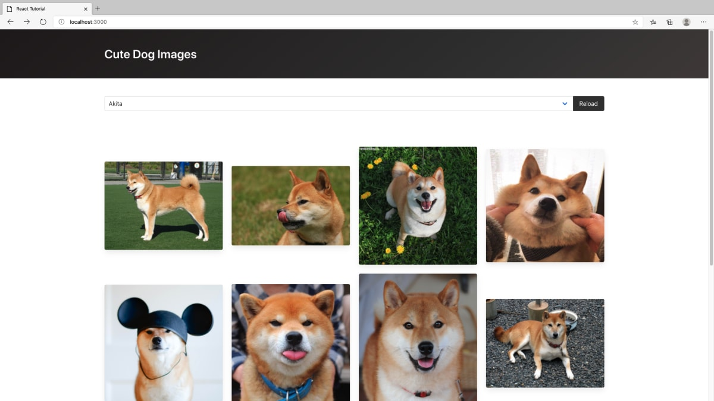

## Reactチュートリアル：API

### 概要
日本大の授業の教材で作成された[犬画像ギャラリーを作ろう](https://zenn.dev/likr/articles/6be53ca64f29aa035f07)を参考に、Webアプリケーションを作成してください。

犬の画像は[Dog API](https://dog.ceo/dog-api/)より取得します。  
Dog APIはたくさんの犬の画像を提供しているWeb APIです。  

完成イメージは以下です。



Reactについても深く学べるため、おすすめです。
自分はこのチュートリアルで、Reactを理解しました。

:::caution

> Netlify による Web アプリの公開

上記は、Netlifyというサービスに登録する必要があるため、行わなくて大丈夫です。

興味がある人はやってみてください。

:::

### 実施環境
Cloud9やローカルどちらでも実施できます。

ローカルで行う場合は、`Node.js`をインストールしている必要があります。  
詳細はモダンフロントエンド開発環境構築を参照してください。  

### ポートの設定
本チュートリアルで、Cloud9を利用する場合は`vite.config.js`にポートの設定を追記してください。  
[Cloud9では使用できるポートが`8080`、`8081`、`8082`に限定されている](https://docs.aws.amazon.com/ja_jp/cloud9/latest/user-guide/app-preview.html)ため、`Vite`にポートを指定する設定を行う必要があります。  

[Vite の設定 | Vite](https://ja.vitejs.dev/config/#server-port)

```js title="vite.config.js"
import { defineConfig } from "vite";
import react from "@vitejs/plugin-react";

export default defineConfig({
  // highlight-start
  server: {
    port: 8080
  },
  // highlight-end
  plugins: [react()],
});
```

以下の箇所で  
https://zenn.dev/likr/articles/6be53ca64f29aa035f07#hello%2C-world   
