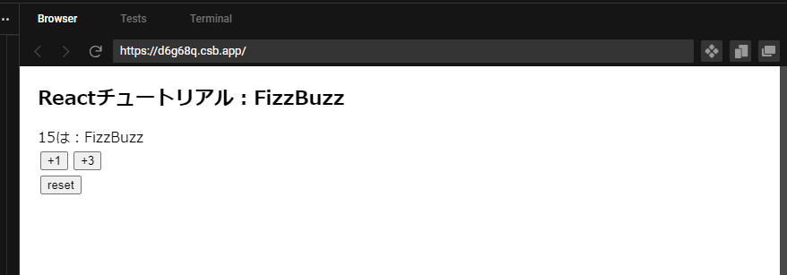

## Reactチュートリアル：FizzBuzz

### 概要
[クイックスタート](https://ja.react.dev/learn)を参考に、FizzBuzzを作成してください。



ルール
- 初期値は1
- FizzBuzzを表示する
- 1カウントアップするボタンを作成する
- 3カウントアップするボタンを作成する
- リセットするボタンを作成する

### FizzBuzz問題とは
https://ja.wikipedia.org/wiki/Fizz_Buzz

### FizzBuzzの解き方
割り切れる場合を求めるので剰余演算子が使えればあとはループ処理の書き方だけですが、

- 剰余演算子を使用せずに書く
- 再帰呼び出しを用いる
- 配列を準備しそれらにmap関数を用いる

など人によって書き方は様々です。  

そのほか各言語毎に最小コードもあり、読んでみるとコードを短縮する工夫が見られます。

### キーワード
- FizzBuzz：3の倍数の場合は「Fizz」（Bizz Buzzの場合は「Bizz」）、5の倍数の場合は「Buzz」、3の倍数かつ5の倍数の場合（すなわち15の倍数の場合）は「Fizz Buzz」（Bizz Buzzの場合は「Bizz Buzz」）
- アロー関数 (Arrow Functions): 無名の関数を簡潔に書くための構文です。例えば、`() => countUp(1)` のようにコールバック関数を簡潔に定義しています。
- useStateフック: useState はReactのフックの1つで、コンポーネント内で状態を管理するために使用されています。count と setCount が useState を用いて状態を管理しています。
- プロップス (props): コンポーネント間でデータを受け渡すためのメカニズムです。例えば、FizzBuzz、UpButton、および ResetButton コンポーネントは、親コンポーネントからプロップスを受け取っています。
- 条件付きレンダリング: FizzBuzz コンポーネント内で、与えられた数値に基づいて "Fizz" や "Buzz" を条件付きで表示するための技術です。
- イベントハンドリング: ボタンクリックなどのイベントが発生した際に実行されるコードを定義するための仕組みです。onClick プロップスを使用して、ボタンがクリックされたときに特定の関数を実行しています。
- 関数コンポーネント: MyApp、FizzBuzz、UpButton、および ResetButton は、Reactの関数コンポーネントとして定義されています。関数コンポーネントは状態を持つことができ、UIを描画する役割を果たします。
- JSX (JavaScript XML): React内でUIを構築するためのシンタックス拡張です。HTMLのような構文を用いてコンポーネントを記述します。

### 子から親にデータを渡す流れ
1. 親コンポーネント：
   stateと、stateを更新する関数（set〇〇）を定義
1. 親コンポーネント：
   set〇〇を呼び出す関数Aを定義
1. 親コンポーネント：
   さっき作った関数Aを子コンポーネントにpropsで渡す
1. 子コンポーネント：
   props経由で関数Aを受け取る
1. 子コンポーネント：
   関数Aをイベントハンドラに設定する

### 答え（堀川）
<details>
<summary>クリックして展開</summary>

```js
// useStateを使用する宣言
import { useState } from "react";

export default function MyApp() {
  /**
   * 親コンポーネントで使用する
   * countの初期値とcountを更新する関数を宣言
   * 初期値は1
   */
  const [count, setCount] = useState(1);

  /**
   * 子コンポーネントで使用する
   * 子コンポーネントで発火し、親コンポーネントのcountを更新する
   */
  function countUp(num) {
    setCount(count + num);
  }

  /**
   * countUpと同様
   */
  function countReset() {
    setCount(1);
  }

  return (
    <div>
      <h1>Reactチュートリアル：FizzBuzz</h1>
      {count}は：
      {/* FizzBuzzでcountの内容を判定し、FizzBuzzを表示する */}
      <FizzBuzz num={count} />
      <br />
      {/* countを子コンポーネント側で更新するためにpropsで関数を渡す */}
      <UpButton num={1} onClick={() => countUp(1)} />
      <UpButton num={3} onClick={() => countUp(3)} />
      <br />
      <ResetButton onClick={countReset} />
    </div>
  );
}

function FizzBuzz({ num }) {
  // 空の変数を作成
  let text = "";
  if (num % 3 === 0) {
    // 3の倍数の場合、Fizzを追加
    text += "Fizz";
  }
  if (num % 5 === 0) {
    // 5の倍数の場合、Buzzを追加
    text += "Buzz";
  }
  // textを返す
  return text;
}

// カウントアップのボタン
function UpButton({ num, onClick }) {
  // ボタンがクリックされると、onClickで渡された親の関数を実行する
  return <button onClick={onClick}>+{num}</button>;
}

// リセットのボタン
function ResetButton({ onClick }) {
  // ボタンがクリックされると、onClickで渡された親の関数を実行する
  return <button onClick={onClick}>reset</button>;
}
```

</details>
