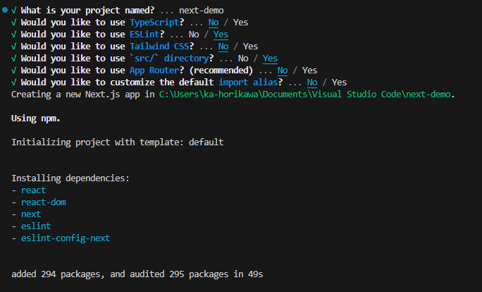
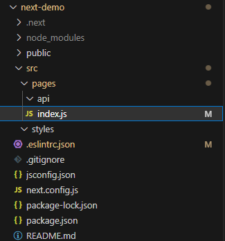
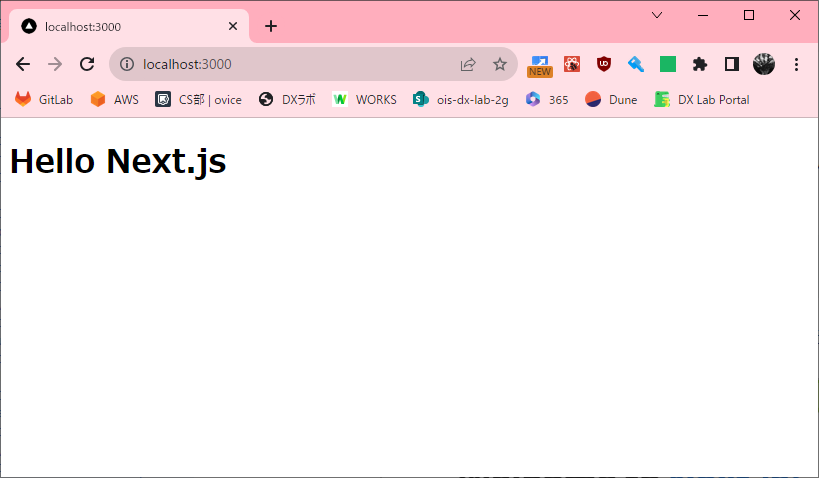
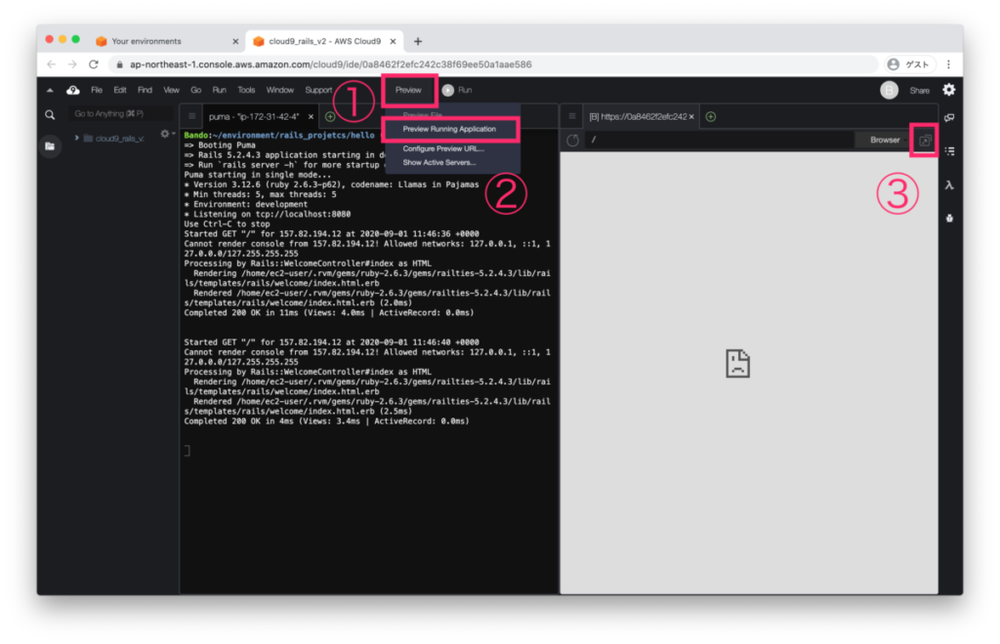
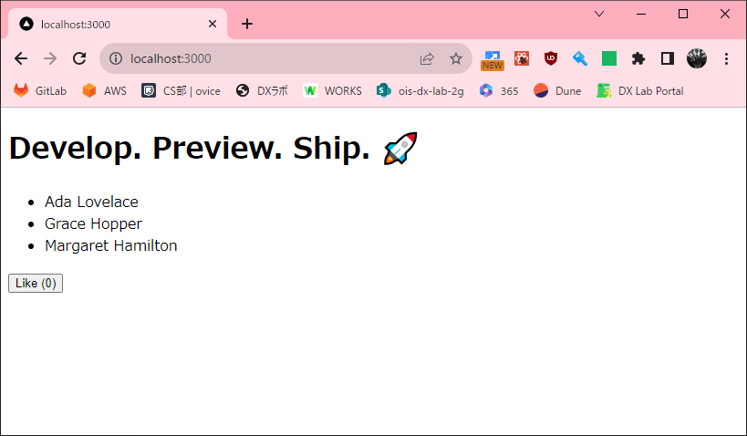

## Reactプロジェクトを始める
### Next.jsで始める
Next.js はフルスタックの React フレームワークです。ほぼ静的なブログサイトから複雑でダイナミックなアプリまで、どんな規模の React アプリでも作成できる万能フレームワークです。Next.js プロジェクトを新規に作るには、ターミナルで次のコマンドを実行してください。  
※Next.js を初めて使う場合は、[Next.js チュートリアル](https://nextjs.org/learn/foundations/about-nextjs)を参照してください。

```sh
npx create-next-app
```

各設定は以下を参考にしてください。

`What is your project named?` では任意の名前を指定してください。



完了すれば以下のようなログが表示されます。

```sh
PS C:\Users\ka-horikawa\Documents\Visual Studio Code> npx create-next-app
√ What is your project named? ... next-demo
√ Would you like to use TypeScript? ... No / Yes
√ Would you like to use ESLint? ... No / Yes
√ Would you like to use Tailwind CSS? ... No / Yes
√ Would you like to use `src/` directory? ... No / Yes
√ Would you like to use App Router? (recommended) ... No / Yes
√ Would you like to customize the default import alias? ... No / Yes
Creating a new Next.js app in C:\Users\ka-horikawa\Documents\Visual Studio Code\next-demo.

Using npm.

Initializing project with template: default


Installing dependencies:
- react
- react-dom
- next
- eslint
- eslint-config-next


added 294 packages, and audited 295 packages in 32s

122 packages are looking for funding
  run `npm fund` for details

found 0 vulnerabilities
Initialized a git repository.

Success! Created next-demo at C:\Users\ka-horikawa\Documents\Visual Studio Code\next-demo

PS C:\Users\ka-horikawa\Documents\Visual Studio Code> 
```

## Next.jsの構成
`create-next-app`で作成した`Next.js`アプリのディレクトリ構成は次のような感じになっています。  

```
作成したフォルダ/
  +-- .git/ ... Git リポジトリ
  +-- .next/ ... サーバー実行時に生成される
  +-- node_package/ ... NPM パッケージ
  +-- public/ ... 画像などの静的リソース
  +-- src/ ... sourceの略
      +-- pages/ ... 表示する Web ページ（`.js` や `.ts` などを格納する）
      +-- styles/ ... スタイルシート
  +-- .gitignore ... Git 用の無視ファイルリスト
  +-- package.json ... Node.js 設定ファイル
  +-- README.md ... GitHub 用のリードミー
```

### ESlintの設定変更
作成したフォルダ配下の`.eslintrc.json`を以下に書き換えてください。

```json title="作成したフォルダ/.eslintrc.json"
{
  "extends": ["next/core-web-vitals", "next", "next/core-web-vitals", "prettier", "next/babel"]
}
```

### Next.jsプロジェクトの初期化
作成したフォルダの`src`配下のファイルで`index.js`以外を削除してください。



`index.js`を以下に書き換えてください。

```js
export default function Home() {
  return <h1>Hello Next.js</h1>;
}
```

### React（Next.js）の実行
作成したフォルダに移動して、`npm run dev`を実行して開発サーバーが起動されるか確認しましょう。

```sh
# ディレクトリの移動
cd next-demo
# 開発サーバーの起動
npm run dev
```



#### Cloud9の場合
上部のPreviewより`Preview Running Application`を押すことで、ページが表示されれば成功です。



#### ローカルの場合
Webブラウザで`http://localhost:3000/`にアクセスして、次のようなページが表示されれば成功です。

## 画面の更新
`index.js`を以下に書き換えてください。

```js
import { useState } from 'react';

function Header({ title }) {
  return <h1>{title ? title : 'Default title'}</h1>;
}

export default function Home() {
  const names = ['Ada Lovelace', 'Grace Hopper', 'Margaret Hamilton'];
  const [likes, setLikes] = useState(0);

  function handleClick() {
    setLikes(likes + 1);
  }

  return (
    <div>
      <Header title="Develop. Preview. Ship. 🚀" />
      <ul>
        {names.map((name) => (
          <li key={name}>{name}</li>
        ))}
      </ul>

      <button onClick={handleClick}>Like ({likes})</button>
    </div>
  );
}
```

書き換えて保存すると、先ほどの画面が更新され以下の内容が表示されます。



### React（Next.js）の停止
停止する場合は、実行しているターミナルで`Ctrl＋C`を入力してください。
