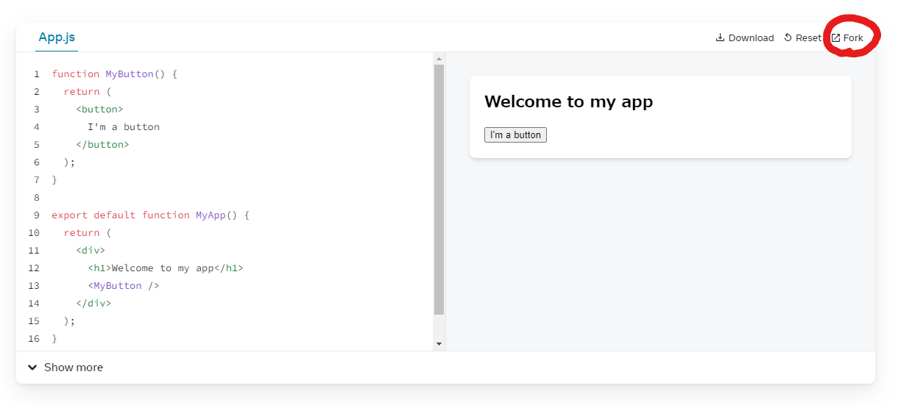
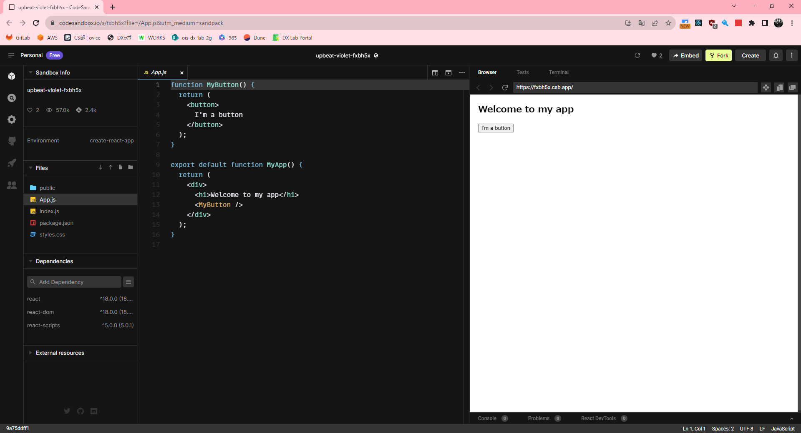

## Reactチュートリアル：クイックスタート
https://ja.react.dev/learn

### 概要
React ドキュメントへようこそ！ このページでは、日々の開発で使用する React のコンセプトのうち 80％ の部分を紹介します。

※公式より

このページではコンポーネントやstateの解説が記載してあります。    
よく読んで概要を理解してください。  

ページ内にあるライブコードエディタで、右上の Fork をクリックすると新しいタブが開き、CodeSandbox というウェブサイトのエディタが表示されます。  

CodeSandbox を使うと、ブラウザ上でコードを書くことができ、作成したアプリがユーザにどのように表示されるかプレビューすることもできるので活用してみてください。  

