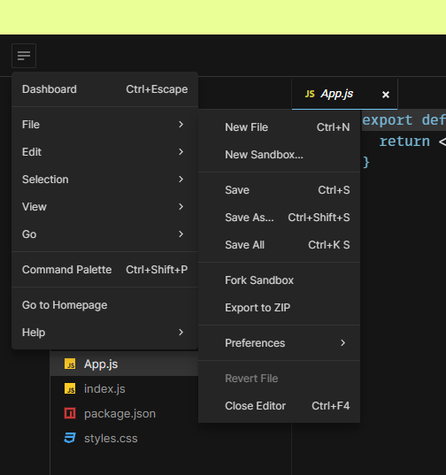
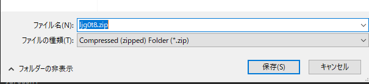

## Reactチュートリアル：三目並べ（公式）
https://ja.react.dev/learn/tutorial-tic-tac-toe

### 概要
このチュートリアルでは、小さな三目並べゲーム (tic-tac-toe) を作成します。このチュートリアルを読むにあたり、React に関する事前知識は一切必要ありません。このチュートリアルで学ぶ技法は React アプリを構築する際の基礎となるものであり、完全に理解することで React についての深い理解が得られます。

※公式より

正直、初心者の方にはかなり難しいので、理解するより書いて慣れることを目的としています。  
一度書いて、全体像は把握してください。  

コンポーネントやstateの理解が足りないと感じたら、[クイックスタート](https://ja.react.dev/learn)をご確認ください。

### チュートリアルのセットアップ
`create-next-app`で作成した環境で実施することもできますが、`CodeSandBox`というウェブサイトのエディタが用意されているので、そこでも実施することができます。

#### `create-next-app`からCloud9 or ローカルで行う場合
正方形のマス目 (square)を装飾する必要があるため、CSSを保存する必要があります。

<details>
<summary>以下のファイルをSRCに保存してください</summary>

```css title="styles.css"
* {
  box-sizing: border-box;
}

body {
  font-family: sans-serif;
  margin: 20px;
  padding: 0;
}

h1 {
  margin-top: 0;
  font-size: 22px;
}

h2 {
  margin-top: 0;
  font-size: 20px;
}

h3 {
  margin-top: 0;
  font-size: 18px;
}

h4 {
  margin-top: 0;
  font-size: 16px;
}

h5 {
  margin-top: 0;
  font-size: 14px;
}

h6 {
  margin-top: 0;
  font-size: 12px;
}

code {
  font-size: 1.2em;
}

ul {
  padding-left: 20px;
}

* {
  box-sizing: border-box;
}

body {
  font-family: sans-serif;
  margin: 20px;
  padding: 0;
}

.square {
  background: #fff;
  border: 1px solid #999;
  float: left;
  font-size: 24px;
  font-weight: bold;
  line-height: 34px;
  height: 34px;
  margin-right: -1px;
  margin-top: -1px;
  padding: 0;
  text-align: center;
  width: 34px;
}

.board-row:after {
  clear: both;
  content: '';
  display: table;
}

.status {
  margin-bottom: 10px;
}
.game {
  display: flex;
  flex-direction: row;
}

.game-info {
  margin-left: 20px;
}
```

</details>

#### フォルダをダウンロードしてCloud9 or ローカルで行う場合
1. 以下のリンクを開く  
   https://codesandbox.io/s/ljg0t8?file=/App.js&utm_medium=sandpack  
1. さきほど開いた CodeSandbox のタブで、左上隅のボタンを押してメニューを開き、そのメニューで `File > Export to ZIP` を選択して、ファイルをローカルにアーカイブとしてダウンロード  
     
     
1. アーカイブを解凍し、ターミナルを開いて解凍したディレクトリに `cd` する
1. `ljg0t8\src\App.js`の先頭に以下を追加する  
   ```js  
   import React from "react";  
   ```  
1. `npm install` で依存ライブラリをインストール
1. `npm start` でローカルサーバを起動し、プロンプト通りに操作し、ブラウザで実行されるコードを確認する
1. `<></>`は利用できないので注意！！

#### CodeSandBoxで行う場合
以下のリンクから実施できます。
https://codesandbox.io/s/ljg0t8?file=/App.js&utm_medium=sandpack

## Reactチュートリアル：五目並べ
https://ja.react.dev/learn/tutorial-tic-tac-toe

### 概要
三目並べから2行2列増やして、五目並べにしてください。

### 修正の観点
- stateで管理できる配列（`history`）の数を9から5掛ける5の25に修正する
- マス（`Square`）を2行2列増やして、5行5列に修正する
- 勝利条件のパターンの配列（`lines`）を、三目並べから五目並べのパターンに修正する
- 勝利条件の判定処理のパターンそれぞれの比較（a,b,c）に2つ追加して、5つ比較するよう修正する
