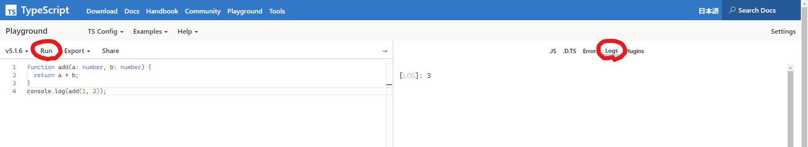

基本、以下を元に解説します  
[サバイバルTypeScript](https://typescriptbook.jp/)

## TypeScriptとは
TypeScriptは、JavaScriptを拡張して作られたプログラミング言語です。2014年頃にMicrosoftによって開発・発表されました。

TypeScriptで書かれたコードをコンパイルするとJavaScriptのコードに変換されます。そのため、JavaScriptファイルが実行できる環境ならすぐに使えて、JavaScriptライブラリもTypeScriptから使用できるなど、互換性の高さが特徴です。

TypeScriptは、大人数のプログラマーが開発に携わる場合でもエラーを防ぎやすいように設計されています。ほかにも、変数のデータ型をあらかじめ決められることや、1つの関数定義で異なるデータ型の引数を処理できることなどの特徴があります。

## TypeScriptとJavaScriptの違い
TypeScriptは、JavaScriptが進化したような特徴を持つイメージのプログラミング言語です。TypeScriptとJavaScriptの具体的な違いとして、以下の要素があります。

- JavaScriptは動的型付け、TypeScriptは静的型付け
- TypeScriptではJavaScriptと同様の構文が使える（JavaScriptはTypeScriptの一部）

### 静的型付け
TypeScriptは静的型付けを持つ言語で、変数や関数の引数に型を指定することで、コードの安全性が向上し、バグが発見しやすくなります。

```ts
function sum(a: number, b: number): number {
  return a + b;
}
```

### JavaScriptはTypeScriptの一部
```js
const hello = "Hello";
const world = "World";
console.log(hello + " " + world);
  "Hello World"
```

## TypeScriptの射程
TypeScriptを覚えるとさまざまなものを作れるようになります。TypeScriptはJavaScriptにコンパイルして使う言語です。そのため、JavaScriptで作れるものは何でも作れます。

- フロントエンド
- バックエンド
- デスクトップアプリケーション
- CLIアプリケーション
- サーバーレス (FaaS)
- インフラ構成管理 (IaC)
- Google Apps Script
- ブラウザ拡張
- 機械学習
- 組み込み系
- WebAssembly

※詳細は以下参照  
https://typescriptbook.jp/overview/range-of-typescript

## TypeScriptの型システム
> 「なぜJavaScriptに型を追加する必要があるのか？」と疑問に思うかもしれません。

型は、コードの品質と読みやすさを高めることが実証されています。大規模なチーム(Google、Microsoft、Facebook)は、常にこの結論に至っています。具体的には以下の通りです

- 型は、リファクタリングをする際の開発スピードを高めます。型があることによって、コードを書いている時点でエラーに気づくことができます。そして、すぐにエラーを修正できます。ランタイム（実行時）で、はじめてエラーに気づいて、コードに戻って修正するよりも、ずっと効率的です。開発中に早い段階でエラーに気づけるということは非常に素晴らしいことです。
- 型は、それ自体が、完璧なドキュメントです。関数のシグネチャは定理であり、関数の本体は証明です。

※TypeScript Deep Dive 日本語版より

### 型指定の方法
:::important

開発者が、明示的にコード上で型を指定することを、`型アノテーション`を書くと言います。

:::

TypeScriptは、ほかの任意な型付き言語(ActionScriptやF#など)で一般的な、末尾型アノテーションを使用します。

以下のように、対象の後ろにコロンをつけて、型を指定します。

```ts
let num: number = 123;
```

型が一致しない場合は、コンパイラはエラーを出力します。VSCodeなどを使用していれば、エディター上にエラーが表示されます。

```ts
let num: number = "123"; // エラー: `string` を `number` に代入できません
```

TypeScriptがサポートしている型アノテーションについては、このあと少し解説します。

### 基本アノテーション
前述のように、`:TypeAnnotation`構文（コロンと型）を使って型アノテーションを書きます。型宣言空間で使用可能なものは、型アノテーションとして使用できます。

以下は、変数、関数パラメータ、および関数戻り値の型アノテーションを示しています。

```ts
let num: number = 123;
function identity(num: number): number {
    return num;
}
```

### プリミティブ型(Primitive Types)
JavaScriptプリミティブ型は、TypeScript型システムでカバーしています。これは、以下に示すように `string`、`number`、`boolean`を意味します：

```ts
let num: number;
let str: string;
let bool: boolean;

num = 123;
num = 123.456;
num = '123'; // Error

str = '123';
str = 123; // Error

bool = true;
bool = false;
bool = 'false'; // Error
```

### 配列(Arrays)
TypeScriptは、配列に専用の構文を提供し、コードにアノテーションを付けて文書化するのを容易にします。構文は、基本的に`[]`を有効な型アノテーションに後置します(例えば `:boolean[]`)。これは通常行う配列操作を安全に行うことを可能にし、誤った型のメンバを割り当てるなどのエラーからあなたを守ります。これは以下のとおりです

```ts
let boolArray: boolean[];

boolArray = [true, false];
console.log(boolArray[0]); // true
console.log(boolArray.length); // 2
boolArray[1] = true;
boolArray = [false, false];

boolArray[0] = 'false'; // Error!
boolArray = 'false'; // Error!
boolArray = [true, 'false']; // Error!
```

### インターフェース(Interfaces)
インターフェースは、複数の型アノテーションを単一の名前付きアノテーションに合成するための、TypeScriptにおける主要な方法です。

以下では、アノテーションを`first: string` + `second: string`という新しいアノテーションNameにまとめて、個々のメンバの型チェックを行っています。

```ts
interface Name {
    first: string;
    second: string;
}

let name: Name;
name = {
    first: 'John',
    second: 'Doe'
};

name = {           // Error : `second` is missing
    first: 'John'
};
name = {           // Error : `second` is the wrong type
    first: 'John',
    second: 1337
};
```

### インライン型アノテーション(Inline Type Annotation)
新しい`interface`を作成するのではなく、構造`:{/* Structure */}`を使ってインラインで必要なものにアノテーションを付けることもできます。前の例を、インライン型で再掲しています。

```ts
let name: {
    first: string;
    second: string;
};
name = {
    first: 'John',
    second: 'Doe'
};

name = {           // Error : `second` is missing
    first: 'John'
};
name = {           // Error : `second` is the wrong type
    first: 'John',
    second: 1337
};
```

インライン型は、1回だけ使うようなアノテーションを素早く提供するのに適しています。  
同じ型アノテーションを複数回インラインで入れる場合は、インターフェースにすることが推奨されています。

## TypeScript Playgroundの使い方

### TypeScript Playgroundとは
公式が提供している Web で TypeScript を手軽に試すことができる実行環境です。

JavaScriptへのコンパイル結果や型定義も確認できるので、機会があれば活用してみてください。

### TypeScript Playgroundを使う
[TypeScript Playground](https://www.typescriptlang.org/play)にアクセスすれば、すぐに使いはじめることができます。

### プログラムの実行結果を確認する
Playground にアクセスできたら、早速コードを実行してみましょう。  
以下のサンプルコードを Playground のエディターに入力します。  

```js
function add(a: number, b: number) {
  return a + b;
}
console.log(add(1, 2));
```

入力が終わったらエディターの上部にある`RUN`をクリックして、コードを実行できます。  
実行後は右側の`Logs`のタブで実行結果が確認できます。  



## ReactでのTypeScript

### Functionコンポーネント(Functional Components)
`React.FC`インターフェースを使ってステートレスなFunctionコンポーネントを定義することができます。`React.FC`は単に、`React.FunctionComponent`の短いバージョンです。

```js
type Props = {
  foo: string;
}
const MyComponent: React.FC<Props> = (props) => {
    return <span>{props.foo}</span>
}

<MyComponent foo="bar" />
```

### React JSX のヒント： レンダリング可能なインターフェース
Reactは`JSX`や`string`をレンダリングすることができます。これらはすべて`React.ReactNode`型に統合されていますので、レンダリング可能なものを受け入れる場合などに使用してください。

```js
type Props = {
  header: React.ReactNode;
  body: React.ReactNode;
}
class MyComponent extends React.Component<Props, {}> {
    render() {
        return <div>
            {this.props.header}
            {this.props.body}
        </div>;
    }
}

<MyComponent header="これはヘッダーです" body="これはボディです" />
```

### 他のヒント
他にも複数のヒントがあるので、ReactでTypeScriptを利用する場合は以下を参考にしてください。

https://typescript-jp.gitbook.io/deep-dive/tsx/react

## 参考
- https://typescriptbook.jp/
- https://typescript-jp.gitbook.io/deep-dive/
