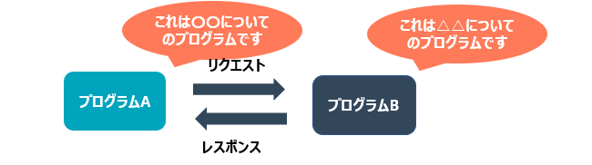
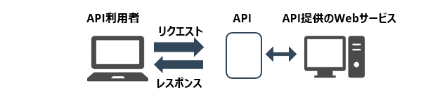

## Web APIとは
Web APIとは、httpやhttpsなどWeb技術を用いて実現されるAPIの一類型です。

API（Application Programming Interface）とは、プログラムの機能の一部を別のプログラム上で利用できるようにやりとりをするための仕組みを指します。

## APIとWeb APIとの違い
APIとWeb APIの概念を学んだうえで、Web APIがデータや機能を取得する仕組みを確認しましょう。

APIは、あるプログラムの機能を別のプログラムで利用するために、利用者（クライアント）が公開されているAPIプログラムのサーバーにリクエストを送ります。その応答（レスポンス）として、プログラムの一部機能が利用できる仕組みです。 

Web APIではないAPIの多くは、利用者側が用いるプログラミング言語と同一の言語を用いて提供されています。しかし、Web APIでは、言語が異なっていても通信が可能なHTTP／HTTPS方式が採用されています。

Web APIの採用するHTTP/HTTPSによる通信では、プログラミング言語が異なっていても通信でき、Webブラウザ上でも稼働する利点があります。さらにデータは自動更新されるなど汎用性の高さに加え、無料のWeb APIも多く公開されていることから、様々なシーンでの導入が進められてきました。

## Web APIの代表例
- Google Map API  
  Webサイト上に、Google Mapの機能を埋め込めるやつ  
- Amazon API  
  サクラチェッカーとかに利用されてます  
- YouTube API  
  Webサイト上に、YouTubeの動画を埋め込めるやつ  
- Twitter API  
  イーロン・マスクが規制したやつ  

## Web APIの3つの役割
Web APIは異なるプログラムをつなぐことを通じて、導入する側にとっても、提供する側にとっても大きな役割を果たしています。主な役割を以下の3つです。

- 新たな機能やサービス開発を助ける
- より良い顧客体験を提供する
- 自社サービスのユーザーを拡大する

## Web APIの種類
### SOAP API（使わない）
SOAP（Simple Object Access Protocol）はHTTPの呼び出し（Request）と応答（Response）にXMLを使ってデータのやりとりを行う通信プロトコル（規約）です。Web APIが登場した初期には、SOAPが主に用いられていました。

しかし、巨大で複雑な仕様のため、近年では敬遠される傾向があります。

### REST API
REST（REpresentational State Transfer ）は「分散システムにおける設計原則のひとつ」という意味を持っており、SOAPのような通信プロトコルではなく、複数のソフトウェアの連携に適した設計ガイドラインを指します。

REST APIには次の4つの原則があります。

- 原則1：ステートレスなクライアント/サーバプロトコル  
  HTTPメッセージの全てがリクエストを理解するための必要な情報を含んでいることから、HTTP通信を行うクライアントもサーバもメッセージ間におけるセッションの状態を記憶している必要がありません。  
  ※ ステートレスと表現していますが、実際には Cookie などを使用しセッション状態を管理しています。
- 原則2：リソースを一意なURIにより識別される  
  RESTfulなシステムでは全てのリソース（情報）はURI（Uniform Resource Identifier）で表現されるユニークなアドレスを持ちます。
- 原則3：HTTPメソッドで操作方法を表現した統一されたインターフェース  
  リソースを操作するメソッドは、HTTPで定義されている `GET`、`POST`、`PUT`、`DELETE` などを使用します。つまり、情報を操作する命令体系があらかじめ定義されています。
- 原則4：アプリケーション情報と状態遷移の両方を扱えるハイパーメディアの使用  
  リソースを様々な形式（`HTML`、`XML`、`JSON`、`バイナリ`）で表現できるようにします。また、関連するデータはハイパーメディア（リンク）としてデータに含めることができます。

これらの原則を満たすWeb APIをRESTful APIと呼びます。

続く...
