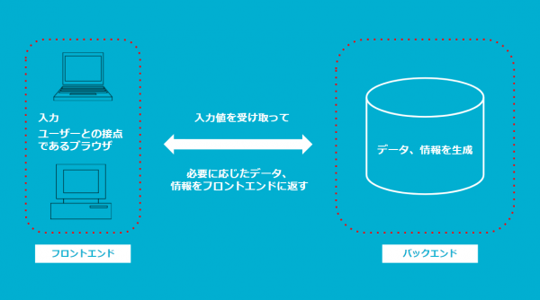

## 対象
- 社内でフロントエンドエンジニアが不足している。
- いきなりフロントエンドやれと言われた。
- サーバーサイドしか知らない。
- SPAって何？
- モダンWebって何？
- どうしていいか分からない。

といった今までフロントエンドとはあまり縁がなかったけど、急に関わることになった方を対象とします。

## フロントエンドとバックエンド
Wikipediaによると、「ソフトウェア設計におけるフロントエンドは、ユーザーと直接やりとりするソフトウェアシステムの部分を指し、バックエンドはフロントエンドへの出力を生成する部分を指す。」とのことです。

イメージにすると以下です。

- フロントエンド…入力やユーザーとの接点であるブラウザ
- バックエンド…入力値を受け取って、必要に応じたデータ、情報をフロントエンドに返す、データ、情報を生成

### フロントエンドとは
フロントエンドとは、ユーザーが直接的に操作できるWebサイトの部分のことです。  
ユーザーが見たり、触れたり、体験したりできるすべての部分が含まれます。フロントエンドは、ナビゲーションメニュー、目立つボタン、カラフルな画像のようなグラフィカルユーザーインターフェースなど、Webサイトで表示される機能を指します。  
すべてのアクションがクライアント側（この場合はユーザー側）で行われるため、フロントエンドは「クライアントサイド」とも呼ばれます。  

Webアプリフロントエンドは主にWebブラウザーであり、ユーザーがWebサイトで見たり経験したりするすべてがフロントエンド開発の一部です。  
フロントエンド開発はデザインと使いやすさの面でユーザーエクスペリエンスの向上に貢献します。Webサイトのデザインを担当するのはWebデザイナーですが、彼らはコードを使わず、美しく、ユーザーフレンドリーなデザインを特徴とするWebサイトの作成と再設計を担当しています。  
一方で、フロントエンド開発者の役割は、HTML、CSSやJavaScriptなどのいくつかのツールを使用して、ユーザーが表示・操作できる環境を開発することです。  

### バックエンドとは
一般的に「サーバーサイド」として知られるバックエンドとはユーザが見ることも操作することもできないWebサイトの部分です。基本的に、Webバックエンド開発は裏で動作するすべての部分を担当します。つまり、Webサイトがどのように動作するかに関するものであり、 フロントエンド開発の間接的なサービスプロバイダーのようなものです。フロントエンドとは異なり、バックエンドはサーバー側で実行されます。それでもフロントエンドと通信して、すべてが適切に動作することを保証します。バックエンドは通常、プログラマーと開発者が担当します。

バックエンド開発者は、ライブラリの作成、APIの作成、Webデザイナーが作成するすべてのものへのユーティリティの追加などの作業を担当します。

### 比較
|  | フロントエンド | バックエンド |
|--|----------------|--------------|
| 開発領域 | Webサービス、Webアプリなどの操作画面 | サーバー側 |
| 内容 | <ul><li>UIデザインなど見た目に関わる部分の制作・開発</li><li>画面遷移やレイアウトの構築</li><li>コーディング</li><li>ユーザーから見える部分</li></ul> | <ul><li>システム構築</li><li>データベース構築</li><li>保守・運用</li><li>ネットワークを介した通信</li><li>ユーザーから見えない部分</li></ul> |
| 使用言語 | <ul><li>HTML</li><li>CSS</li><li>JavaScript など</li></ul> | <ul><li>Java</li><li>Ruby</li><li>PHP</li><li>Python など</li></ul> |
| フレームワーク・ライブラリ | <ul><li>React</li><li>Vue.js</li><li>Next.js</li><li>Nuxt.js など</li></ul> | <ul><li>Express</li><li>Django</li><li>Laravel</li><li>Ruby on Rails など</li></ul> |

## 理解度チェック
- [ ] ウェブアプリケーションにおけるフロントエンドとバックエンドの役割の違いについて簡単に説明できる
- [ ] フロントエンド開発者の役割、開発内容について簡単に説明できる
- [ ] バックエンド開発者の役割、開発内容について簡単に説明できる
- [ ] フロントエンド開発で使われる言語について1つ以上挙げることができる
- [ ] バックエンド開発で使われる言語について1つ以上挙げることができる
- [ ] フロントエンド開発で使われるフレームワーク・ライブラリについて1つ以上挙げることができる
- [ ] バックエンド開発で使われるフレームワーク・ライブラリについて1つ以上挙げることができる