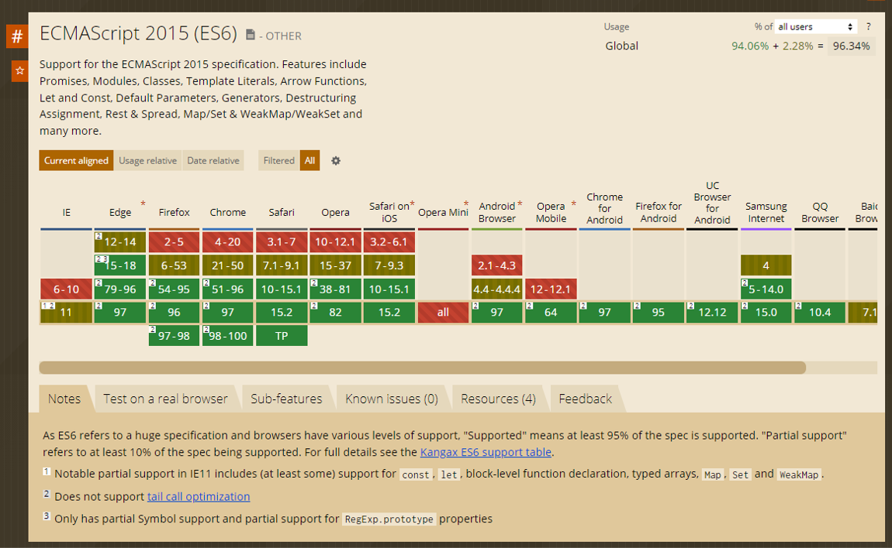
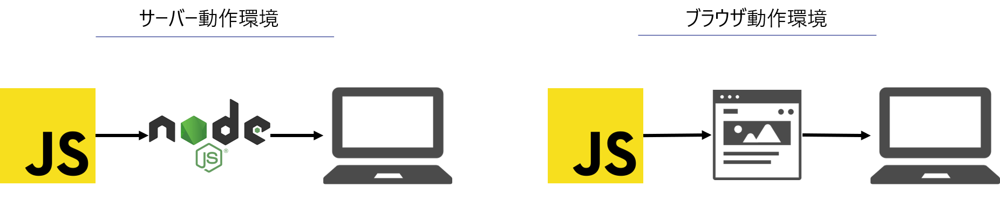
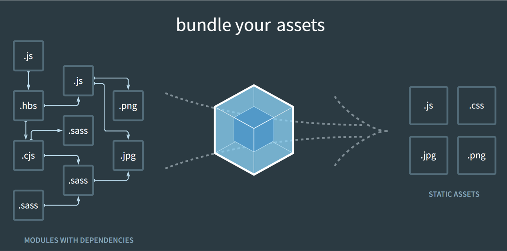
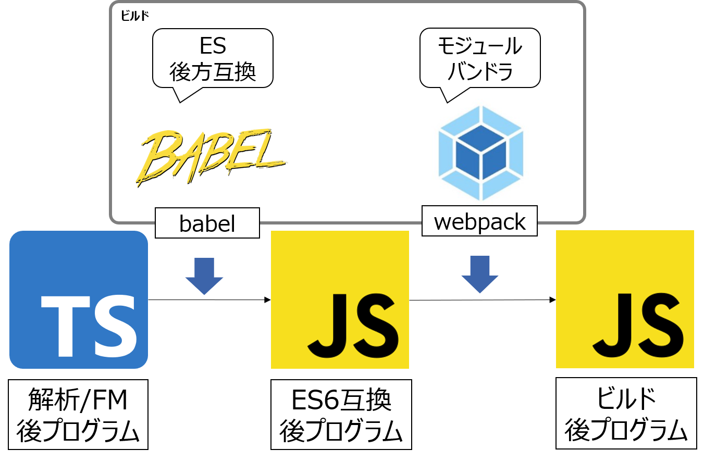
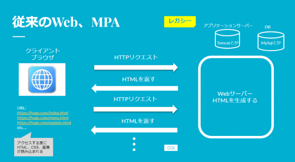
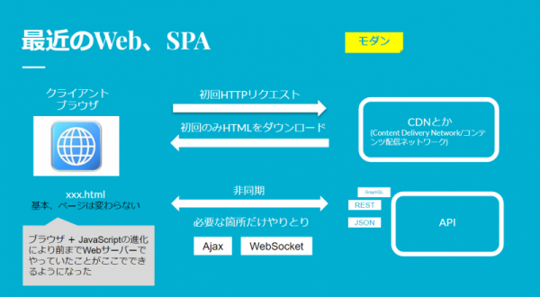

## モダンフロントエンドとは何か
2014年頃以降、React,Angular,Vue.jsなどのフレームワークやライブラリが流行し、いまも続いています。  
これらフレームワークやライブラリとその周辺技術をモダンフロントエンドと呼んでいます。  

## フロントエンドの今と昔
最近のフロントエンドの主流やモダンWebが語られるときに、よく`SPA(Single Page Application)`が登場します。

SPAって何？という前にSPAに対して`MPA(Multiple or Multi Page Application)`という言葉もあります。  
逆に比較対象としてMPAをレガシーWeb、なんて言うこともあったりします。

フロントエンドの今と昔では何がちがうのか？いくつかポイントをまとめます。

## 言語仕様の標準化（EcmaScript2015/ES6）
ECMAScript とは、Ecma インターナショナルという国際標準化団体が定めた JavaScript の言語仕様（言語標準）です。2015年から毎年 ECMAScript は新機能を追加しています。

JavaScript の実行環境は「ブラウザ」です。ブラウザごとに言語仕様が異なっていましたが標準化が進み言語としての安定感が増しました。ただし、標準化はされているもののブラウザが最新機能に追いついているかというとそうではありません。Can I use ?というサイトでブラウザの対応状況がわかります。2022年1月現在、ECMAScript 2015 (ES6) をサポートするブラウザは世界で96.34%です。

## 型の登場（TypeScript）
TypeScript は JavaScript に型を追加します。型があることはメリットでもありデメリットでもありますが、型があることで開発に関わる人数や規模が増えた際にも品質が安定するため TypeScript は是非導入を検討してください。特徴は次のとおりです。

- JavaScriptの上位互換
- 安全性が高い
- 型推論がある
- オープンソースである

## サーバーサイド実行環境の獲得（Node.js）
Node.jsが開発されたことで、JavaScriptでサーバーサイドの処理ができるようになりました。  
それに伴い、JavaScriptのフレームワークが開発されました。（React、Vueなど）

:::tip
JavaScriptは元々フロントエンド言語でブラウザでの画面表示部分、つまりフロントエンドで使用されることを前提に作られたプログラム言語でした。  
そのため、データベースへのアクセスなどサーバーサイドの処理はできませんでした。
:::

## ライブラリ / フレームワーク
代表的なものに React, Vue.js, Angular などがありますが、これらを利用することにより、効率的に開発を行うことができます。。

例ですが、React はユーザインターフェイスを構築するための、宣言型で効率的で柔軟な JavaScript ライブラリです。複雑な UI を、「コンポーネント」と呼ばれる小さく独立した部品から組み立てることができます。

:::note
Reactは、JavaScriptライブラリー。
Vue.jsは、JavaScriptフレームワーク。
:::

:::tip
フレームワークとライブラリの違い

フレームワークとライブラリはアプリケーションを開発するのに必要なコードの量を減らすことで効率化できることは共通しているものの、両者は厳密に言えば意味がまったく異なります。前者はプログラマーがアプリケーションを開発するのに必要な土台です。一方で、後者はプログラマーの作業を簡略化し、開発のプロセスを効率化するために予め定義された関数やクラスの集合体です。
:::

## パッケージマネーシャー（npm / yarn）
npmとyarnは JavaScript 向けのパッケージマネージャです。ライブラリをパッケージ管理することが出来るようになり、本格的なアプリケーションの構築が出来るようになりました。

簡単なコマンドの入力でパッケージをインストールすることができます。

## ビルドツール
自分が勉強した時は`webpack + Babel`が一般的でしたが、近年では次世代のビルドツールに移り変わっています。

webpackがオワコンなんて😢...どれだけ苦しめられたか...

その中で特にwebpackに取って代わる勢いを見せているものにViteとTurbopackがあります。これらは、開発するアプリケーションの肥大化に伴って処理が遅くなってしまうwebpackの問題点を解決することが主要目的となっています。

脱webpackの流れなので、ViteとTurbopackは覚えてください。

### Vite
Vue.jsの開発者であるEvan You氏が開発する新しいJavaScriptビルドツールです。2020年のリリース以降、近年の人気が急上昇しています。

新しプロジェクトはVite以外ありえないですし、Viteに移行するトレンドがあります。

### Turbopack
Webpackの開発者であるTobias Koppers氏が中心となりVercel社が開発している新しいバンドルツールで、2022年10月にα版がリリースされました。

Next.jsで開発されたアプリケーションのバンドルやビルドのスピードが遅いという問題を解決し、Webpackを置き換えることが狙いとなっています。

2024年10月のアップデートでTurbopackが標準になりましたが、めっちゃ早い。

### モジュールバンドラー（webpack）
古いですが、概念としては大事なので残します。

webpack はモジュールバンドラです。複数ファイル間の依存関係を解決して、ブラウザで実行可能な JavaScript ファイルを生成するツールです。まとめる処理をバンドルと呼びます。

複数に分けられているJavaScriptやcssを本番用にビルドするときに１つにまとめてくれます。

### トランスパイラ（Babel）
古いですが、概念としては大事なので残します。

webpackが複数のファイルを一つにまとめるものに対して、Babel は新しい JavaScript 構文を古い JavaScript 構文に変換して、昔のブラウザにも後方互換対応させるためのトランスパイラです。

また React で利用する JSX 構文を実行可能な JavaScript に変換するためにも使われます。TypeScript, Babel, webpack のトランスパイル・バンドルは同時に実行させることが多いです。

## MPA(Multiple or Multi Page Application)

複数のHTMLで構成される。  
ページの遷移時はWebサーバーに問い合わせ、その都度、HTMLをサーバー側で生成してブラウザはそれを静的に表示することを主とする。

サービスの例：WordPress、HTML＋jQuery＋Webサーバー(PHP)のサービスとか他多数

### 長所
- SEOの最適化が簡単。管理しやすい。
- アプリケーション内の構造がわかりやすい。マッピングしやすい。
- SPAと比較して、学習コストは低い。
- 滞在時間の短い、直帰率の高いサービスに適している。

### 短所
- ファイル読み込みの通信が頻繁に発生する。
- バックエンドと密接に結びついている為、導入にはフロントエンド及びバックエンド双方の検討が必要。
- 学習コストは低いが、フロント側は中大規模開発になると管理が大変、構造が複雑になりがち。
- モバイル向けのサイトを作成する場合、UI設計が難しい。さらに実装に時間がかかるため工数(コスト)がかかる。

## SPA(Single Page Application)

ひとつのHTMLで構成される。  
HTML、JavaScript、CSSが読み込まれるのは初回アクセス時のみ。

基本的にページは遷移しない。ページ遷移というのを画面内で表現する。  
必要に応じてデーターを非同期でサーバーに問い合わせ、JavaScriptによってブラウザで動的に描画される。

サービスの例：Gmail、Googleマップ、Facebook、GitHubなど

### 長所
- ファイルの読み込みがほぼ初回だけの為、読み込むファイルを減らすことができる。
- クライアント、サーバ間の処理が減る。応答が速い。
- 画面遷移しない為、アニメーションなどのリッチなコンテンツを提供することができる。
- SPA＋APIで実装できる為、モバイルアプリと同じバックエンドを利用できる。
- また外部サービスのBaaS(Backend as a Service)とかと組み合わせれば、サーバレスで運用できる。
- 従来のWeb、MPAと比較して、バックエンドと密結合にならない。
- ブラウザのキャッシュ機能を効果的に利用でき、オフライン動作を提供できる。
- ブラウザの機能を使ってデバッグがしやすい。
- モバイル向けのサイトとあわせてUI設計がしやすい。
- 滞在時間の長いサービスに適している。

### 短所
- SEOの最適化が難しい。
- ブラウザの設定により、JavaScriptが使えないとつらい。
- 初回のファイル読み込みが重い、時間がかかる。
- 従来のWeb、MPAと比較して、クロスサイトスクリプティング(XSS)による攻撃を受けやすい為、安全性が劣る。
- 従来のWeb、MPAと比較して、学習コストが高い。

## ソースコードのフォーマット（Prettier）
Prettier はコードフォーマッターです。コード整形を主目的としています。ESLint と併用します。

## ソースコードの静的解析（ESLint）
ESLint はコードフォーマッターです。コードの構文解析、間違いを指摘してくれます。

## タスクランナー（Husky）
Husky はタスクランナーです。Git の commit, push をする前に一連の作業を実施してくれます。

## 参考
- [モダンフロントエンドの進む道](https://qiita.com/simezi9/items/d5ace310958be3b715aa)
- [React で紐解くモダンフロントエンド開発の歴史と進歩](https://www.nri-digital.jp/tech/20220216-8262/)
- [【解説】フレームワークとライブラリの違い](https://zenn.dev/nameless_sn/articles/framework_and_library)
