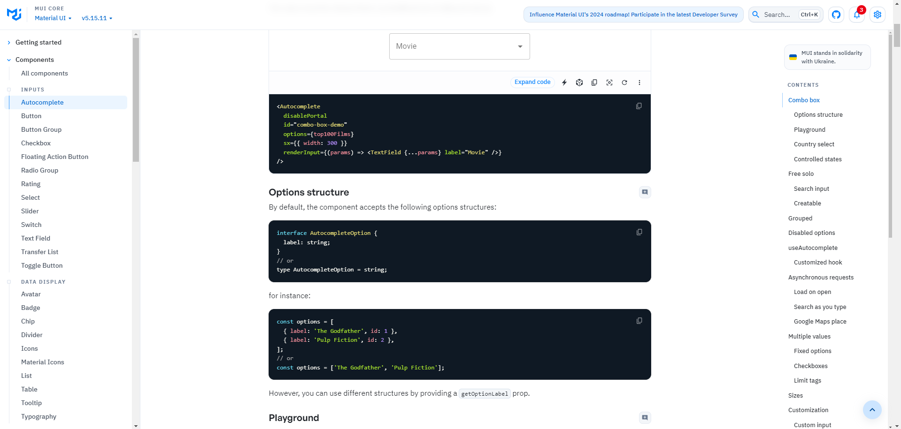
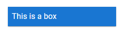

## MUI（Material UI）とは
https://mui.com/

MUIとは、デザイナーやアプリ開発者向けに作られたUIコンポーネントのライブラリ。Webアプリ向けのライブラリであるReactを用いてUIを構築する際にMUIが利用できる。

基礎的なものから、カスタマイズ可能な高度なものまで、膨大なUI要素が備わっている点がMUIの特徴。また、MUIには有料のReact向けテンプレートやツールもあるので、既に完成しているUIを微調整して、自分が作りたいアプリを開発できる。

## マテリアルデザイン
MUIには、Googleが提唱するマテリアルデザインの考え方で作られたUIパーツが用意されているボタンやテキストフィールドなど、洗練されたデザインのUIパーツを使うことが可能。

Reactでは、いくつかのUIパーツを組み合わせて、まとまりとして利用できる。ボタンやチェックボックスなどの最小単位のWebパーツを用いてUIを構築できることが、ReactとMUIの強み。

## MUIのメリット
- デザインに一貫性が生まれる
- コードの記述量が減る
- 拡張性が高い

## MUIのデメリット
- デザインの自由度が下がる
- イブラリに依存する

## MUIを利用するポイント
### divをあまり使いたくない
divをstyledで装飾することはできるが、styledを詳細に定義する必要があるため、コードの量が増えやすい。また、styledはコードの上部で定義することが多く、htmlタグが記載されている下部と距離がある。せっかく`CSS-in-JS`にしているのに、可読性が悪い。

そのため、divをあまり使いたくない

MUIのBox、Container、Grid、Stackを使い分けることで十分にUIを構築することはできる。  
基本的には Box を利用し、子要素に対して特別な配置を適用したい場合に Grid や Stack 等を使う。
Containerは箱として親要素に使う。

`sx prop`によるスタイルが行えるため、`CSS-in-JS`のメリットも活かすことができる。  

- [Box](https://mui.com/system/react-box/)  
  汎用のコンテナ  
- [Container](https://mui.com/system/react-container/)  
  コンテンツを水平方向の中央に配置するレイアウト要素  
- [Grid](https://mui.com/system/react-grid/)  
  レスポンシブなレイアウト グリッドは画面のサイズと方向に適応したレイアウト  
- [stack](https://mui.com/system/react-stack/)  
  要素を縦または横に配置するためのコンテナ  

以下参考

[ReactのMaterial UI (MUI) を細かくデザインする](https://qiita.com/mow_icey/items/d4db94073e0484f2187a)

### MUIの実装例を見てパターンを学ぶ
UIコンポーネント全てに実装例や、表示イメージがあるので、以下のサイトを見て自分が実現したいパターンを探して学ぶのが良い。

https://mui.com/material-ui/react-autocomplete/



## `sx prop` によるスタイル設定
MUI コンポーネントに実装されている`sx prop`を使うと、様々な省略記法 を使って、テーマ (`theme`) に基づいたスタイル設定を行うことができる。

`sx prop`にはオブジェクトを渡すため、コードは `sx={{ ... }}` のように中括弧が 2 つ続く形になることに注意が必要。

```js
<Box
  sx={{
    boxShadow: 1,                   // boxShadow: theme.shadows[1]
    color: 'primary.contrastText',  // color: theme.palette.primary.contrastText
    bgcolor: 'primary.main',        // background: theme.palette.primary.main
    m: 1,                           // margin: theme.spacing(1)
    p: {
      xs: 1,                        // [theme.breakpoints.up('xs')]: { padding: theme.spacing(1) }
    },
    zIndex: 'tooltip',              // zIndex: theme.zIndex.tooltip
  }}
>
  This is a box
</Box>
```



### sx-prop
詳細は以下を確認して欲しい。  
https://mui.com/system/getting-started/the-sx-prop/

### button props
また、各コンポーネントの`Props`で設定できるものもあるため、使いたいコンポーネントの仕様も確認して欲しい。
https://mui.com/material-ui/api/button/

## スペーシング
https://mui.com/system/spacing/

Where property is one of:

- m for classes that set margin
- p for classes that set padding

Where sides is one of:

- t for classes that set margin-top or padding-top
- b for classes that set margin-bottom or padding-bottom
- l for classes that set margin-left or padding-left
- r for classes that set margin-right or padding-right
- x for classes that set both *-left and *-right
- y for classes that set both *-top and *-bottom

```js
<Box sx={{ m: 1 }} /> //　縦横 margin: 8px;
<Box sx={{ mt: 1 }} /> //　上 margin: 8px;
<Box sx={{ mb: 1 }} /> //　下 margin: 8px;
<Box sx={{ ml: 1 }} /> //　左 margin: 8px;
<Box sx={{ mr: 1 }} /> //　右 margin: 8px;
<Box sx={{ mx: 1 }} /> //　横 margin: 8px;
<Box sx={{ my: 1 }} /> //　縦 margin: 8px;
// ※p も同様です
```
