## デプロイ

### Amplifyコンソール
新しいアプリケーション > ウェブアプリケーションをホストを選択

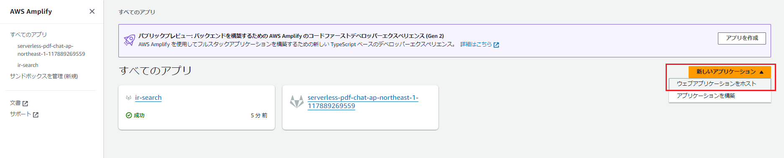

### Amplifyホスティングの開始方法
GitLabを選択

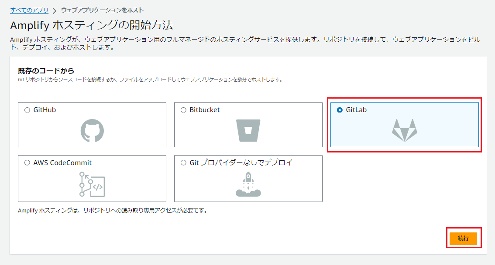

### アカウント認証
Authorizeを選択

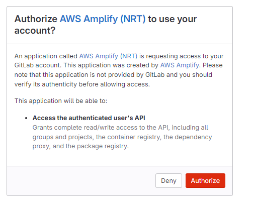

### リポジトリブランチの追加
ホスティングしたいリポジトリとブランチを選択

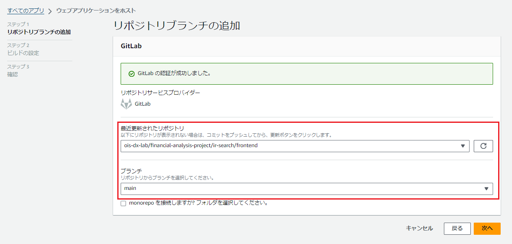

### ビルドの設定
アプリケーションの名前で任意のアプリケーション名を指定

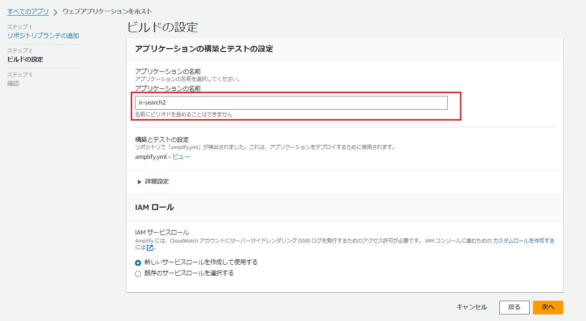

### 確認
問題なければ「保存してデプロイ」を選択

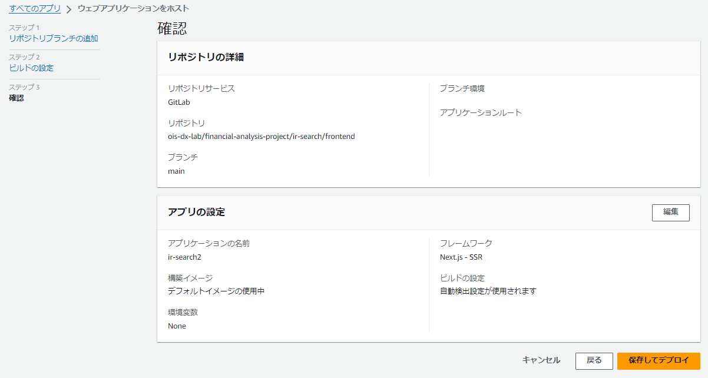

## デプロイ後の初期設定

### ビルドイメージ
構築イメージをデフォルトから任意のイメージに変更

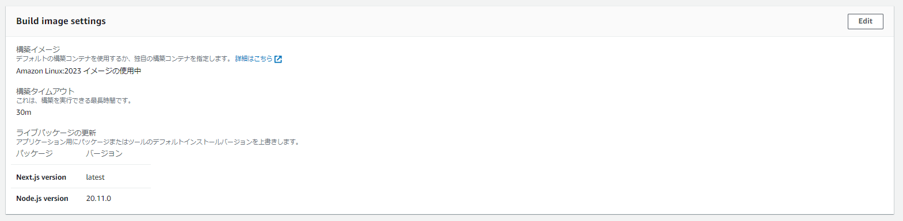

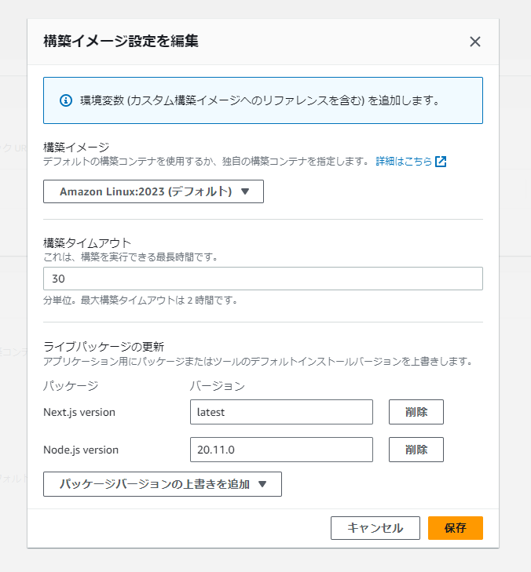

### プレビュー
「プレビューを有効化」をクリックして、プレビューステータスを有効にする

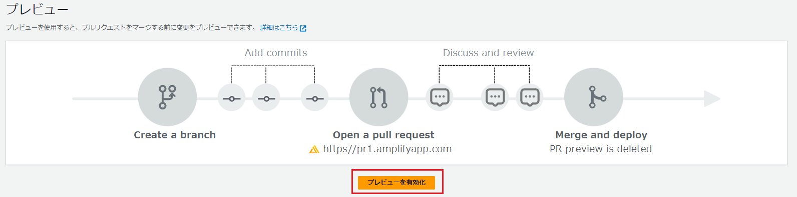

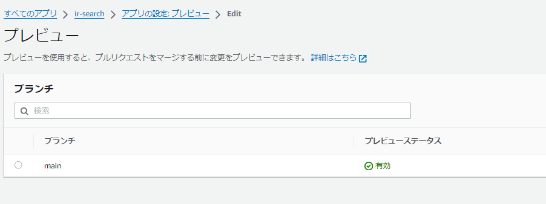

### 環境変数
APIのURIやキー等を設定する  
※`_CUSTOM_IMAGE`や`_LIVE_UPDATES`は、自動設定

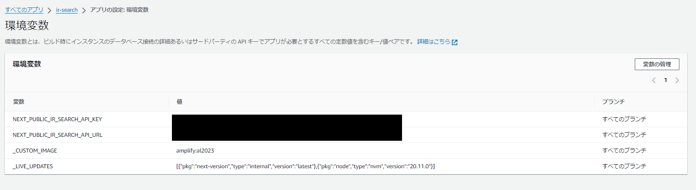

### アクセスコントロール
アクセスを制限する場合は設定する

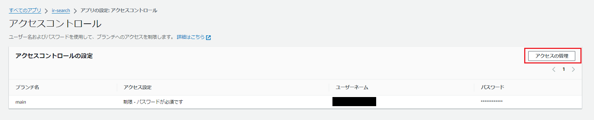
