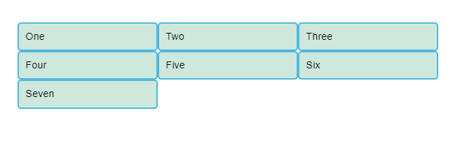
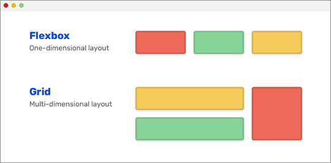
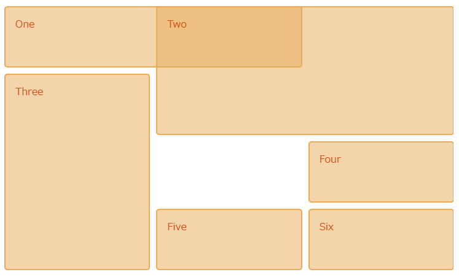

## グリットレイアウトとは
グリッドレイアウトとは、縦と横の線を引いて格子（グリット）または方眼状の線（ブロックライン）を作成し、それを自由に組合わせていく手法のこと。


コンテナに対して `display:grid` を指定することで、中の要素にレイアウトを適用させることが可能となる。
下記のようにHTMLを記述する。

```html
<div class="container">
    <div>One</div>
    <div>Two</div>
    <div>Three</div>
    <div>Four</div>
    <div>Five</div>
    <div>Six</div>
    <div>Seven</div>
</div>
```

コンテナはクラス名 `container` に `display:grid` を指定することで、子要素のレイアウトを変更することが出来る。

```css
.container {
    display: grid;
}
```

フレックスボックスとは異なり、`display:grid`を追加だけでは機能しない。 `display: grid` だけを宣言すると 1 列のグリッドになる。

よりグリッドらしく見せるには、グリッドにいくつかの列を追加する必要がある。

200 ピクセルの列を 3 つ追加し、他のプロパティを設定すると、作成したグリッドの各セルに項目が 1 つずつ再配置されていることがわかる。

```css
.container {
  display: grid;
  grid-template-columns: 200px 200px 200px;
}
```



## フレックスボックスとの違い
フレックスボックスは横並びにしてくれるレイアウトで、横方向か、縦方向の、一方向からレイアウトを組んでいくもの。  
対してグリットレイアウトは、横方向と縦方向の両方向からレイアウトを組む。

- フレックスボックスは一方向のレイアウト
- グリットレイアウトは多次元のレイアウト



## 複雑なレイアウト
最小値 100 ピクセル、最大値 auto で作成された列を含む、3 つの行を表示し、要素は線ベースの配置に従ってグリッド上に配置される。

```html
<div class="wrapper">
    <div class="one">One</div>
    <div class="two">Two</div>
    <div class="three">Three</div>
    <div class="four">Four</div>
    <div class="five">Five</div>
    <div class="six">Six</div>
</div>
```

```css
.wrapper {
  display: grid;
  grid-template-columns: repeat(3, 1fr);
  gap: 10px;
  grid-auto-rows: minmax(100px, auto);
}
.one {
  grid-column: 1 / 3;
  grid-row: 1;
}
.two {
  grid-column: 2 / 4;
  grid-row: 1 / 3;
}
.three {
  grid-column: 1;
  grid-row: 2 / 5;
}
.four {
  grid-column: 3;
  grid-row: 3;
}
.five {
  grid-column: 2;
  grid-row: 4;
}
.six {
  grid-column: 3;
  grid-row: 4;
}
```



## 続き
グリットレイアウトは奥深いので、以下のサイトで続きを見てください。

https://developer.mozilla.org/ja/docs/Learn/CSS/CSS_layout/Grids
