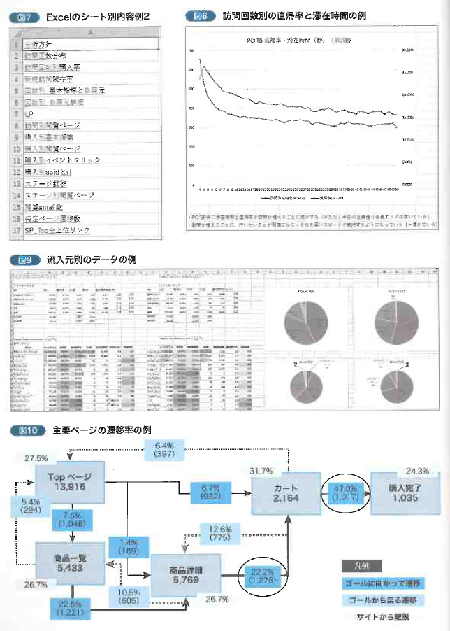
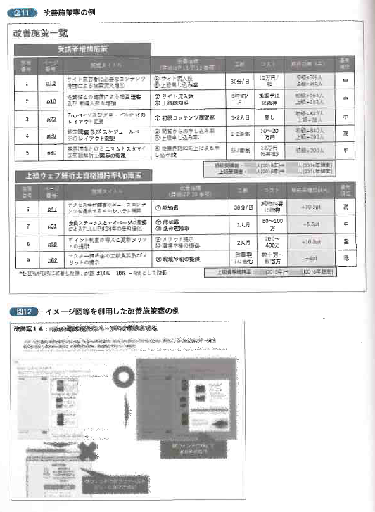
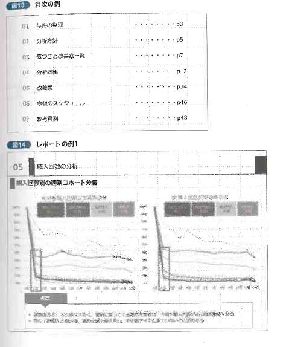

要件や課題が明確な場合は、Googleアナリティクス等で該当するレポートや機能を使用すればよいが、はじめて分析をする場合などは、そもそも何が課題なのかわからない状態からスタートします。  
何が課題なのかわからない状態ではGoogleアナリティクスの使い方を学んでも「点」での理解となり、サービスの課題発見や改善案の検討に繋がりません。
[「やりたいこと」からパッと引ける Google アナリティクス 分析・改善のすべてがわかる本](https://www.amazon.co.jp/%E3%80%8C%E3%82%84%E3%82%8A%E3%81%9F%E3%81%84%E3%81%93%E3%81%A8%E3%80%8D%E3%81%8B%E3%82%89%E3%83%91%E3%83%83%E3%81%A8%E5%BC%95%E3%81%91%E3%82%8B-Google-%E3%82%A2%E3%83%8A%E3%83%AA%E3%83%86%E3%82%A3%E3%82%AF%E3%82%B9-%E5%88%86%E6%9E%90%E3%83%BB%E6%94%B9%E5%96%84%E3%81%AE%E3%81%99%E3%81%B9%E3%81%A6%E3%81%8C%E3%82%8F%E3%81%8B%E3%82%8B%E6%9C%AC-%E5%B0%8F%E5%B7%9D/dp/4800711754)を参考に分析のプロセスをまとめます。

1. ヒアリングの実施
1. 対象サイトの理解
1. 分析方針の整理
1. 解析ツールの設定確認
1. データ取得と加工
1. 気付きからの施策検討
1. 資料作成

## 1. ヒアリングの実施
分析に入る前に対象サービスの担当者と責任者にヒアリングを行う。  
ヒアリングの目的は「分析と試作でどこまでできるのか範囲を把握する」こと。  

以下、ヒアリング項目例  

- ビジネスと対象サービス
  - 対象サービスのビジネスモデル
  - 対象サービスの想定カスタマー
  - 対象サービスの想定カスタマーに提供している価値
  - ベンチマークサイトの有無と差別化ポイント
  - 対象サービスの変遷（リニューアル等）
  - 分析対象範囲
  - 分析対象デバイス
  - 集客施策と利用目的
- 目標とKPI
  - 対象サービスの目標とKっぁい  - 対象サービスの目標とKPIの設定理由
  - 対象サービスの目標とKPIを達成する上で抱えている課題
  - 改善優先順位が高いKPI
  - 改善優先順位が高いページ
- 解析ツール・施策
  - 導入解析ツール
  - 対象サービスに行ってきた施策と結果
  - 施策の実行プロセス
  - 施策を行うことが仕組み的に難しいページや機能
  - 予定しているサービスの大きな変更
  - 検証環境の有無
  - 本番環境利用の注意点
  - 分析時の計測除外設定の有無

## 2. 対象サイトの理解
ヒアリング後、アクセス解析ツールにログインしてデータを見るのではなく、対象サイトの理解をするためにユーザ視点とアナリスト視点の二つの視点でサービスを利用する。  

まずユーザになりきってサイトを利用し、感じたことをひたすらメモする。  
ユーザ視点から気付きを羅列していき、次のステップである分析の仮設だしの材料にする。また同業他社がいる場合は、同じような形で同業他社のサービスを利用して、気付きを出していく。それぞれのサービスの良いところ、悪いところを見つけやすくする。  

アナリスト視点ではユーザ視点と同じタイミングで実施する。各ページでユーザインターフェースやコンテンツなどが気になる部分を列挙していく方法で行う。この作業も仮設出しに役立つ。  

また同時にURLとページ内容の対応表も作成する。  

ユーザ視点とアナリスト視点の二つの視点でサービスを利用し、サイトの理解を進めると同時に、「分析のポイント」を発見する。ここで得た気付きや理解が、後の分析を効率化し、精度を上げる。

全てのレポートを上から見ていくのではなく、**仮説を元にどのレポートを見るか決めて、そこから仮設検証をしていくというアプローチを行うのが大切。**  

## 3. 分析方針の整理
前ステップで仮設出しが出来たら、アクセス解析ツールなどを活用してどのように検証するか考える。
このステップでは、シンプルに仮設に基づき、どのデータを確認するか箇条書きで書き出す。

#### 分析方針の整理例
| 仮設 | 分析ポイント | 活用方法 |
| ------ | ------ | ------ |
| ランキングが全てのページで、目立つところに配置されている。 | ランキングページの利用人数・遷移元・遷移先・他の探し方と比べたコンバージョン率の違い。 | ランキングの配置場所やどれくらい誘導を強化する必要があるかの判断する。 |
| 商品ページの複数箇所にカートページのリンクあり。 | どのリンクが最も利用されているかの調査を行う。ヒートマップツールを導入しているので合わせて確認する。 | 最適なボタンの位置を検討し、ABテストで判断を行う。 |
| トップページのコンテンツが多くてナビゲーションが出来ていないのでは？ | トップページの滞在時間、上記の遷移先を確認。またトップ⇒遷移先別のCVRを確認する。 | トップページの例やレイアウトやコンテンツ量の見直しに役立てる。 |

**分析方針が整理出来たらサイト全体の基本的な数値をアクセス解析ツールで確認する**  
主に以下の5つのレポートを中心に確認する。  

### 1. 時系列の訪問やコンバージョンの傾向を把握する
直近数年の重要な指標を時系列で確認する。訪問者・訪問回数・ページビュー数・直帰率・コンバージョン・新規率などの基本データを月、週、日単位で確認する。  
全体的な増減、季節的なトレンド、そして想定外かつ急激な増減の把握が目的となる。データを分析する上で、訪問の特徴を把握することは分析範囲を決めるうえで参考になり、急激な増減があった期間はその原因を探ることで改善案につながる。  

### 2. 流入元ごとに推移を把握する
流入元ごとの流入数やコンバージョンへの貢献を確認する。どの流入元からのアクセスが多いのかなど。まず一番大きい単位（Googleアナリティクスでは「チャネル」単位）で数値を確認し、そこから変化があればさらに内訳（例：ソーシャルメディアやキーワードごと）を確認する。

### 3. ランディングページと直帰率を把握する
サイトへの入り口ページで流入量が大きいページを確認する。ランディングページの直帰率はコンバージョン率から成果に貢献しているページをチェックする。また、流入が多いかつ直帰率が高いページを、改善対象として有力なページとなる。

### 4. 新規・リピート（あるいは期間中の訪問回数）別のデータ
多くのサイトにおいて、新規とリピーターで行動は大きく変わる。新規・リピーターごとに「1.時系列の訪問やコンバージョンの傾向を把握する」の基本的な指標を確認する。

### 5. コンバージョンデータの確認
アクセス解析ツールで「目標」あるいは「eコマース」として何が設定されているもか、その数値は取得できているのかを確認する。Webサイト分析の一番の目的はサイトを改善することである。何を改善対象とするかは、設定されている目標で見ることとなるため、必ず確認すること。 
 
なお、PCとスマートフォン両デバイスのサイトを分析して改善する場合は、デバイスごとに「1.時系列の訪問やコンバージョンの傾向を把握する」の数値を確認する。

## 4. 解析ツールの設定確認
分析を始める前に、チェックするべき主な以下の項目を確認する。

### 1. ページ単位を確認する
サイト内で商品一覧がカテゴリでパラメータごとに分かれており。以下のようなURLになっているとする。

- `http://ドメイン/search.php?category=01`
- `http://ドメイン/search.php?category=02`

この2つのURLが別のページとして認識されるのか、1つのページとして認識されるのかによって、分析をがどこまでできるのか、また見るべき内容が変わってくる。これが別々のページとして認識されている場合は、カテゴリごとの訪問数やコンバージョン貢献を確認できるが、商品一覧全体の訪問者数を見る場合は、セグメントの設定が必要になる。

また、フォームの入力・確認・完了のURLが全く同一になっているケースもあるので、チェックをする。どのURLパラメータがページ判定をするときに除外されるのかは、Googleアナリティクスでは「管理⇒ビュー設定」にある「除外するURLクエリパラメータ」で確認することが出来る。

### 2. 利用している変数の定義を確認する
Googleアナリティクスでは、自由にデータを取得できるための枠が用意されている。「イベント」「カスタムディメンション」「カスタム値」「eコマース関連」「広告コード（utm_campaign等の広告パラメータ対応表）」などがそれにあたる。どのページでどういった定義で計測されているのか。広告はどういった細かさで分類されているのか。仕様を確認せずに分析を進めてしまわないように気を付ける。

#### 変数設定例
| 該当箇所 | イベントあるいはカスタムディメンション |
| ------ | ------ |
| ユーザ登録ページ | ページリロード：get() |
|  | クリックイベント（ユーザ登録ボタン）：get() |
| ワンタップ作成ページ | ページリロード：get() |
| ワンタップ作成完了ページ | ページリロード：get() |
| マイページ | ページリロード：get() |
| サンプル詳細ページ | ページリロード：get() |
|  | クリックイベント（フォトブックのカート追加）：get() |
|  | クリックイベント（一般ユーザ向け電子書籍購入フローの開始）：get() |
|  | クリックイベント（低解像度ページ電子書籍購入フローの開始）：get() |
|  | クリックイベント（高解像度ページ電子書籍購入フローの開始）：get() |
| 全ページサンプルページ | ページリロード：get() |

### 3. どのレポートを使って分析を行うか
Googleアナリティクスで1つのプロパティ内に対して、複数のビューを設定している場合、どのビューを使うのか確認の上、始める必要がある
（プロパティとビューの意味に関しては別紙参照）。「すべてのデータ」がでデータ量的に一番多いが、「社内からのアクセスが除外されている」ものを利用した方が、顧客の利用実績が明確に確認できる。

また、複数ビューがある場合は、すべてに目標設定がされていないことがあるため、分析に適したビューがどれか確認して進める。

### データが正しく取れていないパターン
データが正しく取れていないと思った場合以下の点を確認する
- 計測タグが二重で入っている（直帰率が極端に低い場合が兆候）
- サイトの一部でGoogleアナリティクスが入っていないページがある
- 目標や変数が正しく取れていない（実装上のミスやリニューアル時に仕様変更、変数を取る予定で設計書に記載したが結果的に取得しなかった）
- 同じプロパティで複数のドメインが存在するが、クロスドメイン設定が正しく行われていない
- 広告パラメータの運用が正しく行われていないため、広告の数値が正しく取得できていない
- イベントやカスタム指標の実装（記述方法）が間違っていた

## 5. データ取得と加工
分析のステップで一番時間がかかるステップは、データ取得と加工である。  
参考書籍では分析の内容と取得するデータをExcelで記録・保存している。また、1回の分析あたり、15~25シート作成し、データごとにシートを別けて作業を行っている。

データをGoogleアナリティクスなどの解析ツールで取得した後に、レポートの簡単な加工をExcel上で行う。グラフやピポットテーブルなどで作成することが多い。なお各レポートを取得する際に、GoogleアナリティクスのレポートのURLを貼っておくと、後で再確認や修正が必要な場合に簡単にアクセスできる。

分析は「3. 分析方針の整理」の分析方針の内容をもとに進めていくが、**データを取得してわかることがあり、気づきがあった場合はさらに深堀りを行うためのデータ出しも行う**。データ出しを行う際に、常に気を付けることは「**なぜそのデータを今取得するのか。取得することでなにがわかるのか**」を考え続けることである。そうしなければ「使えないデータ」が増え、作業工数の増大につながる。

データ取得と加工が一通り終わったら、**他の人に一度内容を確認してもらう**。**同僚や上司などに、主な気づきを伝えアドバイスや意見をもらう**。  

1人で分析を行うと、分析を行う範囲が狭くなることがあるため、15分ほどの時間でも誰かから意見をもらうことが重要。

## 6. 気付きからの施策検討
データから得られた気付きをもとに改善案を考える。改善案は一覧としてまとめ、工数と期待効果を記載すると良い。ただし施策の期待効果・効果予測は難しいため、大中小の分類で問題ない。

施策に関してはなるべく同業他社のスクリーンショットやイメージ図・ワイヤーフレームを入れると分かりやすく、報告対象者にイメージを掴んでもらいやすくなり、施策の採用率アップにつながる。

## 7. 資料作成
レポートを作成する上で最も大切なのが、ストーリーが出来ていることである。ページ間の繋ぎに違和感がないか、「データに基づく気づき」と「改善施策」が繋がっているか必ずチェックをする。  
データが語っていることと、提案する施策に関係性がないと、報告対象者が「なぜ、この施策？」と違和感を持ち分析をした意味がなくなるため。

資料作成の具体的な内容については別書「[ウェブ分析レポーティング講座](https://www.amazon.co.jp/%E3%82%A6%E3%82%A7%E3%83%96%E5%88%86%E6%9E%90%E3%83%AC%E3%83%9D%E3%83%BC%E3%83%86%E3%82%A3%E3%83%B3%E3%82%B0%E8%AC%9B%E5%BA%A7-%E5%B0%8F%E5%B7%9D-%E5%8D%93/dp/479812592X)」で解説されているとのこと。

