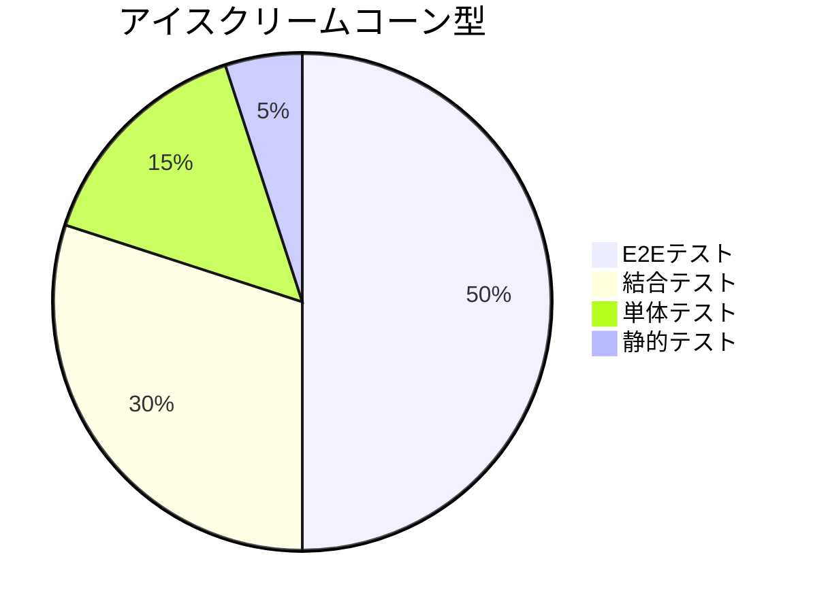
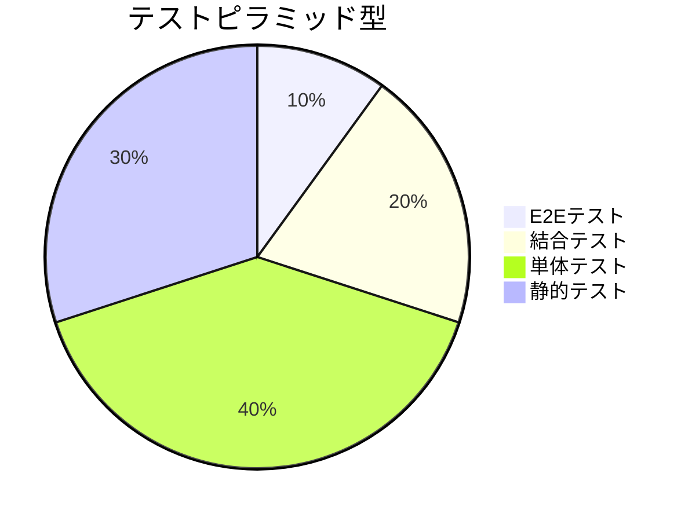
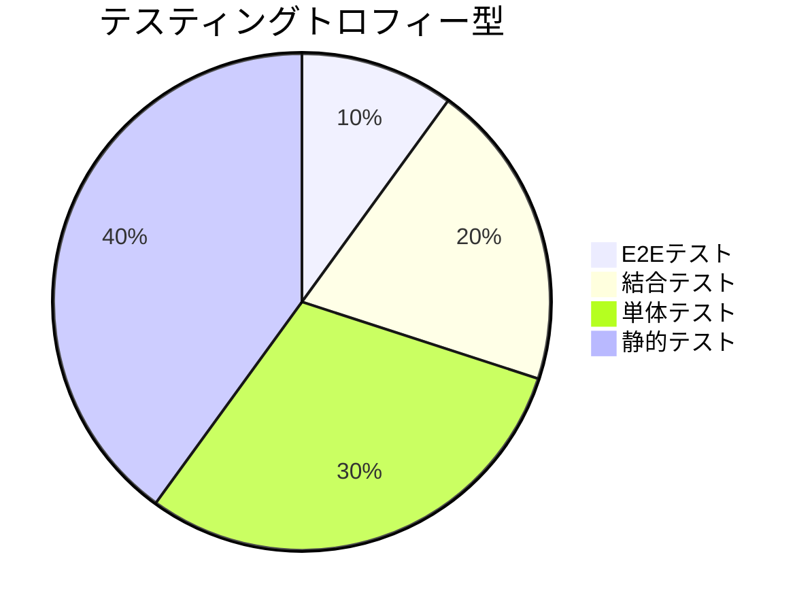

## テストを書く意味・目的
テストを書くことは、ソフトウェア開発において非常に重要である。その主な目的と意義は以下の通り。

a) 品質保証
- バグの早期発見と修正
- 仕様との整合性の確認
- ユーザー体験の向上

b) 開発効率の向上
- リグレッションの防止
- リファクタリングの安全性確保
- 開発者の自信向上

c) ドキュメンテーション
- コードの使用方法や期待される動作の明確化
- チーム内でのコミュニケーション促進

d) 設計の改善
- テスタビリティの高いコード設計の促進
- コンポーネントの責務の明確化

### バグが発生しやすい状況

a) コードの変更や機能追加時
- 既存の機能に影響を与える可能性
- 新旧コードの相互作用による予期せぬ動作

b) 異なる環境での動作時
- ブラウザの違いによる挙動の差異
- デバイスのスペックや画面サイズの違いによる問題

c) ユーザーの予期せぬ操作時
- 想定外の入力値や操作順序
- 高負荷時や低ネットワーク環境での使用

d) 外部APIとの連携時
- APIの仕様変更や障害
- データ形式の不一致

### 不正な状態を防ぐためのテスト

a) 入力値のバリデーション
- 必須項目のチェック
- 形式や範囲の検証

b) エラー処理とエッジケース
- 境界値テスト
- エラー時の適切なフィードバック

c) 状態管理の一貫性
- コンポーネント間の状態の整合性
- 非同期処理後の状態更新の検証

d) セキュリティ関連のチェック
- XSS攻撃の防止
- CSRF対策の確認

## テストの種類
### 静的テスト

目的：コードの品質と一貫性を保つ

手法：
- TypeScriptの型チェック：型の不一致や潜在的なエラーを事前に検出
- ESLintによるコード品質チェック：コーディング規約の遵守、潜在的なバグの検出
- Prettierによるコードフォーマット：コードスタイルの統一

主なツール：
- TypeScript Compiler
- ESLint（カスタムルールの設定）
- Prettier

### 単体テスト

目的：個々のコンポーネントや関数の正確性を確認

対象：
- Reactコンポーネント
- ユーティリティ関数
- カスタムフック

テスト内容：
- プロップスの受け渡し
- イベントハンドリング
- 状態の更新
- 条件付きレンダリング

主なツール：
- Jest
- React Testing Library
- @testing-library/react-hooks

### 結合テスト

目的：複数のコンポーネントやモジュール間の連携を確認

対象：
- 複数のコンポーネントで構成される機能
- コンテキストやReduxとの連携
- APIとの連携

テスト内容：
- データの流れ
- 状態の共有と更新
- エラー処理
- 非同期処理

主なツール：
- React Testing Library
- MSW (Mock Service Worker)

### E2Eテスト

目的：実際のユーザー体験に近い形で全体的な機能を検証

対象：
- 主要なユーザーフロー
- クリティカルな機能
- 複数ページにまたがる操作

テスト内容：
- サインインからサインアウトまでの一連の流れ
- 検索機能や絞り込み機能
- フォーム送信と結果の確認

主なツール：
- Cypress
- Playwright

## テスト戦略モデル
### アイスクリームコーン型

概要:
- E2Eテストに最も重点を置くモデル
- 上位のテスト（E2Eテスト、結合テスト）の比率が高い
- 下位のテスト（単体テスト、静的テスト）の比率が低い

特徴:
- ユーザー体験に近いテストを重視
- システム全体の動作確認に焦点を当てる
- 早期のフィードバックが難しい
- テストの実行時間が長くなりがち

適している状況:
- レガシーシステムの保守
- 小規模なプロジェクト
- 迅速なプロトタイピングが必要な場合

### テストピラミッド型

概要:
- 下位のテスト（単体テスト、静的テスト）に重点を置くモデル
- 上位に行くほどテストの数が少なくなる
- 単体テストが最も多く、E2Eテストが最も少ない

特徴:
- 高速で頻繁なフィードバックが可能
- 下位レベルでの問題を早期に発見できる
- テストの保守が比較的容易
- コスト効率が良い

適している状況:
- 大規模で複雑なプロジェクト
- 継続的デリバリーを実践している開発チーム
- マイクロサービスアーキテクチャ

### テスティングトロフィー型

概要:
- 静的テストに最も重点を置き、他のテストタイプもバランスよく配分するモデル
- テストピラミッドを進化させたモデル

特徴:
- 静的テストによる早期の問題発見
- 単体テストと結合テストのバランスが良い
- E2Eテストも適度に含まれる
- モダンな開発プラクティスに適合

適している状況:
- フロントエンド開発（特にReactやVueなどのコンポーネントベースのフレームワーク）
- アジャイル開発
- 品質と開発速度のバランスを重視するプロジェクト

## 理想のテスト戦略
- ロジックは基本的に hooks に切り出す
- hooks は基本的に単体テスト書く

### 静的テスト
- 全てのTypeScriptファイルに対して厳格な型チェックを適用
- ESLintルールセットをカスタマイズし、プロジェクト固有のルールを追加
- Prettierの設定をチーム内で統一し、コードスタイルの一貫性を確保
- CIでの自動チェックを実施し、問題がある場合はビルドを失敗させる

### 単体テスト
- 全てのReactコンポーネントに対して、最低限のレンダリングテストを実施
- ロジックを含むコンポーネントは、各条件分岐をカバーするテストを作成
- ユーティリティ関数は、入力値の範囲や特殊なケースを考慮したテストを実施
- カスタムフックは、異なる使用シナリオでのテストを行う
- モックやスタブを適切に使用し、外部依存を分離

### 結合テスト
- 主要な画面やフローに対して、複数のコンポーネントの連携をテスト
- Recoilやコンテキストを使用している場合、状態の更新と反映をテスト
- APIとの連携は、MSWを使用してモックレスポンスを返すテストを実施
- エラーケースや読み込み中の状態なども考慮したテストを作成

### E2Eテスト
- サインインなど主要な機能の利用など、重要なフローをテスト
- 複数のデバイスサイズや主要なブラウザでのテストを実施

## 理想のテスト実施方針
- 新機能開発時：
  - 機能仕様に基づいたテストケースを事前に作成
  - TDD（テスト駆動開発）の適用を推奨
  - 単体テストと結合テストを必須とし、機能の重要度に応じてE2Eテストも追加
  - コードレビュー時にテストの十分性も確認

- バグ修正時：
  - バグを再現するテストケースを先に作成
  - 修正後、そのテストが通ることを確認
  - 関連する箇所の既存テストも確認し、必要に応じて追加や修正

- リファクタリング時：
  - リファクタリング前に全てのテストが通ることを確認
  - リファクタリング後も全てのテストが通ることを再確認
  - テストコード自体のリファクタリングも定期的に実施

- CIでの自動テスト実行：
  - プルリクエスト作成時に全てのテストを実行
  - メインブランチへのマージ時にも全テストを実行
  - テスト失敗時はマージをブロック
  - 定期的（例：毎晩）にE2Eテストを実行し、環境の変化による影響を早期に検出

- パフォーマンステスト：
  - 重要な画面やコンポーネントに対して、定期的にパフォーマンス計測を実施
  - Lighthouseなどのツールを使用し、スコアの推移を監視

- アクセシビリティテスト：
  - 開発中のコンポーネントに対して、aXeなどのツールを使用してチェック
  - 定期的に全画面に対してアクセシビリティ監査を実施
