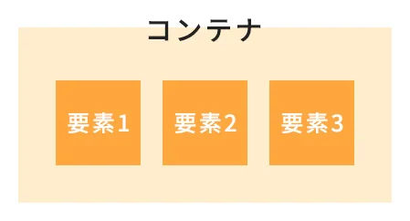
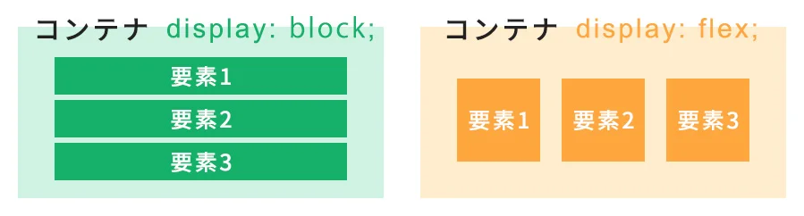
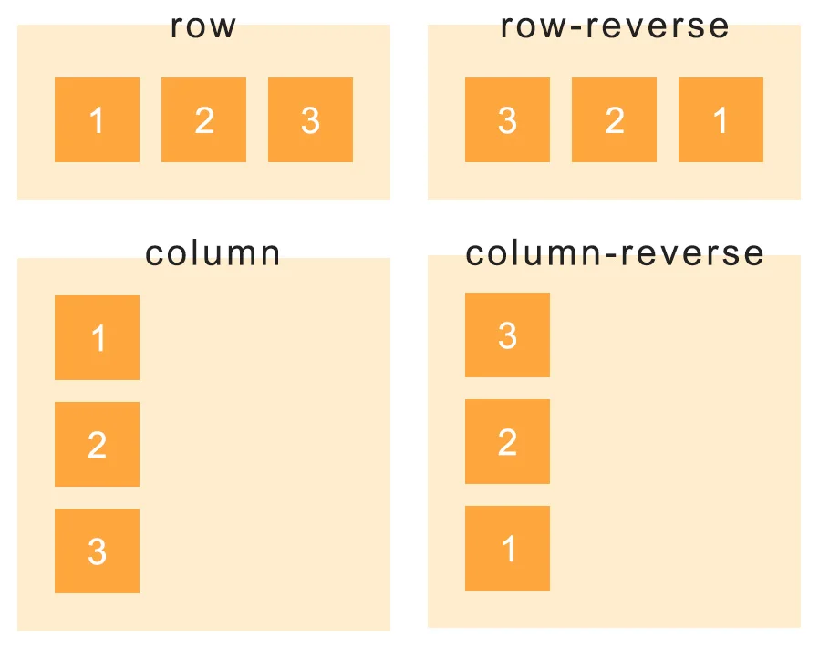
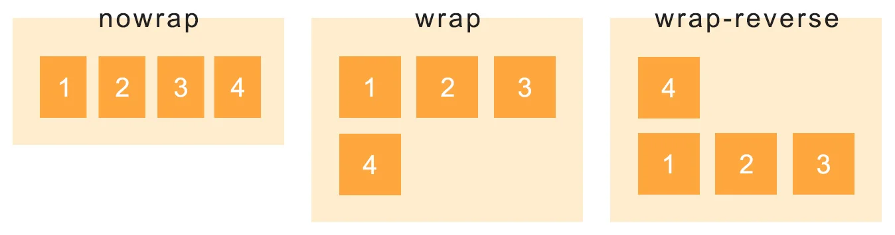
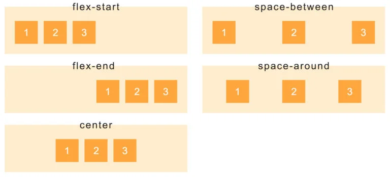
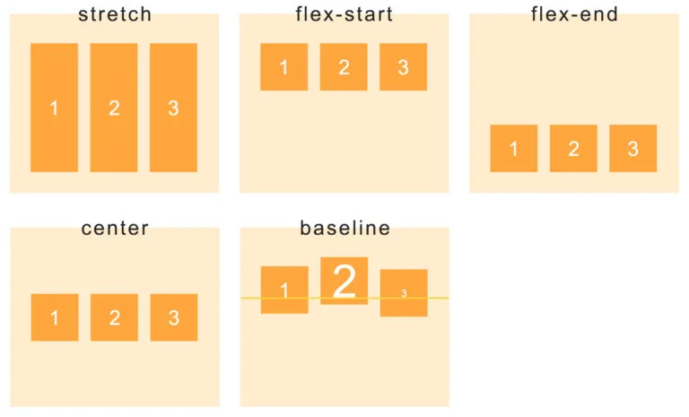
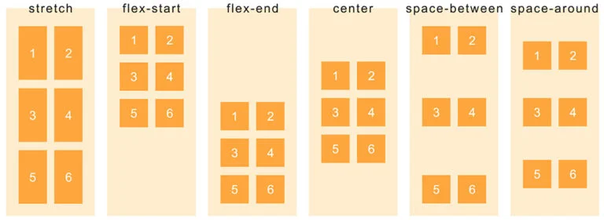

## フレックスボックスとは
フレックスボックス (Flexbox) は、アイテムを行または列に並べるための 1 次元のレイアウト方法。アイテムがたわんで（伸びて）追加の空間を埋めたり、縮んで小さい空間に収まったりする。



コンテナに対して `display:flex` を指定することで、中の要素にレイアウトを適用させることが可能となる。
下記のようにHTMLを記述する。

```html
<div class="container">
    <div class="item">
        要素1
    </div>
    <div class="item">
        要素2
    </div>
    <div class="item">
        要素3
    </div>
</div>
```

コンテナはクラス名 `container` で、その中のクラス名 `item` が要素となる。  
この場合は `container` に `display:flex` を指定することで、 `item` のレイアウトを変更することが出来る。

```css
.container {
    display: flex;
}
```

このように、要素をラップしているコンテナに対し、 `display: flex;` とCSSを一行追加するだけで直下の子要素を横並びにすることが出来る。



また、コンテナに追加でプロパティを指定することで、レイアウトの種類を変化させることが出来る。  
以上がフレックスボックスの基本。  

## 並べる方向を指定する（flex-direction）
`flex-direction`は指定して並べる方向を指定できる。

CSSの記述例は以下

```css
.container {
    display: flex;
    flex-direction: row-reverse;
}
```

| 値 | 表示 |
| - | - |
| row（初期値） | 左から右に横並びで子要素を配置 |
| row-reverse | 右から左に横並びで子要素を配置 |
| column | 上から下に縦並びに子要素を配置 |
| column-reverse | 下から上に縦並びに子要素を配置 |



## 折り返しを指定する（flex-wrap）
`flex-wrap`は子要素を折り返すかどうかを指定できる。

CSSの記述例は以下

```css
.container {
    display: flex;
    flex-wrap: wrap;
}
```

| 値 | 表示 |
| - | - |
| nowrap（初期値） | 子要素を折り返ししないで、一行に並べる |
| wrap | 子要素を折り返しさせ、上から下へ複数行で並べる |
| wrap-reverse | 子要素を折り返させ、下から上へ複数行で並べる |



## 水平方向のレイアウトを指定する（justify-content）
`justify-content`は右揃えや中央揃え、均等配置など、横並びの要素のレイアウトを指定できる。

CSSの記述例は以下

```css
.container {
    display: flex;
    justify-content: center;
}
```

| 値 | 表示 |
| - | - |
| flex-start（初期値） | 子要素を左揃えで配置する |
| flex-end | 子要素を右揃えで配置する |
| center | 子要素を中央揃えで配置する |
| space-between | 子要素を均等配置する。このとき左右端の要素を親要素の端に接して配置する |
| space-around | 子要素を均等配置する。このとき左右端の要素も親要素の端から均等に離して配置する |



## 垂直方向のレイアウトを指定する（align-items）
`align-items`は垂直方向のレイアウトを指定できる。

CSSの記述例は以下

```css
.container {
    display: flex;
    align-items: center;
}
```

| 値 | 表示 |
| - | - |
| stretch（初期値） | 子要素の中で一番高い要素に合わせて全ての子要素の高さを統一させて配置する |
| flex-start | 親要素の上端を基準に上揃えで配置する |
| flex-end | 親要素の下端を基準に下揃えで配置する |
| center | 親要素の上下中央を基準に、中央揃えで配置する |
| baseline | 子要素のベースラインで揃えて配置する |



## 複数行の垂直方向レイアウトを指定する（align-content）
`align-content`は`flex-wrap: wrap;`を使った場合や`flex-direction: column;`で縦並びにした要素をまとめてレイアウトを指定できる。

CSSの記述例は以下

```css
.container {
    display: flex;
    align-content: center;
}
```

| 値 | 表示 |
| - | - |
| stretch（初期値） | 親要素の高さに合わせて子要素の高さを統一させて配置する |
| flex-start | 親要素の上端を基準に上揃えで配置する。このとき子要素の高さは変化しない |
| flex-end | 親要素の下端を基準に下揃えで配置する。このとき子要素の高さは変化しない |
| center | 親要素の上下中央を基準に、中央揃えで配置する。このとき子要素の高さは変化しない |
| space-between | 子要素を均等配置する。このとき上下端の要素を親要素の端に接して配置する |
| space-around | 子要素を均等配置する。このとき上下端の要素も親要素の端から均等に離して配置する |


