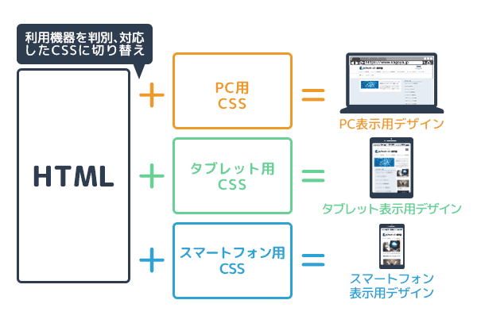
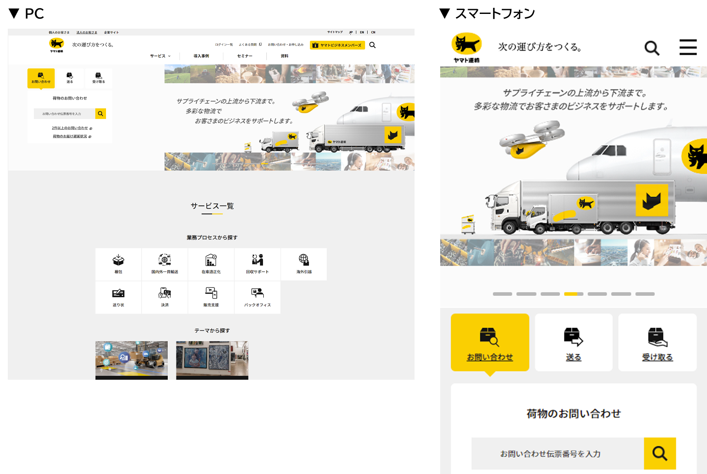

## レスポンシブデザインとは
レスポンシブデザインとは、デバイスの画面サイズに依存しないサイトを構築する手法。言い換えると、デバイスのウィンドウ幅に「responsive(良く反応)」して、見やすい表示に自動で切り替える仕組みを持つデザインのこと。

## レスポンシブデザインの定義
近年は、スマートフォンやタブレットを使うモバイルユーザーが増えており、画面サイズの異なるPCとスマートフォンの両方から同じサイトを閲覧することが普及している。このマルチデバイス(マルチスクリーン)の流れに対応するために、レスポンシブデザインを導入し、どの端末からアクセスしても最適なサイト表示をする必要性が高まっている。

Googleは、2015年の4月にモバイルフレンドリーアップデートを行い、モバイル対応済みページの検索順位を引き上げることを発表した。そして、サイトをモバイルフレンドリーにする方法として、サイトにレスポンシブなテンプレートやテーマを利用することを勧めている。

参考：[Google公式アナウンス](https://developers.google.com/search/blog/2015/04/rolling-out-mobile-friendly-update?hl=ja)

## レスポンシブデザインの特徴
レスポンシブデザインを採用すると、PCサイトとスマートフォンサイトを別々に作る必要がない。共通のサイトを1つ構築して、URLやHTML(画像やテキストを表示するために必要なコード)も、ページごとに1種類ずつ用意すれば良くなる。このサイト構造のシンプルさがレスポンシブデザインの特徴であり、数々のメリットをもたらす要因。

## 対応方法の比較
スマホ表示に対応する主な方法には、「レスポンシブWebデザインでの対応」と「スマホ専用ベージの制作」の2種類ある。以下は比較。

| | レスポンシブWebデザインでの対応 | スマホ専用ベージの制作 |
|-------------------|----------------------------------------------|------------------------------|
| 作成するHTMLファイル数     | 1 （PC表示用とスマホ表示用を兼ねる）                     | 2 （PC表示用とスマホ表示用を別々に制作）   |
| ページのURLアドレスの数     | 1 （PC表示用とスマホ表示用と同一）                      | 2 （PC表示用とスマホ表示用は別々に存在する） |
| 制御方法              | 独立したCSSファイルより、HTMLファイルに対して指定する               | 通常通り                         |
| メリット              | ・Google検索により優位になる（SEO対策） ・ページ作成や更新の手間が減る | 比較的自由なデザインレイアウトが可能           |
| デメリット             | ・制御するCSSが複雑になる ・デザインレイアウトの制約が若干ある        | レスポンシブに比べ作業量は倍               |

## レスポンシブデザインのメリット・デメリット
レスポンシブデザインでは、サイトの各ページのURLは1種類で、どのデバイスにも同じHTMLコードが配信される。これによって数々のメリットがもたらされますが、デメリットもある。

### レスポンシブデザインのメリット
レスポンシブデザインには、以下のようなメリットがある。

- スマートフォンなどの画面が小さな端末で、見やすさ・使いやすさが向上する
- URLが1つなので、ユーザーがリンク・共有をしやすい
- Googleが推奨していて、モバイルの検索順位に有利
- サイト構造がシンプルでURLのリダイレクト(転送)が不要なので、クロールがしやすくSEO上の利点が期待できる
- URL・HTML・CSSがワンソースなので更新やメンテナンスがしやすい

上記のうち、1と2はユーザー視点、3と4は検索エンジン視点、5は運営担当者の視点。

### レスポンシブデザインのデメリット
レスポンシブデザインには、以下のようなデメリットがある。

- どのデバイスにも適したサイトを構築するには熟考が必要で、初期設計に時間がかかる
- ある程度の知識や技術(デザイン、コーディング)がないと、デバイスによって表示が崩れるリスクがある
- 上記の理由から、初期の構築費用が高額になりやすい
- PCサイトに適したデザインやテキストを諦めなければならないことがある
- スマートフォンではPCサイトと同じ情報を読み込むため表示に時間がかかることがある

4のデメリットを具体的に挙げると、例えば以下のようなケースが考えられる。

- スマートフォンでの表示速度を考慮して画像を軽くすると、PCサイトで綺麗に表示することができない
- PCでは丁度良いテキスト量でも、スマートフォンでは文字だらけで読みにくいため文章を削ったり画像を挟んだりする必要が出てくる

## 例：ヤマト運輸の公式サイト

CSSのメディアクエリを@mediascreenand(max-width:760px)にし、760pxまではスマートフォン向けの表示に、760px以上でPC向けの表示に切り替えているそう。

## メディアクエリ
メディアクエリとは、従来のCSS（CSS2）では媒体までしか判断できなかったメディア・タイプを拡張して媒体の特性まで判断できるようにしたCSS3の要素のこと。

MUIでは以下のコンポーネントを活用することで実現できる。

- [grid](https://mui.com/material-ui/react-grid/) ：レスポンシブデザインでグリッドレイアウトは、画面サイズと向きに適応し、レイアウト間の一貫性を確保する
- [container](https://mui.com/material-ui/react-container/) ：コンテナはコンテンツを水平方向に中央に配置する
- [breakpoints](https://mui.com/material-ui/customization/breakpoints/) ：さまざまなコンテキストでブレイクポイントの使用を可能にする
- [useMediaQuery](https://mui.com/material-ui/react-use-media-query/) ：React 用の CSS メディアクエリのフック

詳細は以下を見て欲しい。

https://mui.com/material-ui/guides/responsive-ui/

## ブレイクポイント
ブレイクポイントは、デバイスやビューポートのサイズによってレイアウトがどのようにレスポンシブに変化するかを示すトリガー。

ブレイクポイントを決める際、主流となっているPC、タブレット、スマホの横幅を基準に決めたほうが良い。

MUIのdefaultのブレイクポイントは以下。

Each breakpoint (a key) matches with a fixed screen width (a value):

- xs, extra-small: 0px
- sm, small: 600px
- md, medium: 900px
- lg, large: 1200px
- xl, extra-large: 1536px
